# 🐍 Python Classes: The Complete Beginner's Guide

## 1. Introduction to Classes 🏗️

### The Problem with Scattered Code

Imagine you're building a program to manage students in a school. Without classes, your code might look like this:

```python
# Student 1 data scattered everywhere
student1_name = "Alice"
student1_age = 20
student1_grade = "A"

# Student 2 data scattered everywhere
student2_name = "Bob"
student2_age = 19
student2_grade = "B"

def print_student1_info():
    print(f"Student: {student1_name}, Age: {student1_age}, Grade: {student1_grade}")

def print_student2_info():
    print(f"Student: {student2_name}, Age: {student2_age}, Grade: {student2_grade}")
```

**Problems with this approach:**
- Data is scattered and hard to manage
- Need separate functions for each student
- Adding a new student means lots of duplicate code
- No clear relationship between related data
- Nightmare to maintain and debug

### The "Aha!" Moment: Classes to the Rescue

Classes solve these problems by **grouping related data and functions together**:

```python
class Student:
    def __init__(self, name, age, grade):
        self.name = name
        self.age = age
        self.grade = grade

    def print_info(self):
        print(f"Student: {self.name}, Age: {self.age}, Grade: {self.grade}")

# Now creating students is clean and consistent
alice = Student("Alice", 20, "A")
bob = Student("Bob", 19, "B")
charlie = Student("Charlie", 21, "A+")

alice.print_info()    # Student: Alice, Age: 20, Grade: A
bob.print_info()      # Student: Bob, Age: 19, Grade: B
charlie.print_info()  # Student: Charlie, Age: 21, Grade: A+
```

**Why Classes are Revolutionary:**
- **Organization**: Related data stays together
- **Reusability**: One class definition creates unlimited objects
- **Maintainability**: Change the class once, all objects benefit
- **Scalability**: Easy to add new features and objects
- **Real-world modeling**: Objects mirror how we think about things

## 2. Real-life Analogies 🌍

### 🍪 Cookie Cutter & Cookies


- **Cookie Cutter (Class)**: Defines the shape and structure
- **Cookies (Objects)**: Individual cookies made from the same cutter
- **Different Flavors**: Each cookie can have different ingredients (attributes)

### 🏠 House Blueprint & Actual Houses

```mermaid
graph TB
    A[House Blueprint Class<br/>📋 Floor Plan<br/>🚪 2 Bedrooms<br/>🍳 1 Kitchen<br/>🛁 1 Bathroom] --> B[Red House<br/>🏠 Built from blueprint<br/>🎨 Red paint<br/>📍 123 Oak St]
    A --> C[Blue House<br/>🏠 Built from blueprint<br/>🎨 Blue paint<br/>📍 456 Pine Ave]
    A --> D[Green House<br/>🏠 Built from blueprint<br/>🎨 Green paint<br/>📍 789 Elm Dr]

    style A fill:#388e3c
    style B fill:#d32f2f
    style C fill:#1976d2
    style D fill:#388e3c
```



### 🚗 Car Factory & Cars

```mermaid
graph TB
    A[Car Factory Class<br/>🏭 Assembly Line<br/>⚙️ Engine System<br/>🛞 4 Wheels<br/>🚗 Body Frame] --> B[Honda Civic<br/>🚙 Blue Color<br/>⚡ 150 HP<br/>📅 2023 Model]
    A --> C[Toyota Camry<br/>🚙 White Color<br/>⚡ 200 HP<br/>📅 2023 Model]
    A --> D[Ford Focus<br/>🚙 Red Color<br/>⚡ 160 HP<br/>📅 2023 Model]

    style A fill:#f57c00
    style B fill:#1976d2
    style C fill:#7b1fa2
    style D fill:#d32f2f
```



### 🎓 Student ID Template & Student Cards


**Key Insight**: The class is the **template/pattern**, objects are the **individual items** created from that template.

## 3. Basic Class Syntax 🐍

### Step-by-Step Class Creation

#### Step 1: Define the Class

```python
class Dog:  # Class name in PascalCase
    pass    # Placeholder for now
```

#### Step 2: Add the Constructor (`__init__`)

```python
class Dog:
    def __init__(self, name, breed):  # Constructor method
        self.name = name              # Instance attribute
        self.breed = breed            # Instance attribute
```

#### Step 3: Add Methods

```python
class Dog:
    def __init__(self, name, breed):
        self.name = name
        self.breed = breed

    def bark(self):                   # Instance method
        return f"{self.name} says Woof!"

    def introduce(self):              # Another instance method
        return f"Hi, I'm {self.name}, a {self.breed}!"
```

#### Step 4: Create Objects and Use Them

```python
# Create objects (instances) from the class
buddy = Dog("Buddy", "Golden Retriever")
max_dog = Dog("Max", "German Shepherd")

# Use the objects
print(buddy.bark())        # Buddy says Woof!
print(max_dog.introduce()) # Hi, I'm Max, a German Shepherd!
print(buddy.name)          # Buddy
print(max_dog.breed)       # German Shepherd
```

### Class Anatomy Diagram


## 4. Key Concepts Deep Dive 🧠

### Classes vs Objects: The Template vs The Thing

```python
# This is the CLASS - the template/blueprint
class Car:
    def __init__(self, brand, model, color):
        self.brand = brand
        self.model = model
        self.color = color

    def honk(self):
        return "Beep beep!"

# These are OBJECTS - individual cars made from the template
my_car = Car("Toyota", "Camry", "Blue")      # Object #1
your_car = Car("Honda", "Civic", "Red")      # Object #2
work_car = Car("Ford", "Focus", "White")     # Object #3
```

### Class vs Instance Visualization


### Attributes: The "What" - Data Storage Containers

**Attributes are like labeled boxes that store information about each object.**

```python
class Person:
    def __init__(self, name, age, city):
        self.name = name    # String attribute
        self.age = age      # Integer attribute
        self.city = city    # String attribute
        self.friends = []   # List attribute (starts empty)

alice = Person("Alice", 25, "New York")

# Accessing attributes
print(alice.name)    # "Alice"
print(alice.age)     # 25
print(alice.city)    # "New York"
print(alice.friends) # []

# Modifying attributes
alice.age = 26
alice.friends.append("Bob")
print(alice.age)     # 26
print(alice.friends) # ["Bob"]
```

### Person Class Structure


### Methods: The "How" - Actions Objects Can Perform

**Methods are like buttons on a remote control - they make objects do things.**

```python
class BankAccount:
    def __init__(self, owner, balance=0):
        self.owner = owner
        self.balance = balance

    def deposit(self, amount):           # Action: Add money
        self.balance += amount
        return f"Deposited ${amount}. Balance: ${self.balance}"

    def withdraw(self, amount):          # Action: Remove money
        if amount <= self.balance:
            self.balance -= amount
            return f"Withdrew ${amount}. Balance: ${self.balance}"
        else:
            return "Insufficient funds!"

    def check_balance(self):             # Action: Check money
        return f"{self.owner}'s balance: ${self.balance}"

# Create account and use methods
account = BankAccount("John", 100)
print(account.deposit(50))      # Deposited $50. Balance: $150
print(account.withdraw(30))     # Withdrew $30. Balance: $120
print(account.check_balance())  # John's balance: $120
```

### Bank Account Class Diagram


### The `self` Parameter: The Object Talking About Itself

**Think of `self` as each object pointing to itself and saying "me".**

```python
class Student:
    def __init__(self, name):
        self.name = name              # "my name is..."

    def introduce(self):
        return f"Hello, I am {self.name}"  # "I am..."

student1 = Student("Alice")
student2 = Student("Bob")

print(student1.introduce())  # Alice says: "Hello, I am Alice"
print(student2.introduce())  # Bob says: "Hello, I am Bob"
```

### Self Parameter Flow


**What happens behind the scenes:**
```python
# When you call:
student1.introduce()

# Python actually does:
Student.introduce(student1)  # Passes the object as 'self'
```

### Constructor (`__init__`): The Birth Certificate of Objects

**The `__init__` method is like filling out a birth certificate - it gives the object its initial identity.**

```python
class Phone:
    def __init__(self, brand, model, storage):
        print(f"Creating a new {brand} {model}...")  # Birth announcement
        self.brand = brand        # Identity trait 1
        self.model = model        # Identity trait 2
        self.storage = storage    # Identity trait 3
        self.battery = 100        # Default starting value
        self.apps = []           # Starts with no apps
        print(f"Phone created with {storage}GB storage and {self.battery}% battery")

# Watch the "birth" process
iphone = Phone("Apple", "iPhone 14", 128)
# Output:
# Creating a new Apple iPhone 14...
# Phone created with 128GB storage and 100% battery
```

### Object Creation Process


## 5. Progressive Examples 📚

### Level 1: Simple Person (Name Only)

**Goal**: Create the most basic class with one attribute and one method.

```python
class Person:
    def __init__(self, name):
        self.name = name

    def say_hello(self):
        return f"Hello, my name is {self.name}!"

# Usage
alice = Person("Alice")
bob = Person("Bob")

print(alice.say_hello())  # Hello, my name is Alice!
print(bob.say_hello())    # Hello, my name is Bob!
print(alice.name)         # Alice
```


**What You Learn:**
- Basic class structure
- Single attribute assignment
- Simple method with self
- Object creation and method calling

### Level 2: Enhanced Dog (Name, Breed, Actions)

**Goal**: Add multiple attributes and more interesting methods.

```python
class Dog:
    def __init__(self, name, breed, age):
        self.name = name
        self.breed = breed
        self.age = age
        self.energy = 100
        self.is_sleeping = False

    def bark(self):
        if self.is_sleeping:
            return f"{self.name} is sleeping and can't bark right now."
        else:
            self.energy -= 5
            return f"{self.name} barks loudly! Woof! (Energy: {self.energy})"

    def play(self):
        if self.energy > 20:
            self.energy -= 20
            return f"{self.name} plays happily! (Energy: {self.energy})"
        else:
            return f"{self.name} is too tired to play. Need rest!"

    def sleep(self):
        self.is_sleeping = True
        self.energy = 100
        return f"{self.name} takes a nap and restores energy!"

    def wake_up(self):
        self.is_sleeping = False
        return f"{self.name} wakes up refreshed!"

    def introduce(self):
        return f"Hi! I'm {self.name}, a {self.age}-year-old {self.breed}!"

# Usage Example
buddy = Dog("Buddy", "Golden Retriever", 3)

print(buddy.introduce())  # Hi! I'm Buddy, a 3-year-old Golden Retriever!
print(buddy.bark())       # Buddy barks loudly! Woof! (Energy: 95)
print(buddy.play())       # Buddy plays happily! (Energy: 75)
print(buddy.play())       # Buddy plays happily! (Energy: 55)
print(buddy.play())       # Buddy plays happily! (Energy: 35)
print(buddy.play())       # Buddy plays happily! (Energy: 15)
print(buddy.play())       # Buddy is too tired to play. Need rest!
print(buddy.sleep())      # Buddy takes a nap and restores energy!
print(buddy.bark())       # Buddy is sleeping and can't bark right now.
print(buddy.wake_up())    # Buddy wakes up refreshed!
```


**What You Learn:**
- Multiple attributes with different types
- Default attribute values (energy, is_sleeping)
- Methods that modify object state
- Conditional logic in methods
- Object state affecting behavior

### Level 3: Feature-Rich Car (Multiple Attributes, Complex Methods)

**Goal**: Build a comprehensive class with various data types and complex interactions.

```python
class Car:
    def __init__(self, brand, model, year, color, fuel_capacity=50):
        # Basic car info
        self.brand = brand
        self.model = model
        self.year = year
        self.color = color

        # Car state
        self.fuel_capacity = fuel_capacity
        self.fuel_level = fuel_capacity  # Start with full tank
        self.is_engine_on = False
        self.speed = 0
        self.odometer = 0
        self.maintenance_due = False

        # Trip tracking
        self.trip_distance = 0
        self.destinations = []

    def start_engine(self):
        if self.fuel_level > 0:
            self.is_engine_on = True
            return f"{self.brand} {self.model} engine started! Vroom!"
        else:
            return "Cannot start engine: out of fuel!"

    def stop_engine(self):
        self.is_engine_on = False
        self.speed = 0
        return f"{self.brand} {self.model} engine stopped."

    def accelerate(self, target_speed):
        if not self.is_engine_on:
            return "Start the engine first!"

        if self.fuel_level <= 0:
            return "Out of fuel! Cannot accelerate."

        self.speed = min(target_speed, 120)  # Max speed limit
        fuel_consumption = target_speed * 0.1
        self.fuel_level = max(0, self.fuel_level - fuel_consumption)

        return f"Accelerating to {self.speed} mph. Fuel remaining: {self.fuel_level:.1f}L"

    def drive(self, distance):
        if not self.is_engine_on:
            return "Start the engine first!"

        fuel_needed = distance * 0.08  # Fuel consumption per mile

        if fuel_needed > self.fuel_level:
            max_distance = self.fuel_level / 0.08
            return f"Not enough fuel! Can only drive {max_distance:.1f} miles."

        # Update car state
        self.fuel_level -= fuel_needed
        self.odometer += distance
        self.trip_distance += distance

        # Check maintenance
        if self.odometer % 5000 < distance:
            self.maintenance_due = True

        return f"Drove {distance} miles. Total: {self.odometer} miles. Fuel: {self.fuel_level:.1f}L"

    def refuel(self, amount=None):
        if amount is None:
            amount = self.fuel_capacity - self.fuel_level

        space_available = self.fuel_capacity - self.fuel_level
        fuel_added = min(amount, space_available)
        self.fuel_level += fuel_added

        return f"Refueled {fuel_added:.1f}L. Tank: {self.fuel_level:.1f}/{self.fuel_capacity}L"

    def add_destination(self, place):
        self.destinations.append(place)
        return f"Added {place} to trip destinations."

    def get_car_info(self):
        status = "ON" if self.is_engine_on else "OFF"
        maintenance = "⚠️ MAINTENANCE DUE" if self.maintenance_due else "✅ Good condition"

        return f"""
🚗 {self.color} {self.year} {self.brand} {self.model}
   Engine: {status} | Speed: {self.speed} mph
   Fuel: {self.fuel_level:.1f}/{self.fuel_capacity}L
   Odometer: {self.odometer} miles | Trip: {self.trip_distance} miles
   Status: {maintenance}
   Destinations: {', '.join(self.destinations) if self.destinations else 'None'}
        """

    def service_car(self):
        self.maintenance_due = False
        self.trip_distance = 0
        self.destinations = []
        return f"{self.brand} {self.model} has been serviced! Ready for new adventures."
```


**What You Learn:**
- Complex attribute relationships
- Methods that interact with multiple attributes
- Conditional logic and validation
- String formatting and user-friendly output
- Object state management over time
- Error handling and edge cases

## 6. Class vs Instance Masterclass 🔍

### Understanding the Relationship

```python
class Phone:
    # This is defined once for the entire class
    def __init__(self, brand, model):
        # These are created separately for each instance
        self.brand = brand
        self.model = model
        self.battery = 100

# Creating instances
phone1 = Phone("Apple", "iPhone 14")
phone2 = Phone("Samsung", "Galaxy S23")
phone3 = Phone("Google", "Pixel 7")
```

### Memory and Class Relationship


### Attribute Ownership: Who Owns What?

```python
class Counter:
    # Class attribute - shared by ALL instances
    total_counters = 0

    def __init__(self, name):
        # Instance attributes - unique to each instance
        self.name = name
        self.count = 0

        # Modify class attribute
        Counter.total_counters += 1

    def increment(self):
        self.count += 1  # Only affects this instance
        return f"{self.name}: {self.count}"

    @classmethod
    def get_total_counters(cls):
        return f"Total counters created: {cls.total_counters}"

# Usage
counter1 = Counter("First")
counter2 = Counter("Second")
counter3 = Counter("Third")

print(Counter.get_total_counters())  # Total counters created: 3

print(counter1.increment())  # First: 1
print(counter1.increment())  # First: 2
print(counter2.increment())  # Second: 1

# Instance attributes are separate
print(f"counter1.count: {counter1.count}")  # counter1.count: 2
print(f"counter2.count: {counter2.count}")  # counter2.count: 1
print(f"counter3.count: {counter3.count}")  # counter3.count: 0

# Class attribute is shared
print(f"Class attribute: {Counter.total_counters}")  # Class attribute: 3
```

### Class vs Instance Attributes


### Method Calls: How `obj.method()` Works

```python
class Calculator:
    def __init__(self, name):
        self.name = name

    def add(self, a, b):
        result = a + b
        return f"{self.name} calculated: {a} + {b} = {result}"

calc = Calculator("MyCalc")

# These two calls are equivalent:
result1 = calc.add(5, 3)                    # Normal way
result2 = Calculator.add(calc, 5, 3)        # What Python actually does

print(result1)  # MyCalc calculated: 5 + 3 = 8
print(result2)  # MyCalc calculated: 5 + 3 = 8
```

### Method Call Process


## 7. Beginner Mistake Prevention 🚨

### Mistake #1: Forgetting `self` in Method Definitions

❌ **Wrong:**
```python
class Dog:
    def __init__(self, name):
        self.name = name

    def bark():  # Missing 'self' parameter!
        return f"{self.name} says Woof!"  # NameError: name 'self' is not defined

dog = Dog("Buddy")
dog.bark()  # TypeError: bark() takes 0 positional arguments but 1 was given
```

✅ **Correct:**
```python
class Dog:
    def __init__(self, name):
        self.name = name

    def bark(self):  # Always include 'self' as first parameter
        return f"{self.name} says Woof!"

dog = Dog("Buddy")
print(dog.bark())  # Buddy says Woof!
```

### Common Error Flow


**Why This Happens:** Python automatically passes the object as the first argument to methods, but you need to explicitly define `self` to receive it.

### Mistake #2: Class Variables vs Instance Variables Confusion

❌ **Wrong (Unintended Sharing):**
```python
class Student:
    grades = []  # Class variable - shared by ALL instances!

    def __init__(self, name):
        self.name = name

    def add_grade(self, grade):
        self.grades.append(grade)  # Modifies the shared list!

alice = Student("Alice")
bob = Student("Bob")

alice.add_grade(85)
bob.add_grade(92)

print(f"Alice's grades: {alice.grades}")  # [85, 92] - Wrong!
print(f"Bob's grades: {bob.grades}")      # [85, 92] - Wrong!
```

✅ **Correct (Individual Lists):**
```python
class Student:
    def __init__(self, name):
        self.name = name
        self.grades = []  # Instance variable - unique per object

    def add_grade(self, grade):
        self.grades.append(grade)

alice = Student("Alice")
bob = Student("Bob")

alice.add_grade(85)
bob.add_grade(92)

print(f"Alice's grades: {alice.grades}")  # [85]
print(f"Bob's grades: {bob.grades}")      # [92]
```

### Variable Scope Comparison


### Mistake #3: Forgetting to Use `self` When Accessing Attributes

❌ **Wrong:**
```python
class Calculator:
    def __init__(self, name):
        self.name = name

    def add(self, a, b):
        result = a + b
        return f"{name} calculated: {result}"  # NameError: name 'name' is not defined

calc = Calculator("MyCalc")
calc.add(5, 3)  # NameError!
```

✅ **Correct:**
```python
class Calculator:
    def __init__(self, name):
        self.name = name

    def add(self, a, b):
        result = a + b
        return f"{self.name} calculated: {result}"  # Use self.name

calc = Calculator("MyCalc")
print(calc.add(5, 3))  # MyCalc calculated: 8
```

### Mistake #4: Wrong Class Naming Convention

❌ **Wrong:**
```python
class my_car:  # Should use PascalCase
    pass

class car_factory:  # Should use PascalCase
    pass
```

✅ **Correct:**
```python
class MyCar:  # PascalCase for class names
    pass

class CarFactory:  # PascalCase for class names
    pass
```

### Mistake #5: Trying to Call Methods on the Class Instead of Instance

❌ **Wrong:**
```python
class Dog:
    def __init__(self, name):
        self.name = name

    def bark(self):
        return f"{self.name} says Woof!"

# Trying to call method on class instead of instance
Dog.bark()  # TypeError: bark() missing 1 required positional argument: 'self'
```

✅ **Correct:**
```python
class Dog:
    def __init__(self, name):
        self.name = name

    def bark(self):
        return f"{self.name} says Woof!"

# Create instance first, then call method
my_dog = Dog("Buddy")
print(my_dog.bark())  # Buddy says Woof!
```

### Debugging Tips for Class-Related Errors

1. **AttributeError: 'ClassName' object has no attribute 'attribute_name'**
   - Check if you set the attribute in `__init__`
   - Check for typos in attribute names

2. **TypeError: method() missing 1 required positional argument: 'self'**
   - You're calling a method on the class instead of an instance
   - Create an object first: `obj = ClassName()`, then `obj.method()`

3. **NameError: name 'self' is not defined**
   - You forgot to include `self` as the first parameter in a method
   - Add `self` to the method definition: `def method(self):`

4. **Unexpected shared data between objects**
   - You're using class variables instead of instance variables
   - Move variable assignment inside `__init__`: `self.var = value`

## 8. Visual Learning 📊

### Class Definition vs Object Instances


### Object Lifecycle and Method Interaction


### Object Relationship and Data Flow

```mermaid
graph TD
    A["User Code"] --> B["Create Student Objects"]
    B --> C["Alice Student"]
    B --> D["Bob Student"]
    B --> E["Charlie Student"]

    C --> F["Alice's Data<br/>name: 'Alice'<br/>age: 20<br/>grades: 85, 92"]
    D --> G["Bob's Data<br/>name: 'Bob'<br/>age: 19<br/>grades: 78, 81"]
    E --> H["Charlie's Data<br/>name: 'Charlie'<br/>age: 21<br/>grades: 95, 98"]

    F --> I["Alice's Methods<br/>add_grade()<br/>calculate_gpa()"]
    G --> J["Bob's Methods<br/>add_grade()<br/>calculate_gpa()"]
    H --> K["Charlie's Methods<br/>add_grade()<br/>calculate_gpa()"]

    style F fill:#1976d2
    style G fill:#f57c00
    style H fill:#388e3c
```

## 9. Best Practices 🌟

### Naming Conventions

#### ✅ Class Names: PascalCase
```python
class BankAccount:     # Good
class StudentRecord:   # Good
class CarEngine:       # Good

class bank_account:    # Bad - use PascalCase for classes
class STUDENT_RECORD:  # Bad - too much uppercase
```

#### ✅ Method and Attribute Names: snake_case
```python
class Student:
    def __init__(self, first_name, last_name):  # Good
        self.first_name = first_name            # Good
        self.last_name = last_name              # Good
        self.grade_point_average = 0.0          # Good

    def calculate_gpa(self):                    # Good
        pass

    def add_course_grade(self, grade):          # Good
        pass

    # Bad examples:
    def CalculateGPA(self):         # Bad - use snake_case for methods
        pass

    def addCourseGrade(self, grade): # Bad - use snake_case for methods
        pass
```

### Naming Convention Diagram

```mermaid
classDiagram
    class GoodNamingExample {
        +string first_name
        +string last_name
        +float grade_point_average
        +__init__(first_name, last_name)
        +calculate_gpa() float
        +add_course_grade(grade)
        +get_full_name() string
    }

    class bad_naming_example {
        +string firstName
        +string LastName
        +float GPA
        +__init__(firstName, LastName)
        +CalculateGPA() float
        +addCourseGrade(grade)
        +getFullName() string
    }

    note for GoodNamingExample "✅ PascalCase for class\n✅ snake_case for methods/attributes"
    note for bad_naming_example "❌ Wrong case conventions"
```

### Documentation Strings (Docstrings)

```python
class BankAccount:
    """
    A class representing a bank account with basic operations.

    Attributes:
        owner (str): The name of the account owner
        balance (float): The current account balance
        account_number (str): Unique account identifier
    """

    def __init__(self, owner, initial_balance=0, account_number=None):
        """
        Initialize a new bank account.

        Args:
            owner (str): Name of the account owner
            initial_balance (float, optional): Starting balance. Defaults to 0.
            account_number (str, optional): Account ID. Generated if not provided.
        """
        self.owner = owner
        self.balance = initial_balance
        self.account_number = account_number or self._generate_account_number()

    def deposit(self, amount):
        """
        Deposit money into the account.

        Args:
            amount (float): Amount to deposit (must be positive)

        Returns:
            str: Confirmation message with new balance

        Raises:
            ValueError: If amount is negative or zero
        """
        if amount <= 0:
            raise ValueError("Deposit amount must be positive")

        self.balance += amount
        return f"Deposited ${amount:.2f}. New balance: ${self.balance:.2f}"
```

### Code Organization Principles

#### ✅ Single Responsibility Principle
```python
# Good - Each class has one clear responsibility
class EmailValidator:
    def is_valid_email(self, email):
        return "@" in email and "." in email

class EmailSender:
    def send_email(self, to_email, message):
        print(f"Sending '{message}' to {to_email}")

class User:
    def __init__(self, name, email):
        self.name = name
        self.email = email
```

```mermaid
classDiagram
    class EmailValidator {
        +is_valid_email(email) boolean
    }

    class EmailSender {
        +send_email(to_email, message)
    }

    class User {
        +string name
        +string email
        +__init__(name, email)
    }

    note for EmailValidator "Single responsibility:\nValidation only"
    note for EmailSender "Single responsibility:\nSending only"
    note for User "Single responsibility:\nUser data only"
```

#### ❌ Multiple Responsibilities (Avoid)
```python
# Bad - User class is doing too many things
class User:
    def __init__(self, name, email):
        self.name = name
        self.email = email

    def validate_email(self):      # Email validation logic
        return "@" in self.email and "." in self.email

    def send_email(self, message): # Email sending logic
        print(f"Sending email...")

    def save_to_database(self):    # Database logic
        print("Saving to database...")

    def generate_report(self):     # Reporting logic
        print("Generating report...")
```

### When to Create a New Class vs Modify Existing

```mermaid
flowchart TD
    A[Need to add functionality?] --> B{Same core purpose?}
    B -->|Yes| C[Modify existing class]
    B -->|No| D{Related functionality?}
    D -->|Yes| E[Consider inheritance]
    D -->|No| F[Create new class]

    C --> G[Add method to existing class]
    E --> H[Create child class]
    F --> I[Create independent class]

    style G fill:#388e3c
    style H fill:#f57c00
    style I fill:#1976d2
```

#### ✅ Create a New Class When:
1. **Different Core Purpose**
```python
class Car:      # Transportation vehicle
    pass

class House:    # Living structure - completely different purpose
    pass
```

2. **Specialized Behavior**
```python
class Animal:
    pass

class Dog(Animal):     # Specialized animal with dog-specific behaviors
    def bark(self):
        pass

class Cat(Animal):     # Specialized animal with cat-specific behaviors
    def meow(self):
        pass
```

#### ✅ Modify Existing Class When:
1. **Same Core Purpose, New Feature**
```python
class BankAccount:
    def __init__(self, owner, balance=0):
        self.owner = owner
        self.balance = balance

    def deposit(self, amount):
        self.balance += amount

    # Adding new feature to existing class
    def get_account_summary(self):  # Same purpose, additional functionality
        return f"Account: {self.owner}, Balance: ${self.balance}"
```

2. **Bug Fixes or Improvements**
```python
class Calculator:
    def divide(self, a, b):
        # Modify existing method to handle edge case
        if b == 0:
            raise ValueError("Cannot divide by zero")
        return a / b
```

### Constructor Best Practices

#### ✅ Provide Sensible Defaults
```python
class GameCharacter:
    def __init__(self, name, health=100, level=1, inventory=None):
        self.name = name
        self.health = health
        self.level = level
        self.inventory = inventory if inventory is not None else []

# Easy to create with minimal info
hero = GameCharacter("Hero")              # Uses defaults
wizard = GameCharacter("Gandalf", 150, 10) # Custom values
```

#### ✅ Validate Input Parameters
```python
class Rectangle:
    def __init__(self, width, height):
        if width <= 0 or height <= 0:
            raise ValueError("Width and height must be positive")

        self.width = width
        self.height = height
```

#### ✅ Keep Constructors Simple
```python
# Good - Constructor only initializes data
class Student:
    def __init__(self, name, student_id):
        self.name = name
        self.student_id = student_id
        self.courses = []
        self.gpa = 0.0

# Avoid - Constructor doing too much work
class Student:
    def __init__(self, name, student_id):
        self.name = name
        self.student_id = student_id
        self.courses = []

        # Too much work in constructor
        self.load_previous_courses_from_database()
        self.calculate_initial_gpa()
        self.send_welcome_email()
        self.create_student_directory()
```

## 10. Exercise Roadmap 🗺️

### Overview of the 7 Exercises in This Directory

Your journey through `00_class_basics` is carefully designed to build your skills progressively:

```mermaid
flowchart LR
    A[01_person<br/>Simple Start] --> B[02_animal<br/>Behaviors & Actions]
    B --> C[03_car<br/>State Changes]
    C --> D[04_bank<br/>Methods & Data]
    D --> E[05_library<br/>Complex Attributes]
    E --> F[06_student<br/>Multiple Features]
    F --> G[07_triangle<br/>Calculations & Geometry]

    style A fill:#388e3c
    style B fill:#f57c00
    style C fill:#1976d2
    style D fill:#c2185b
    style E fill:#7b1fa2
    style F fill:#00695c
    style G fill:#d32f2f
```

### Exercise Progression Overview

```mermaid
graph TD
    A[Class Basics Foundation] --> B[01_person: Your First Class 👤]
    A --> C[02_animal: Adding Behavior 🐕]
    A --> D[03_car: Object State Changes 🚗]
    A --> E[04_bank: Methods and Data Operations 🏦]
    A --> F[05_library: Complex Attributes 📚]
    A --> G[06_student: Multiple Features 🎓]
    A --> H[07_triangle: Calculations & Geometry 📐]

    B --> I[Skills: Basic class structure, single attribute, simple method]
    C --> J[Skills: Multiple attributes, method logic, object behavior]
    D --> K[Skills: State management, conditional logic, object state changes]
    E --> L[Skills: Mathematical operations, input validation, business logic]
    F --> M[Skills: List attributes, collection manipulation, complex data structures]
    G --> N[Skills: Multi-feature design, method interdependence, comprehensive modeling]
    H --> O[Skills: Math formulas, calculated properties, real-world problem modeling]
```

### 01_person: Your First Class 👤
**What you'll learn:**
- Basic class structure (`class`, `__init__`, `self`)
- Single attribute storage
- Simple method definition and calling
- Object creation and usage

**Skills built:**
- Understanding class vs object
- Method syntax with `self`
- Attribute access

```mermaid
classDiagram
    class Person {
        +string name
        +__init__(name)
        +say_hello() string
    }

    note for Person "Foundation: Learn basic\nclass structure and self"
```

### 02_animal: Adding Behavior 🐕
**What you'll learn:**
- Multiple attributes in one class
- Methods that use instance data
- Object behavior and actions

**Skills built:**
- Multi-attribute classes
- Method logic using `self.attribute`
- Object state representation

```mermaid
classDiagram
    class Animal {
        +string name
        +string species
        +__init__(name, species)
        +make_sound() string
        +eat() string
        +sleep() string
    }

    note for Animal "Progression: Multiple attributes\nand behavioral methods"
```

### 03_car: Object State Changes 🚗
**What you'll learn:**
- Attributes that change over time
- Methods that modify object state
- Tracking object conditions

**Skills built:**
- State management
- Conditional logic in methods
- Object behavior based on current state

```mermaid
classDiagram
    class Car {
        +string brand
        +string model
        +boolean is_running
        +int fuel_level
        +__init__(brand, model)
        +start() string
        +stop() string
        +drive(distance) string
    }

    note for Car "Evolution: State changes\nand conditional behavior"
```

### 04_bank: Methods and Data Operations 🏦
**What you'll learn:**
- Methods that perform calculations
- Data validation and error handling
- Complex object interactions

**Skills built:**
- Mathematical operations in methods
- Input validation
- Business logic implementation

```mermaid
classDiagram
    class BankAccount {
        +string owner
        +float balance
        +__init__(owner, initial_balance)
        +deposit(amount) string
        +withdraw(amount) string
        +get_balance() float
    }

    note for BankAccount "Complexity: Data operations\nand validation logic"
```

### 05_library: Complex Attributes 📚
**What you'll learn:**
- List attributes and manipulation
- Multiple data types in one class
- Object collections and management

**Skills built:**
- Working with lists as attributes
- Adding/removing items from collections
- Complex data structures

```mermaid
classDiagram
    class Library {
        +string name
        +list books
        +list members
        +__init__(name)
        +add_book(book) string
        +add_member(member) string
        +lend_book(title, member) string
    }

    note for Library "Advanced: Collection management\nand complex data structures"
```

### 06_student: Multiple Features 🎓
**What you'll learn:**
- Classes with many attributes
- Multiple methods working together
- Complex object relationships

**Skills built:**
- Multi-feature class design
- Method interdependence
- Comprehensive object modeling

```mermaid
classDiagram
    class Student {
        +string name
        +string student_id
        +list grades
        +list courses
        +float gpa
        +__init__(name, student_id)
        +add_grade(grade)
        +enroll_course(course)
        +calculate_gpa() float
        +get_transcript() string
    }

    note for Student "Integration: Multiple features\nworking together"
```

### 07_triangle: Calculations & Geometry 📐
**What you'll learn:**
- Mathematical operations in classes
- Property calculations
- Geometric concepts in programming

**Skills built:**
- Math formula implementation
- Calculated properties
- Real-world problem modeling

```mermaid
classDiagram
    class Triangle {
        +float side1
        +float side2
        +float side3
        +__init__(side1, side2, side3)
        +calculate_perimeter() float
        +calculate_area() float
        +is_valid() boolean
        +get_triangle_type() string
    }

    note for Triangle "Mastery: Mathematical operations\nand real-world modeling"
```

### Progression Path Strategy

```mermaid
gantt
    title Class Basics Learning Timeline
    dateFormat X
    axisFormat %s

    section Week 1: Foundation
    Exercise 1-2    :w1, 0, 2

    section Week 2: Behavior
    Exercise 3-4    :w2, 2, 2

    section Week 3: Complexity
    Exercise 5-6    :w3, 4, 2

    section Week 4: Application
    Exercise 7      :w4, 6, 1
```

**Week 1: Foundation (Exercises 1-2)**
- Focus on syntax and basic concepts
- Practice creating simple classes
- Understand `self` and basic methods

**Week 2: Behavior (Exercises 3-4)**
- Learn state management
- Practice method logic
- Understand object behavior changes

**Week 3: Complexity (Exercises 5-6)**
- Work with complex attributes
- Build multi-feature classes
- Practice real-world modeling

**Week 4: Application (Exercise 7)**
- Apply mathematical concepts
- Build complete, functional classes
- Prepare for inheritance concepts

### Tips for Success

#### 🎯 **For Each Exercise:**
1. **Read the `.md` file completely** before coding
2. **Start with the simplest version** that works
3. **Test frequently** with different inputs
4. **Add features gradually** rather than all at once
5. **Compare your output** with the examples exactly

#### 🔧 **Debugging Strategy:**
1. **Print statements** to see what's happening
2. **Test one method at a time** before combining
3. **Check attribute names** for typos
4. **Verify `self` usage** in all methods

#### 📚 **Learning Reinforcement:**
- **Explain your code** to yourself or others
- **Modify examples** to try different scenarios
- **Create additional objects** to test edge cases
- **Draw diagrams** of your object relationships

#### 🚀 **Going Beyond:**
- **Add extra features** to finished exercises
- **Combine concepts** from different exercises
- **Create your own classes** using learned patterns
- **Help others** understand the concepts

### Learning Progression Diagram

```mermaid
flowchart TD
    A[Start: No OOP Knowledge] --> B[Exercise 1: Basic Class Syntax]
    B --> C[Exercise 2: Multiple Attributes]
    C --> D[Exercise 3: State Management]
    D --> E[Exercise 4: Business Logic]
    E --> F[Exercise 5: Complex Data]
    F --> G[Exercise 6: Feature Integration]
    G --> H[Exercise 7: Mathematical Modeling]
    H --> I[Ready for Inheritance!]

    J[Key Skills Acquired:] --> K[✅ Class creation]
    J --> L[✅ Object instantiation]
    J --> M[✅ Method implementation]
    J --> N[✅ State management]
    J --> O[✅ Data validation]
    J --> P[✅ Complex attributes]
    J --> Q[✅ Real-world modeling]

    style A fill:#d32f2f
    style I fill:#388e3c
    style J fill:#1976d2
```

### Preparation for Next Level (Inheritance)

After completing these exercises, you'll be ready for:
- **Class inheritance** and parent-child relationships
- **Method overriding** and extending functionality
- **Polymorphism** and treating different objects similarly
- **Advanced OOP patterns** and design principles

**Success Indicators:**
✅ You can create classes from scratch without looking at examples
✅ You understand when to use classes vs simple variables
✅ You can debug class-related errors independently
✅ You can explain `self` to someone else clearly
✅ You can design classes for real-world problems

---

## 🎉 Congratulations!

You now have a comprehensive understanding of Python classes! This foundation will serve you well as you progress through object-oriented programming concepts. Remember:

- **Classes are templates** for creating objects
- **Objects are instances** with their own data
- **self always refers** to the current object
- **Methods are functions** that belong to objects
- **Practice makes perfect** - keep coding!

Start with Exercise 01_Person and work your way through each exercise. Take your time, experiment with the code, and don't be afraid to make mistakes - they're part of the learning process!

Happy coding! 🐍✨