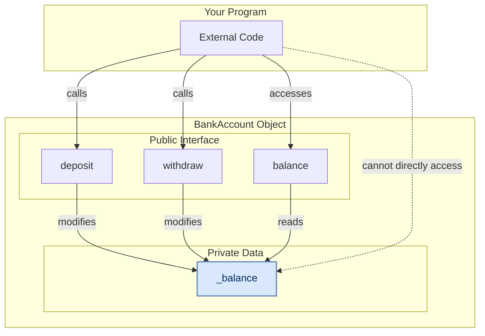

# Object-Oriented Programming: Encapsulation

## What is Encapsulation?

Encapsulation means bundling data (attributes) and the methods that work on that data into a single unit (a class). 

More importantly, it involves **protecting** that data by controlling access to it. Instead of letting other parts of your code change the data directly, you provide safe, public methods to do so.

Think of it as a protective "capsule" around your object's important data.

## A Real-World Analogy: The Bank Account

This is the perfect analogy for encapsulation.

-   **Your Data:** The account balance.
-   **The Problem:** You can't just walk into the bank vault and scribble a new number on your account record. That would be chaos!
-   **The Solution:** You must use a controlled interface—the bank teller. You can ask to `deposit`, `withdraw`, or `transfer` money. The teller follows strict rules (e.g., "you can't withdraw more money than you have") and handles complex operations like transfers automatically.

Encapsulation works the same way: it protects your object's data (`balance`) by forcing code to use safe methods (`deposit`, `withdraw`, `transfer_to`) instead of changing the data directly.

### Why Transfers Are a Perfect Example

Bank transfers are particularly illustrative because they require **two operations**:
1. **Subtract** money from the sender's account
2. **Add** money to the recipient's account

Without encapsulation, developers must manually perform both steps every time they want to transfer money. This leads to:
- **Forgotten steps:** Easy to subtract from one account but forget to add to the other
- **Code duplication:** The same two-step logic repeated everywhere transfers happen
- **Invalid states:** Accounts can end up with incorrect balances
- **No validation:** Nothing prevents transferring more money than available

With encapsulation, a single `transfer_to()` method handles both steps atomically, with proper validation.

## Naming Conventions for Encapsulation

In Python, we use the prefix of a variable name to indicate how it should be treated. Here is a simple guide:

| Feature                  | `_single_underscore` (Protected)                                                                       | `__double_underscore` (Private)                                                     |
|:-------------------------|:-------------------------------------------------------------------------------------------------------|:------------------------------------------------------------------------------------|
| **What it's called**     | "Protected" by convention.                                                                             | "Private" by convention.                                                            |
| **Main Purpose**         | A **hint** to other developers that a variable or method is intended for internal use only.            | To **avoid name clashes** in child classes when using inheritance.                  |
| **How Python treats it** | **It does nothing.** This is purely a naming convention; the variable is still fully accessible.       | **Name Mangling.** Python automatically changes the name to `_ClassName__variable`. |
| **Can you access it?**   | **Yes**, you can access it directly (e.g., `my_obj._my_var`), but you shouldn't. It's an honor system. | **No, not directly.** Trying `my_obj.__my_var` will cause an `AttributeError`.      |
| **Example**              | `self._balance = 100`                                                                                  | A class `Car` with `self.__vin` becomes accessible as `my_car._Car__vin`.           |

> **Note:** For this tutorial, we will focus on the single underscore (`_`), which is the most common convention for encapsulation.

## Encapsulation in Code: A `BankAccount` Class

Let's see why we need protection for our object's data.

### The Problem: Uncontrolled Access

Without encapsulation, any part of the program could directly change an account's balance to an invalid value, like a negative number. This would put the object in a broken state.

**Example of problems with unencapsulated code:**

```python
# Creating money from thin air!
alice.balance -= 200.0    # Subtract from Alice
# Oops! Forgot to add to Bob - Bob gets free money!

# Multiple transactions with duplicate code
alice.balance -= 100.0    # Transfer 1: Alice to Bob
bob.balance += 100.0

charlie.balance -= 50.0   # Transfer 2: Charlie to Alice
alice.balance += 50.0

bob.balance -= 75.0       # Transfer 3: Bob to Charlie
charlie.balance += 75.0   # More duplicate logic!

# Direct manipulation allows invalid states
alice.balance = -999.0    # The bank would never allow this!
```

Our objects are now in invalid states with duplicated, error-prone code. We need to protect the `balance` and provide safe transfer methods.

### Solution A: The General Approach (Getter & Setter Methods)

One common way to solve this, especially in other languages, is to use explicit "getter" and "setter" methods. We make the attribute "private" with an underscore and require all access to go through these methods.

This approach involves making the `balance` variable private and creating public methods: `get_balance()` to read the value, `set_balance()` to write it safely, and crucially, `transfer_to()` to handle transfers atomically.

**Example of encapsulated code with getters/setters:**

```python
class BankAccount:
    def __init__(self, holder, balance):
        self.account_holder = holder
        self._balance = balance  # Protected with underscore

    def get_balance(self):
        return self._balance

    def set_balance(self, amount):
        if amount >= 0:
            self._balance = amount
        else:
            print("Error: Invalid amount")

    def transfer_to(self, recipient, amount):
        """Safe, atomic transfer operation"""
        if self._balance >= amount:
            self._balance -= amount
            recipient._balance += amount
            return True
        else:
            print("Insufficient funds")
            return False

# Usage - no more duplicate code or forgotten steps!
alice.transfer_to(bob, 200.0)     # One line, both steps handled
bob.transfer_to(charlie, 150.0)   # Safe and atomic
```

This works and our data is safe. However, it's a bit verbose to call methods like `get_balance()` all the time.

### Solution B: The Pythonic Approach (`@property`)

Python provides a more elegant way to do the exact same thing. The `@property` decorator lets us create getter and setter logic but access the variable as if it were a simple attribute.

**Example of encapsulated code with properties:**

```python
class BankAccount:
    def __init__(self, holder, balance):
        self.account_holder = holder
        self._balance = balance

    @property
    def balance(self):
        """Getter - runs when you read account.balance"""
        return self._balance

    @balance.setter
    def balance(self, amount):
        """Setter - runs when you write account.balance = value"""
        if amount >= 0:
            self._balance = amount
        else:
            print("Error: Invalid amount")

    def transfer_to(self, recipient, amount):
        """Clean property access in transfer logic"""
        if self.balance >= amount:  # Uses @property getter
            self._balance -= amount
            recipient._balance += amount
            return True
        else:
            print("Insufficient funds")
            return False

# Usage - clean syntax with safety!
print(f"Alice has: ${alice.balance}")  # Property getter
alice.balance = 500.0                  # Property setter (with validation)
alice.transfer_to(bob, 200.0)          # Safe atomic transfer
```

Python's preferred solution uses 'properties'. It allows you to hide the private `balance` variable but still access it using the simple `account.balance` syntax. Behind the scenes, your validation logic automatically runs whenever the balance is changed, providing protection without the need for explicit `get_` and `set_` methods.

With `@property`, we get the best of both worlds: the simple, clean syntax of direct access, combined with the safety and control of getter and setter methods, **plus** atomic operations like `transfer_to()` that prevent the two-step mistake.

## Visualizing Encapsulation

The public methods and properties form a protective barrier around the internal data.



## Key Takeaways

-   **Encapsulation bundles data and methods together.**
-   **It protects data.** You control how attributes are read and changed.
-   **It prevents forgotten steps.** Complex operations like transfers become atomic, eliminating the possibility of forgetting the second step.
-   **It reduces code duplication.** Instead of repeating the same two-step transfer logic everywhere, you have one `transfer_to()` method.
-   **It provides validation.** All access goes through controlled methods that can enforce business rules.
-   In Python, use a single underscore (`_`) to mark data as internal (e.g., `_balance`).
-   Use `@property` and `@*.setter` to create a safe, public way to access that internal data.
-   Create atomic methods like `transfer_to()` for complex operations that require multiple steps.
