# Object-Oriented Programming: Inheritance vs. Composition - A Unified Guide

## Introduction

Object-Oriented Programming (OOP) provides two fundamental mechanisms for building relationships between classes: **Inheritance** and **Composition**. While often presented as competing approaches, they are complementary tools that, when used together effectively, create robust, flexible, and maintainable software systems.

This guide provides a comprehensive framework for understanding both concepts, making informed decisions about when to use each, and leveraging their combined power in real-world applications.

## Core Concepts Overview

### Inheritance: "Is-A" Relationships

Inheritance models **"is-a"** relationships where a child class inherits properties and behaviors from a parent class.

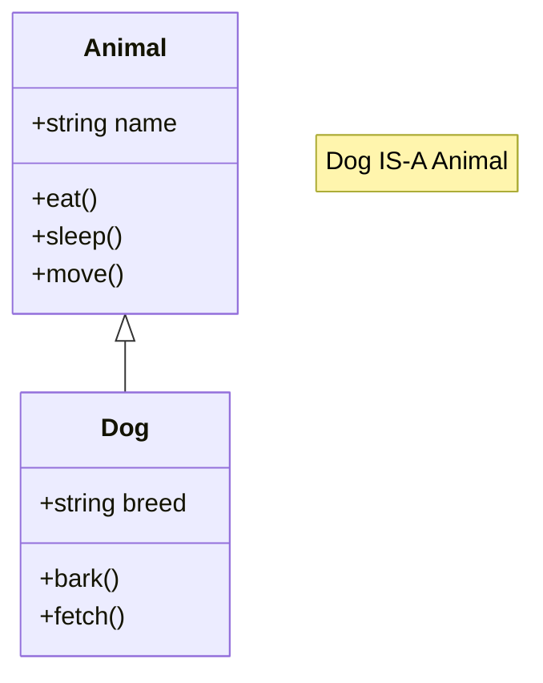

**Key Characteristics:**
- Tight coupling between parent and child
- Fixed relationship at compile time
- Polymorphism through method overriding
- Code reuse through hierarchy

### Composition: "Has-A" Relationships

Composition models **"has-a"** relationships where objects are built by combining other objects as components.

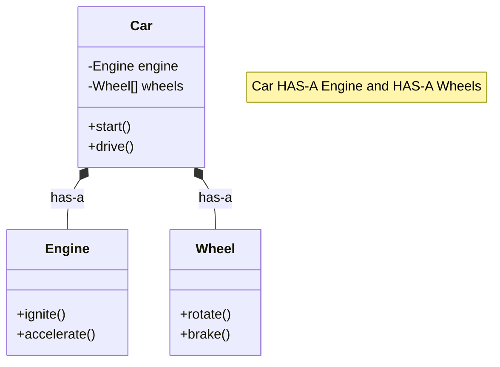

**Key Characteristics:**
- Loose coupling between components
- Flexible relationships that can change at runtime
- Reusability across different contexts
- Easier testing and maintenance

## The Relationship Spectrum

Rather than viewing inheritance and composition as mutually exclusive, consider them as points on a spectrum of object relationships:

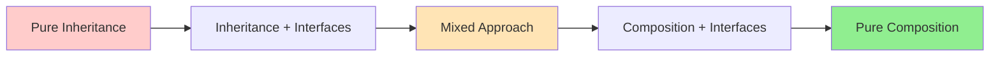

Most real-world systems benefit from a **mixed approach** that uses:
- Inheritance for core "is-a" relationships
- Composition for "has-a" relationships and flexible behavior
- Interfaces/protocols for polymorphism without tight coupling

## Quick Decision Framework

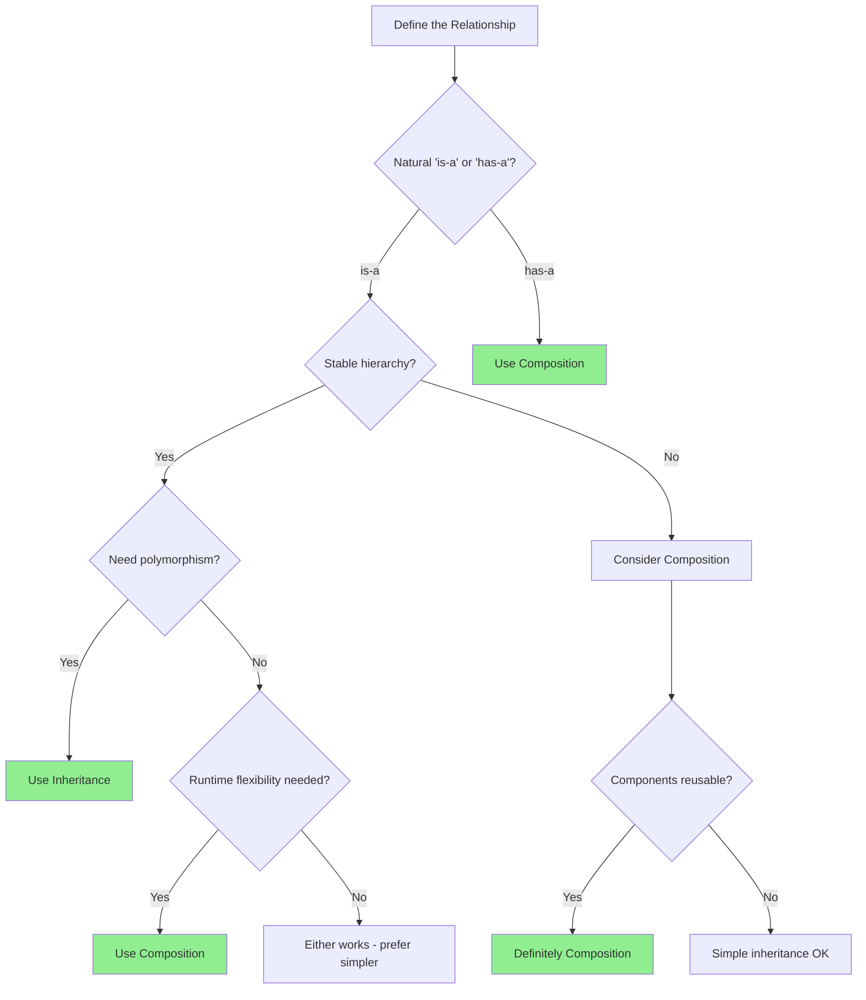

## When Each Approach Shines

### Inheritance is Best For:

1. **Natural Taxonomies**
   - Animal hierarchies (Dog → Mammal → Animal)
   - Shape hierarchies (Circle → Shape)
   - Exception hierarchies (ValueError → Exception)

2. **Polymorphic Behavior**
   - Processing collections of related objects uniformly
   - Plugin architectures with common interfaces
   - Template method patterns

3. **Framework Extension Points**
   - Web framework controllers
   - Game engine components
   - GUI widget hierarchies

### Composition is Best For:

1. **System Architecture**
   - Microservices communication
   - Database access layers
   - Configuration management

2. **Behavioral Flexibility**
   - Strategy patterns (payment processing)
   - State machines (game character states)
   - Decorator patterns (middleware)

3. **Cross-Cutting Concerns**
   - Logging and monitoring
   - Authentication and authorization
   - Caching and performance optimization

## The Power of Combination

The most effective OOP designs combine both approaches strategically:

### Example: Modern Web Application Architecture

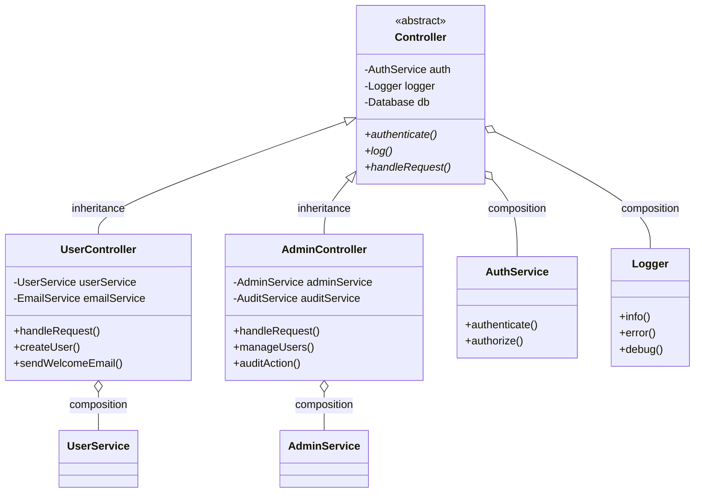

This design uses:
- **Inheritance** for the core controller hierarchy (common request handling)
- **Composition** for services and dependencies (flexibility and testability)

## Advanced Decision Criteria

### Performance Considerations

| Aspect                  | Inheritance                   | Composition                                   |
|-------------------------|-------------------------------|-----------------------------------------------|
| **Method Calls**        | Direct (faster)               | Indirect through delegation (slight overhead) |
| **Memory Usage**        | Lower (shared vtable)         | Higher (object references)                    |
| **Startup Time**        | Faster (less object creation) | Slower (more initialization)                  |
| **Runtime Flexibility** | None                          | High (can swap components)                    |

### Maintainability Factors

| Factor                 | Inheritance                     | Composition                      |
|------------------------|---------------------------------|----------------------------------|
| **Change Impact**      | High (affects entire hierarchy) | Low (localized to components)    |
| **Testing Complexity** | High (requires parent setup)    | Low (mock individual components) |
| **Code Understanding** | Requires hierarchy knowledge    | Clear component boundaries       |
| **Refactoring Ease**   | Difficult (breaking changes)    | Easier (interface-based)         |

### Team and Project Considerations

**Choose Inheritance When:**
- Team is familiar with the domain
- Requirements are stable
- Performance is critical
- Clear hierarchical relationships exist

**Choose Composition When:**
- Requirements change frequently
- Multiple teams work on different components
- Testing is a priority
- System needs to integrate with various external services

## Comprehensive Decision Framework

### The SOLID Principles Lens

Both inheritance and composition support SOLID principles, but in different ways:

#### Single Responsibility Principle (SRP)
- **Inheritance**: Can violate SRP when parent classes become too broad
- **Composition**: Naturally supports SRP through focused components

#### Open/Closed Principle (OCP)
- **Inheritance**: Extension through subclassing (closed for modification)
- **Composition**: Extension through new components (open for extension)

#### Liskov Substitution Principle (LSP)
- **Inheritance**: Must ensure child objects can replace parent objects
- **Composition**: Less relevant since components aren't substitutes

#### Interface Segregation Principle (ISP)
- **Inheritance**: Can force unnecessary methods on subclasses
- **Composition**: Allows selective interface implementation

#### Dependency Inversion Principle (DIP)
- **Inheritance**: High-level modules depend on concrete parent classes
- **Composition**: Both depend on abstractions (interfaces)

### Detailed Decision Matrix

| Scenario                            | Inheritance Score | Composition Score | Recommendation |
|-------------------------------------|-------------------|-------------------|----------------|
| **Stable "is-a" relationship**      | ⭐⭐⭐⭐⭐             | ⭐⭐                | Inheritance    |
| **Need polymorphism**               | ⭐⭐⭐⭐⭐             | ⭐⭐⭐               | Inheritance    |
| **Simple hierarchies (2-3 levels)** | ⭐⭐⭐⭐              | ⭐⭐⭐               | Inheritance    |
| **Performance critical**            | ⭐⭐⭐⭐⭐             | ⭐⭐⭐               | Inheritance    |
| **Framework/library design**        | ⭐⭐⭐⭐              | ⭐⭐⭐               | Inheritance    |
|                                     |                   |                   |                |
| **Complex business logic**          | ⭐⭐                | ⭐⭐⭐⭐⭐             | Composition    |
| **Frequent requirement changes**    | ⭐                 | ⭐⭐⭐⭐⭐             | Composition    |
| **Multiple behavioral aspects**     | ⭐⭐                | ⭐⭐⭐⭐⭐             | Composition    |
| **Testability priority**            | ⭐⭐                | ⭐⭐⭐⭐⭐             | Composition    |
| **Team collaboration**              | ⭐⭐                | ⭐⭐⭐⭐⭐             | Composition    |
| **Runtime behavior changes**        | ⭐                 | ⭐⭐⭐⭐⭐             | Composition    |

### Context-Specific Guidelines

#### Domain Modeling
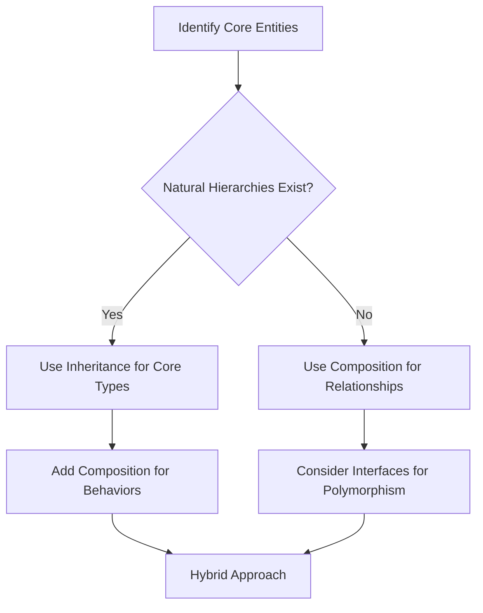

**Example Decisions:**
- **E-commerce System**: Product inheritance (Book → Product), Order composition (has items, payment, shipping)
- **Game Engine**: Entity inheritance (Character → GameObject), Component composition (Physics, Rendering, AI)
- **Banking System**: Account inheritance (Savings → Account), Service composition (has notification, audit, security)

#### Architecture Patterns

| Pattern                 | Primary Approach | Secondary Approach | Rationale                                                           |
|-------------------------|------------------|--------------------|---------------------------------------------------------------------|
| **MVC**                 | Composition      | Inheritance        | Controllers composed of services; view inheritance for UI hierarchy |
| **Microservices**       | Composition      | Interface          | Services communicate through composition; shared interfaces         |
| **Plugin Architecture** | Inheritance      | Composition        | Plugin base classes; composed with host services                    |
| **Event-Driven**        | Composition      | Inheritance        | Event handlers as components; event type hierarchies                |

### Migration Strategies

#### From Inheritance to Composition

**When to Migrate:**
- Deep inheritance hierarchies (>4 levels)
- Frequent requirement changes breaking LSP
- Testing becomes difficult
- Multiple inheritance conflicts

**Migration Steps:**
1. **Identify Core Behaviors**: Extract common functionality into components
2. **Create Interfaces**: Define contracts for component interactions
3. **Implement Components**: Move behavior from parent classes to components
4. **Update Client Code**: Change from inheritance to composition relationships
5. **Remove Inheritance**: Keep only essential hierarchies

**Example Migration:**
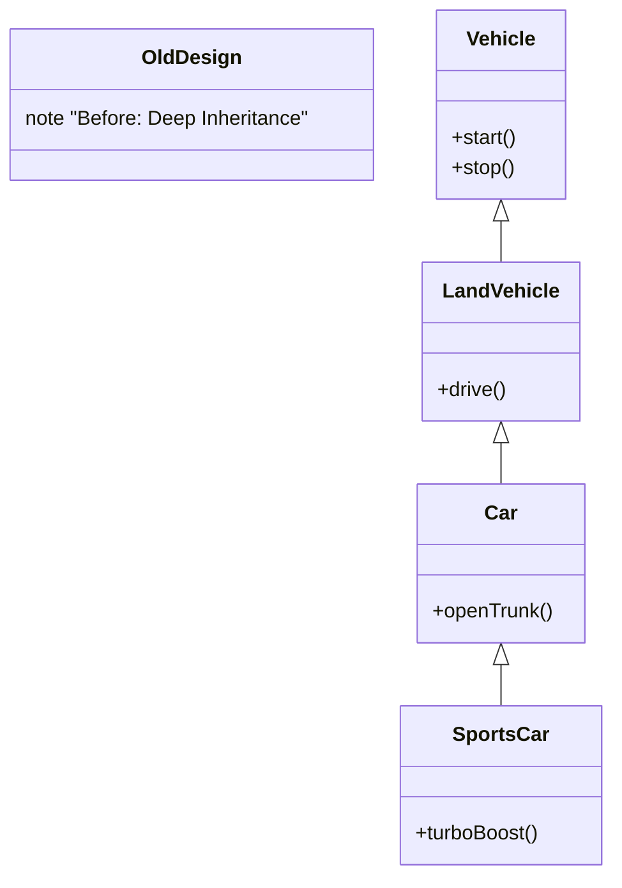

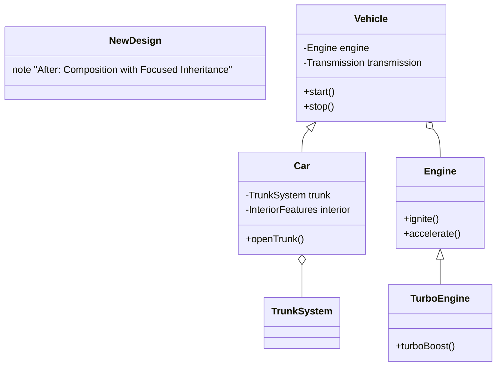

#### From Composition to Inheritance

**When to Consider:**
- Stable, well-understood domain
- Performance becomes critical
- Simple, clear hierarchical relationships emerge
- Excessive delegation overhead

**Migration Considerations:**
- Only migrate when "is-a" relationships are genuinely stable
- Maintain interfaces for continued flexibility
- Consider a hybrid approach rather than pure inheritance

### Anti-Patterns to Avoid

#### Inheritance Anti-Patterns

1. **Refused Bequest**: Child classes that don't use inherited functionality
   ```python
   class Bird:
       def fly(self): pass

   class Penguin(Bird):  # Antipattern: Penguins can't fly
       def fly(self): raise NotImplementedError
   ```

2. **Deep Hierarchy Syndrome**: More than 4 levels of inheritance
   ```
   Object → Animal → Mammal → Carnivore → Feline → DomesticCat → PersianCat
   ```

3. **Implementation Inheritance**: Inheriting for code reuse, not "is-a"
   ```python
   class Stack(List):  # Antipattern: Stack is not a List
       pass
   ```

#### Composition Anti-Patterns

1. **Anemic Objects**: Objects that are just data holders
   ```python
   class Order:  # Anti-pattern: No behavior, just data
       def __init__(self, items, total):
           self.items = items
           self.total = total
   ```

2. **God Object**: One object that knows about too many components
   ```python
   class Application:  # Antipattern: Controls everything
       def __init__(self):
           self.db = Database()
           self.ui = UserInterface()
           self.network = NetworkManager()
           self.file_system = FileManager()
           # ... 20 more components
   ```

3. **Inappropriate Intimacy**: Components knowing too much about each other's internals
   ```python
   class Car:
       def __init__(self):
           self.engine = Engine()

       def start(self):
           self.engine.spark_plugs.ignite()  # Anti-pattern: Too specific
   ```

### Language-Specific Decision Factors

#### Python
- **Strengths**: Multiple inheritance with MRO, duck typing, flexible composition
- **Recommendations**: Prefer composition for most cases; use inheritance for clear taxonomies
- **Special Considerations**: Mixins for shared behavior, protocols for typing

#### Java/C#
- **Strengths**: Single inheritance + interfaces, strong typing, reflection
- **Recommendations**: Use interfaces extensively; composition for complex business logic
- **Special Considerations**: Dependency injection frameworks favor composition

#### Go
- **Strengths**: No inheritance, embedding, implicit interfaces
- **Recommendations**: Composition-first by design; embedding for "is-a" semantics
- **Special Considerations**: Interface segregation is natural

#### Rust
- **Strengths**: No inheritance, traits, zero-cost abstractions
- **Recommendations**: Traits for shared behavior; composition for complex types
- **Special Considerations**: Ownership model influences design decisions

## Hybrid Design Patterns: Best of Both Worlds

Real-world systems rarely use pure inheritance or pure composition. The most effective designs combine both approaches strategically. Here are proven patterns that leverage the strengths of each.

### Pattern 1: Template Method + Strategy (Inheritance + Composition)

**Problem**: You need a common algorithm structure but with customizable steps.

**Solution**: Use inheritance for the algorithm template and composition for interchangeable strategies.

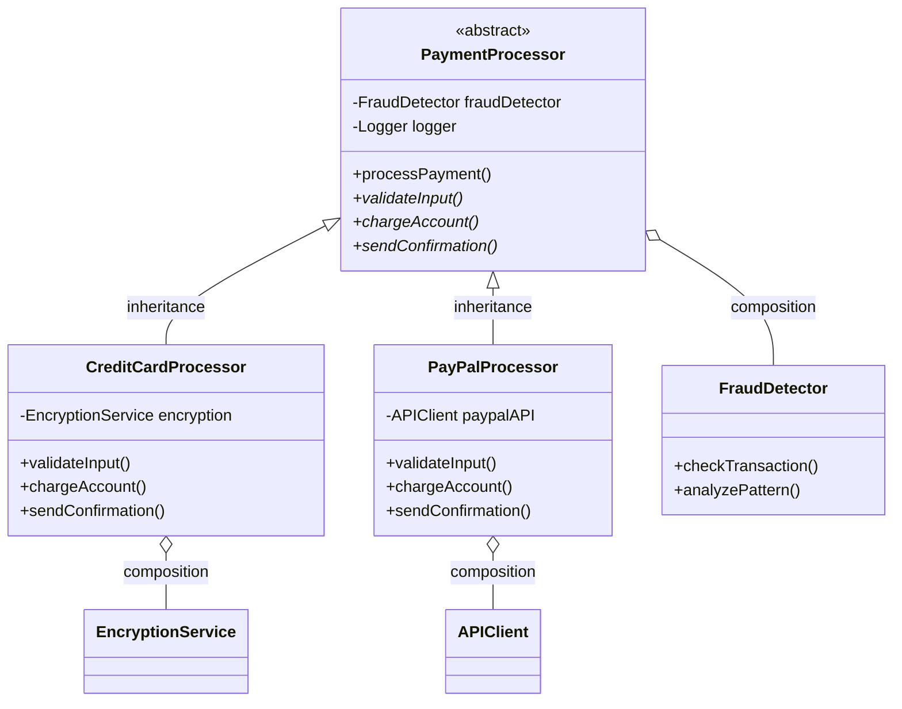

**Benefits:**
- Common workflow through inheritance
- Flexible fraud detection and logging through composition
- Easy to add new payment types
- Testable components

### Pattern 2: Entity-Component-System (ECS)

**Problem**: Game objects need diverse, combinable behaviors without deep inheritance hierarchies.

**Solution**: Use shallow inheritance for entity types and composition for component systems.

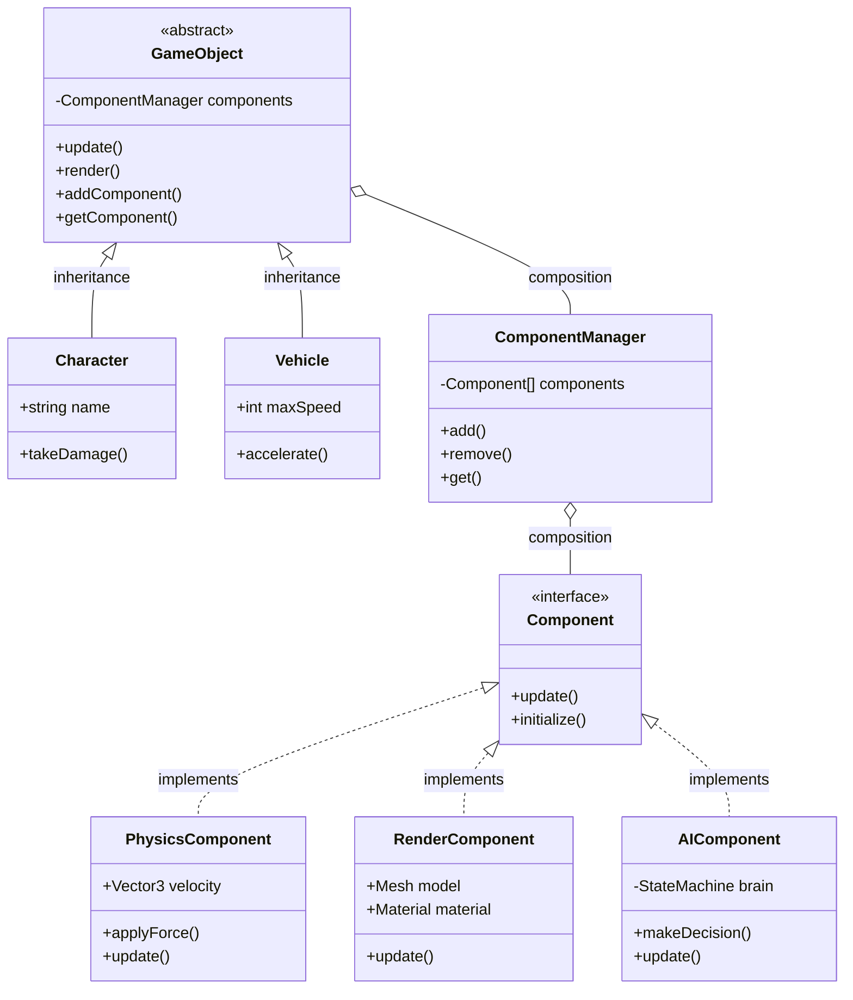

**Benefits:**
- Entity types through inheritance provide structure
- Components through composition provide unlimited flexibility
- Systems can process components independently
- Easy to create new entity types and behaviors

### Pattern 3: Layered Architecture with Specialized Services

**Problem**: Web applications need a consistent structure but specialized behavior per domain.

**Solution**: Use inheritance for application layers and composition for domain services.

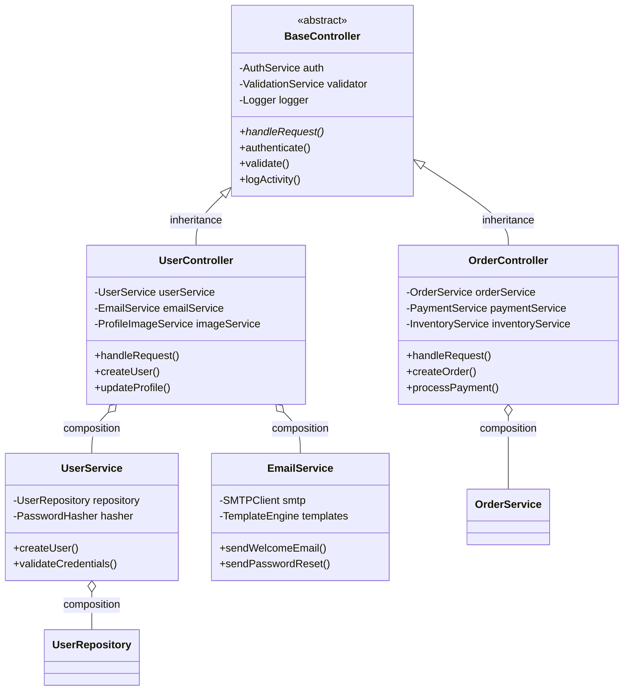

**Benefits:**
- Consistent request handling through inheritance
- Specialized business logic through composition
- Easy to test individual services
- Clear separation of concerns

### Pattern 4: Plugin Architecture with Extension Points

**Problem**: Create extensible applications where third parties can add functionality.

**Solution**: Use inheritance for plugin contracts and composition for plugin implementation.

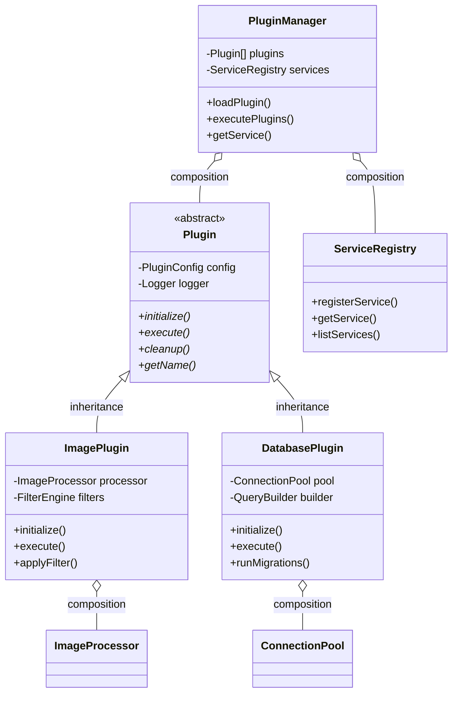

**Benefits:**
- Plugin contract through inheritance ensures consistency
- Implementation flexibility through composition
- Host application provides services through composition
- Plugins can be developed independently

### Pattern 5: Observer + Command with Inheritance Hierarchies

**Problem**: Event-driven systems with typed events and hierarchical command structures.

**Solution**: Use inheritance for event and command hierarchies, composition for observers and handlers.

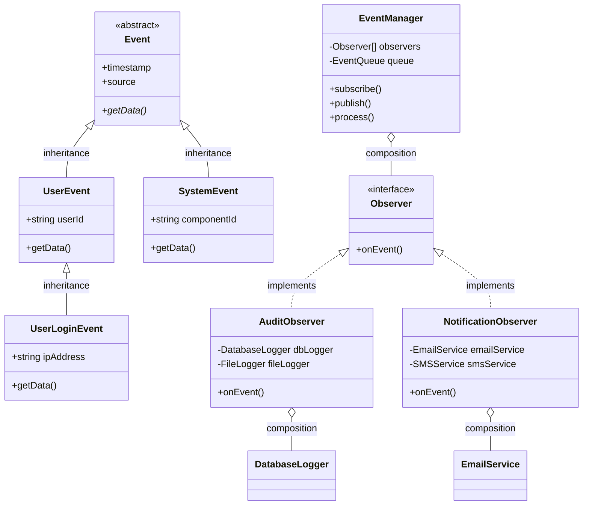

**Benefits:**
- Event taxonomy through inheritance enables type-safe handling
- Observer implementation through composition allows flexible responses
- Easy to add new event types and observers
- Loose coupling between event sources and handlers

### Pattern 6: State Machine with Polymorphic States

**Problem**: Complex state machines where states have both common behavior and state-specific logic.

**Solution**: Use inheritance for state hierarchy and composition for state context and actions.

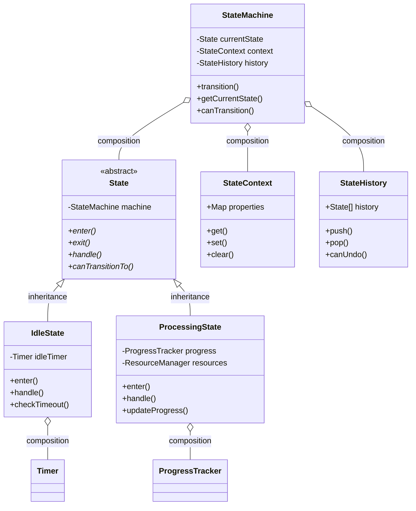

**Benefits:**
- State behavior hierarchy through inheritance
- Context and history management through composition
- Type-safe state transitions
- Easy to add new states and behaviors

### Choosing the Right Hybrid Pattern

| Use Case             | Inheritance For                       | Composition For                       | Key Benefit                  |
|----------------------|---------------------------------------|---------------------------------------|------------------------------|
| **Framework Design** | Common interfaces, base functionality | Plugin implementations, services      | Extensibility + Consistency  |
| **Game Development** | Entity types, component interfaces    | Component implementations, systems    | Performance + Flexibility    |
| **Web Applications** | Controller/service base classes       | Business logic, external integrations | Structure + Testability      |
| **Event Systems**    | Event hierarchies, handler interfaces | Event processing, side effects        | Type Safety + Loose Coupling |
| **State Machines**   | State hierarchies, transition rules   | State context, actions                | Polymorphism + Encapsulation |
| **Plugin Systems**   | Plugin contracts, host interfaces     | Plugin implementations, host services | Consistency + Extensibility  |

### Implementation Guidelines

#### 1. Start with Composition
- Begin with composition-based design
- Add inheritance when clear "is-a" relationships emerge
- Keep inheritance hierarchies shallow (2-3 levels max)

#### 2. Use Interfaces as Bridges
- Define interfaces between inheritance and composition boundaries
- Allow composition-based implementations of inherited contracts
- Enable testing with mock implementations

#### 3. Separate Structure from Behavior
- Use inheritance for structural relationships and contracts
- Use composition for behavioral implementation and business logic
- This separation improves flexibility and testability

#### 4. Consider Evolution Paths
- Design for change by preferring composition in business logic
- Use inheritance for stable, foundational relationships
- Plan migration paths from inheritance to composition if needed

## Language-Specific Implementation Strategies

Different programming languages provide varying levels of support for inheritance and composition. Understanding these differences is crucial for making informed design decisions.

### Python: The Flexible Giant

Python's dynamic nature makes it exceptionally flexible for both inheritance and composition patterns.

#### Inheritance Features
- **Multiple Inheritance**: Python supports multiple inheritance with Method Resolution Order (MRO)
- **Dynamic Method Resolution**: Methods can be added/modified at runtime
- **Duck Typing**: No explicit interfaces needed; "if it walks like a duck..."

```python
# Multiple inheritance with MRO
class Flyable:
    def fly(self):
        return "Flying high!"

class Swimmable:
    def swim(self):
        return "Swimming fast!"

class Duck(Flyable, Swimmable):  # Multiple inheritance
    def quack(self):
        return "Quack!"

# MRO: Duck -> Flyable -> Swimmable -> object
```

#### Composition Patterns
```python
# Composition with dependency injection
class EmailService:
    def __init__(self, smtp_client, template_engine):
        self.smtp = smtp_client
        self.templates = template_engine

    def send_email(self, to, template, data):
        content = self.templates.render(template, data)
        return self.smtp.send(to, content)

# Protocol-based composition (Python 3.8+)
from typing import Protocol

class Drawable(Protocol):
    def draw(self) -> None: ...

class Canvas:
    def __init__(self):
        self.shapes: list[Drawable] = []

    def add_shape(self, shape: Drawable):
        self.shapes.append(shape)
```

**Python Recommendations:**
- Use inheritance for clear taxonomies (Exception hierarchies, ABC patterns)
- Prefer composition for business logic and complex behaviors
- Leverage mixins for shared functionality across unrelated classes
- Use protocols (typing) for structural subtyping without inheritance

### Java: The Enterprise Workhorse

Java's design emphasizes strong typing and clear contracts through interfaces.

#### Inheritance Patterns
```java
// Single inheritance with interface implementation
public abstract class Animal {
    protected String name;

    public Animal(String name) {
        this.name = name;
    }

    public abstract void makeSound();

    public void sleep() {
        System.out.println(name + " is sleeping");
    }
}

public interface Flyable {
    void fly();
    default void land() {
        System.out.println("Landing safely");
    }
}

public class Bird extends Animal implements Flyable {
    public Bird(String name) {
        super(name);
    }

    @Override
    public void makeSound() {
        System.out.println("Tweet!");
    }

    @Override
    public void fly() {
        System.out.println(name + " is flying");
    }
}
```

#### Composition with Dependency Injection
```java
// Spring-style dependency injection
@Service
public class OrderService {
    private final PaymentProcessor paymentProcessor;
    private final InventoryService inventoryService;
    private final EmailService emailService;

    @Autowired
    public OrderService(PaymentProcessor paymentProcessor,
                       InventoryService inventoryService,
                       EmailService emailService) {
        this.paymentProcessor = paymentProcessor;
        this.inventoryService = inventoryService;
        this.emailService = emailService;
    }

    public Order processOrder(OrderRequest request) {
        // Business logic using composed services
        inventoryService.reserveItems(request.getItems());
        PaymentResult payment = paymentProcessor.process(request.getPayment());

        if (payment.isSuccessful()) {
            Order order = createOrder(request, payment);
            emailService.sendConfirmation(order);
            return order;
        }
        throw new PaymentException("Payment failed");
    }
}
```

**Java Recommendations:**
- Use interfaces extensively for contracts and polymorphism
- Prefer composition with dependency injection for business logic
- Use inheritance for framework extension points and clear hierarchies
- Leverage annotations for declarative programming patterns

### Go: Composition by Design

Go explicitly avoids inheritance, promoting composition through embedding and interfaces.

#### Struct Embedding (Composition)
```go
// Composition through embedding
type Engine struct {
    Horsepower int
    Type       string
}

func (e *Engine) Start() {
    fmt.Printf("Starting %s engine with %d HP\n", e.Type, e.Horsepower)
}

type Car struct {
    Engine    // Embedded struct - composition
    Brand     string
    Model     string
    doors     int
}

func (c *Car) Drive() {
    c.Start() // Method from embedded Engine
    fmt.Printf("Driving %s %s\n", c.Brand, c.Model)
}

// Interface-based polymorphism
type Vehicle interface {
    Start()
    Drive()
}

func StartVehicle(v Vehicle) {
    v.Start()
    v.Drive()
}
```

#### Interface Segregation
```go
// Small, focused interfaces
type Reader interface {
    Read([]byte) (int, error)
}

type Writer interface {
    Write([]byte) (int, error)
}

type ReadWriter interface {
    Reader
    Writer
}

// Composition with interface satisfaction
type FileProcessor struct {
    reader Reader
    writer Writer
    logger Logger
}

func NewFileProcessor(r Reader, w Writer, l Logger) *FileProcessor {
    return &FileProcessor{
        reader: r,
        writer: w,
        logger: l,
    }
}
```

**Go Recommendations:**
- Use embedding for "is-a-kind-of" relationships
- Design small, focused interfaces
- Compose behavior through interface implementations
- Leverage implicit interface satisfaction for loose coupling

### C#: The Balanced Approach

C# provides both inheritance and composition features with strong typing support.

#### Inheritance with Properties
```csharp
public abstract class Shape
{
    public abstract double Area { get; }
    public abstract double Perimeter { get; }

    public virtual void Display()
    {
        Console.WriteLine($"Area: {Area}, Perimeter: {Perimeter}");
    }
}

public class Rectangle : Shape
{
    public double Width { get; set; }
    public double Height { get; set; }

    public override double Area => Width * Height;
    public override double Perimeter => 2 * (Width + Height);
}
```

#### Composition with Generics
```csharp
// Generic composition pattern
public class Repository<T> where T : class
{
    private readonly IDbContext _context;
    private readonly ILogger<Repository<T>> _logger;

    public Repository(IDbContext context, ILogger<Repository<T>> logger)
    {
        _context = context;
        _logger = logger;
    }

    public async Task<T> GetByIdAsync(int id)
    {
        _logger.LogInformation($"Fetching {typeof(T).Name} with ID {id}");
        return await _context.Set<T>().FindAsync(id);
    }
}

// Service composition
public class UserService
{
    private readonly Repository<User> _userRepository;
    private readonly IPasswordHasher _passwordHasher;
    private readonly IEmailService _emailService;

    public UserService(Repository<User> userRepository,
                      IPasswordHasher passwordHasher,
                      IEmailService emailService)
    {
        _userRepository = userRepository;
        _passwordHasher = passwordHasher;
        _emailService = emailService;
    }
}
```

**C# Recommendations:**
- Use interfaces and abstract classes for contracts
- Leverage dependency injection containers for composition
- Use generics to create reusable composed components
- Apply SOLID principles through interface design

### Rust: Safety Through Composition

Rust's ownership model naturally favors composition over inheritance.

#### Trait-Based Behavior
```rust
// Traits define behavior contracts
trait Drawable {
    fn draw(&self);
}

trait Movable {
    fn move_to(&mut self, x: f64, y: f64);
}

// Composition through struct fields
struct Circle {
    center: Point,
    radius: f64,
    color: Color,
}

impl Drawable for Circle {
    fn draw(&self) {
        println!("Drawing circle at {:?} with radius {}",
                self.center, self.radius);
    }
}

impl Movable for Circle {
    fn move_to(&mut self, x: f64, y: f64) {
        self.center.x = x;
        self.center.y = y;
    }
}

// Generic composition
struct Canvas<T: Drawable> {
    shapes: Vec<T>,
}

impl<T: Drawable> Canvas<T> {
    fn render(&self) {
        for shape in &self.shapes {
            shape.draw();
        }
    }
}
```

#### Zero-Cost Abstractions
```rust
// Composition with zero runtime cost
struct DatabaseConnection {
    pool: ConnectionPool,
    config: DatabaseConfig,
}

impl DatabaseConnection {
    fn execute_query<T>(&self, query: &str) -> Result<T, DatabaseError>
    where
        T: DeserializeOwned
    {
        let conn = self.pool.get_connection()?;
        let result = conn.execute(query)?;
        serde_json::from_str(&result).map_err(DatabaseError::from)
    }
}

// Trait objects for dynamic dispatch when needed
trait PaymentProcessor {
    fn process(&self, amount: Money) -> Result<PaymentResult, PaymentError>;
}

struct PaymentService {
    processors: Vec<Box<dyn PaymentProcessor>>,
}
```

**Rust Recommendations:**
- Use traits for shared behavior across types
- Compose functionality through struct fields and trait implementations
- Leverage zero-cost abstractions for performance
- Use trait objects sparingly when dynamic dispatch is needed

### JavaScript/TypeScript: The Dynamic Duo

JavaScript's prototype-based inheritance and TypeScript's structural typing offer unique opportunities.

#### JavaScript Prototype Patterns
```javascript
// Prototype-based inheritance
function Animal(name) {
    this.name = name;
}

Animal.prototype.speak = function() {
    console.log(`${this.name} makes a sound`);
};

function Dog(name, breed) {
    Animal.call(this, name);
    this.breed = breed;
}

Dog.prototype = Object.create(Animal.prototype);
Dog.prototype.constructor = Dog;

Dog.prototype.speak = function() {
    console.log(`${this.name} barks`);
};

// Modern class syntax (syntactic sugar)
class Cat extends Animal {
    constructor(name, color) {
        super(name);
        this.color = color;
    }

    speak() {
        console.log(`${this.name} meows`);
    }
}
```

#### Composition Patterns
```javascript
// Mixin pattern
const Flyable = {
    fly() {
        console.log(`${this.name} is flying`);
    }
};

const Swimmable = {
    swim() {
        console.log(`${this.name} is swimming`);
    }
};

// Factory with composition
function createDuck(name) {
    const duck = {
        name,
        speak() {
            console.log(`${this.name} quacks`);
        }
    };

    return Object.assign(duck, Flyable, Swimmable);
}
```

#### TypeScript Interface Composition
```typescript
// Interface composition
interface Readable {
    read(): string;
}

interface Writable {
    write(data: string): void;
}

interface ReadWritable extends Readable, Writable {}

// Generic composition
class DataProcessor<T> {
    constructor(
        private reader: Readable,
        private writer: Writable,
        private transformer: (data: string) => T
    ) {}

    process(): T {
        const data = this.reader.read();
        const transformed = this.transformer(data);
        this.writer.write(JSON.stringify(transformed));
        return transformed;
    }
}

// Union types for flexible composition
type PaymentMethod = CreditCard | PayPal | BankTransfer;

class PaymentService {
    processPayment(method: PaymentMethod, amount: number): PaymentResult {
        switch (method.type) {
            case 'credit-card':
                return this.processCreditCard(method, amount);
            case 'paypal':
                return this.processPayPal(method, amount);
            case 'bank-transfer':
                return this.processBankTransfer(method, amount);
        }
    }
}
```

**JavaScript/TypeScript Recommendations:**
- Use classes for clear hierarchical relationships
- Prefer composition and mixins for a flexible behavior combination
- Leverage TypeScript interfaces for structural contracts
- Use union types and discriminated unions for type-safe composition

### Language Comparison Summary

| Language       | Inheritance Strength             | Composition Strength           | Best Practice                                |
|----------------|----------------------------------|--------------------------------|----------------------------------------------|
| **Python**     | Multiple inheritance, dynamic    | Duck typing, protocols         | Composition-first with strategic inheritance |
| **Java**       | Single + interfaces, annotations | DI frameworks, strong typing   | Interface-driven composition                 |
| **Go**         | None (by design)                 | Embedding, implicit interfaces | Composition-only with interface contracts    |
| **C#**         | Single + interfaces, generics    | DI containers, strong typing   | Balanced approach with SOLID principles      |
| **Rust**       | None (traits instead)            | Zero-cost traits, ownership    | Trait-based composition for performance      |
| **JavaScript** | Prototype-based, flexible        | Mixins, dynamic objects        | Flexible composition with type safety in TS  |

### Cross-Language Patterns

Regardless of language, certain patterns consistently work well:

1. **Interface Segregation**: Small, focused contracts
2. **Dependency Injection**: Externally provided dependencies
3. **Strategy Pattern**: Interchangeable algorithms through composition
4. **Template Method**: Common structure with inheritance, flexible implementation with composition
5. **Observer Pattern**: Event-driven composition with inheritance hierarchies for event types
