# Object-Oriented Programming: Aggregation

## What is Aggregation?

Aggregation is a specialized form of association in Object-Oriented Programming (OOP) that represents a "whole-part" or "has-a" relationship between objects where the parts can exist independently of the whole. It's a weaker form of composition where the contained objects have their own lifecycle and can exist without the container object.

Think of aggregation like assembling a team from existing employees, creating a playlist from existing songs, or forming a committee from existing members - the parts (employees, songs, members) exist independently and can survive even if the whole (team, playlist, committee) is dissolved.

## Real-Life Analogy

Imagine you're organizing a sports team:

**Aggregation approach:**
- A team "has" players
- Players exist independently of the team
- When a team is disbanded, players continue to exist
- Players can be part of multiple teams (different seasons, different sports)
- The team aggregates existing players rather than creating them

**Contrast with Composition:**
- A house "has" rooms (composition - rooms don't exist without the house)
- A car "has" an engine (composition - engine is built for that specific car)

**Contrast with Inheritance:**
- A player "is-a" person (inheritance - fundamental identity relationship)

## Aggregation vs. Composition vs. Inheritance

### Key Differences

| Aspect          | Inheritance        | Composition           | Aggregation              |
|-----------------|--------------------|-----------------------|--------------------------|
| Relationship    | "is-a"             | "has-a" (strong)      | "has-a" (weak)           |
| Lifecycle       | Shared             | Child depends on parent| Independent lifecycles   |
| Coupling        | Tight              | Tight                 | Loose                    |
| Part Existence  | N/A                | Parts destroyed with whole | Parts survive independently |
| Ownership       | N/A                | Exclusive ownership   | Shared or temporary ownership |
| Flexibility     | Static             | Moderate              | High                     |

### Visual Comparison

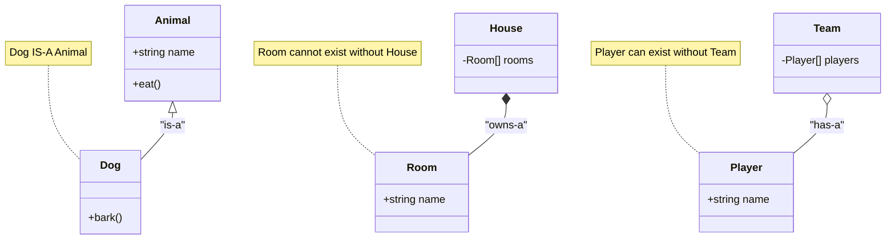

## Types of Aggregation

### 1. Simple Aggregation
Objects are grouped together but maintain complete independence.

**Real-life example: University and Students**

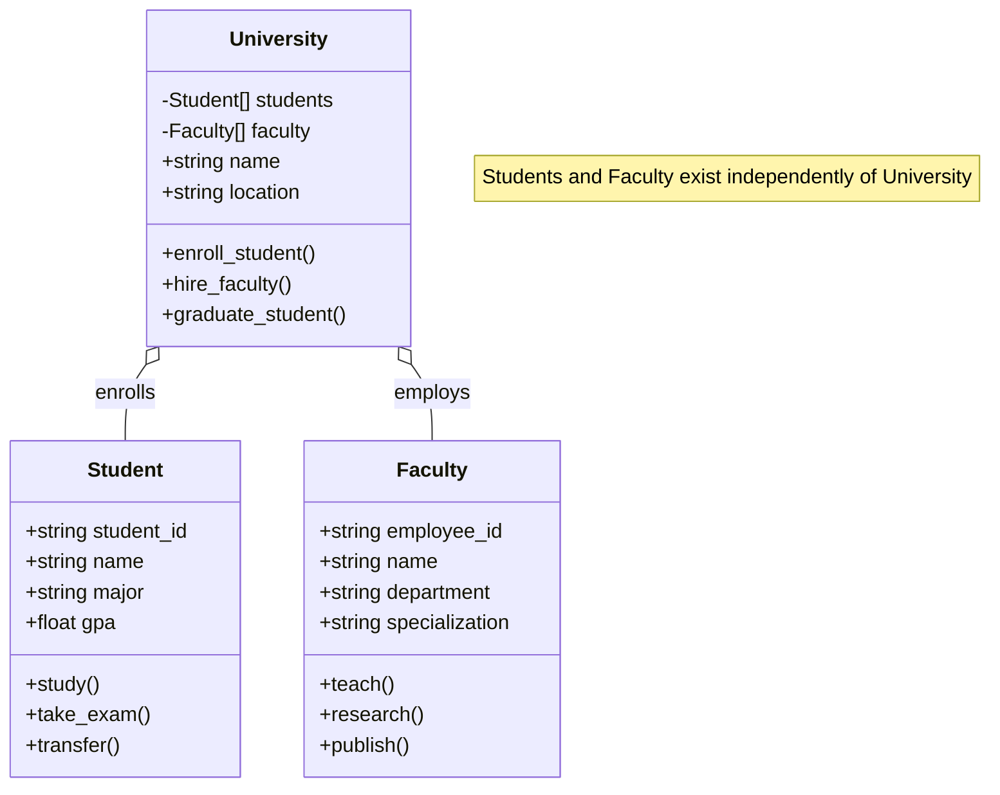

### 2. Shared Aggregation
Objects can be part of multiple aggregates simultaneously.

**Real-life example: Author and Books**

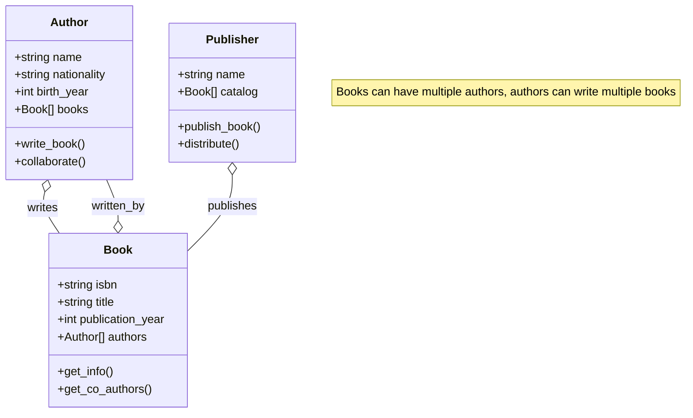

### 3. Temporal Aggregation
Objects are aggregated for a specific time period.

**Real-life example: Project Teams**

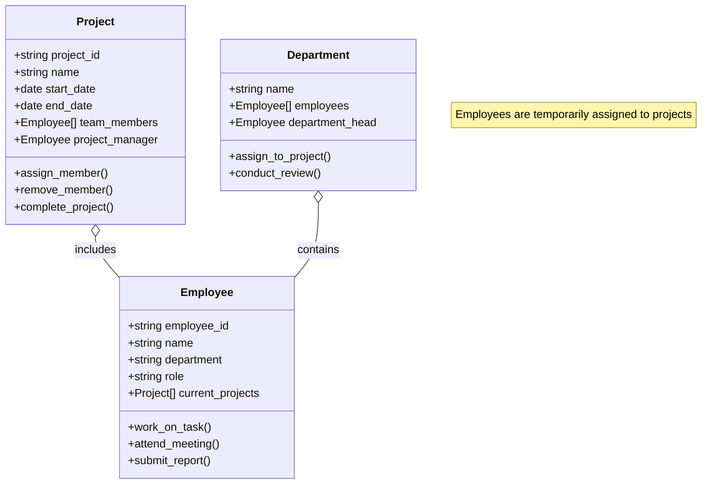

## Real-World Aggregation Examples

### Library System

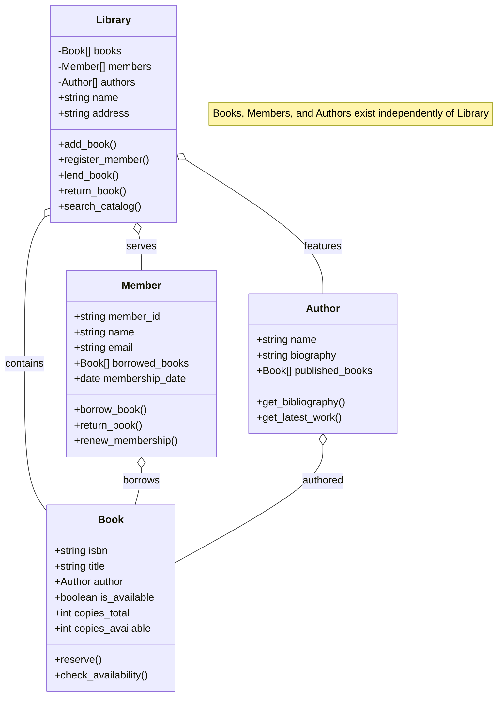

### Music Streaming Platform

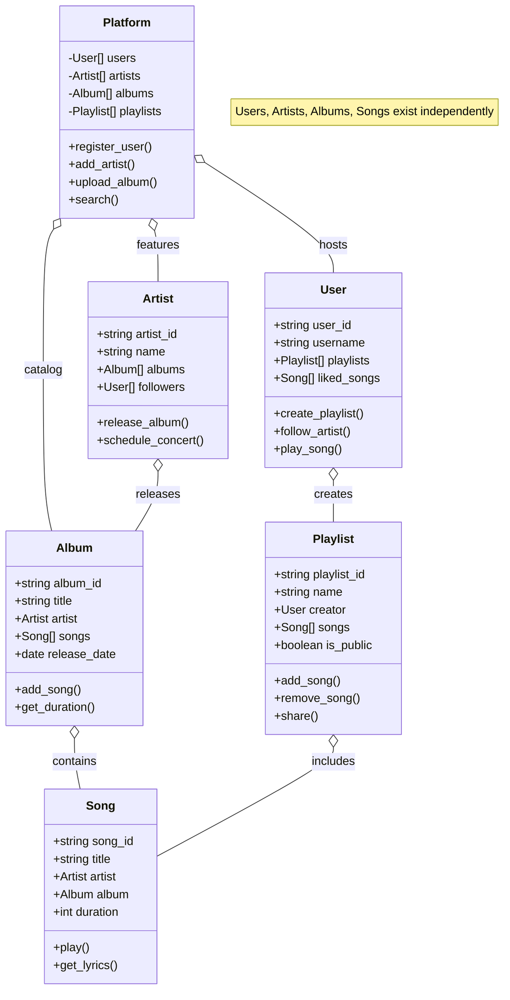

### Social Media Network

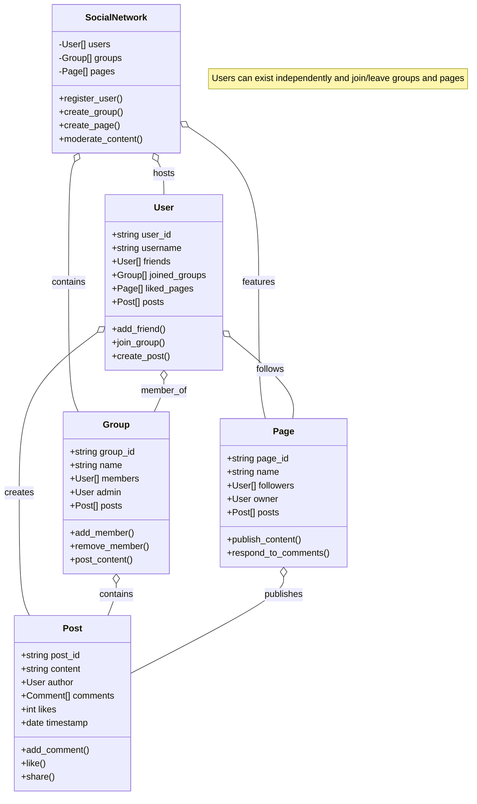

### E-commerce Marketplace

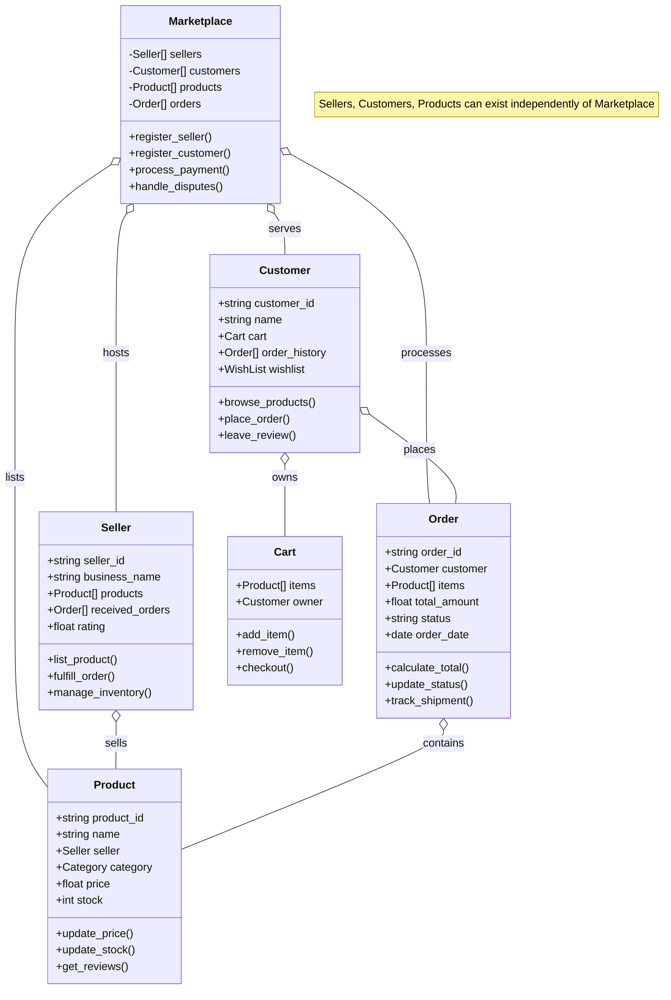

## Aggregation Patterns and Relationships

### 1. Collection Aggregation
Groups of similar objects managed together.

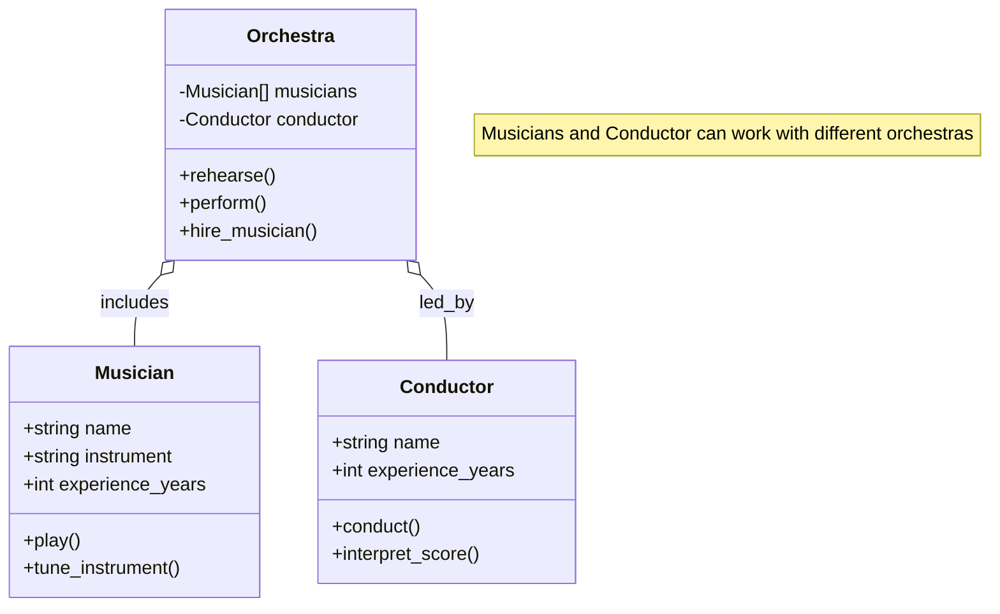

### 2. Registry Aggregation
Central registry managing independent entities.

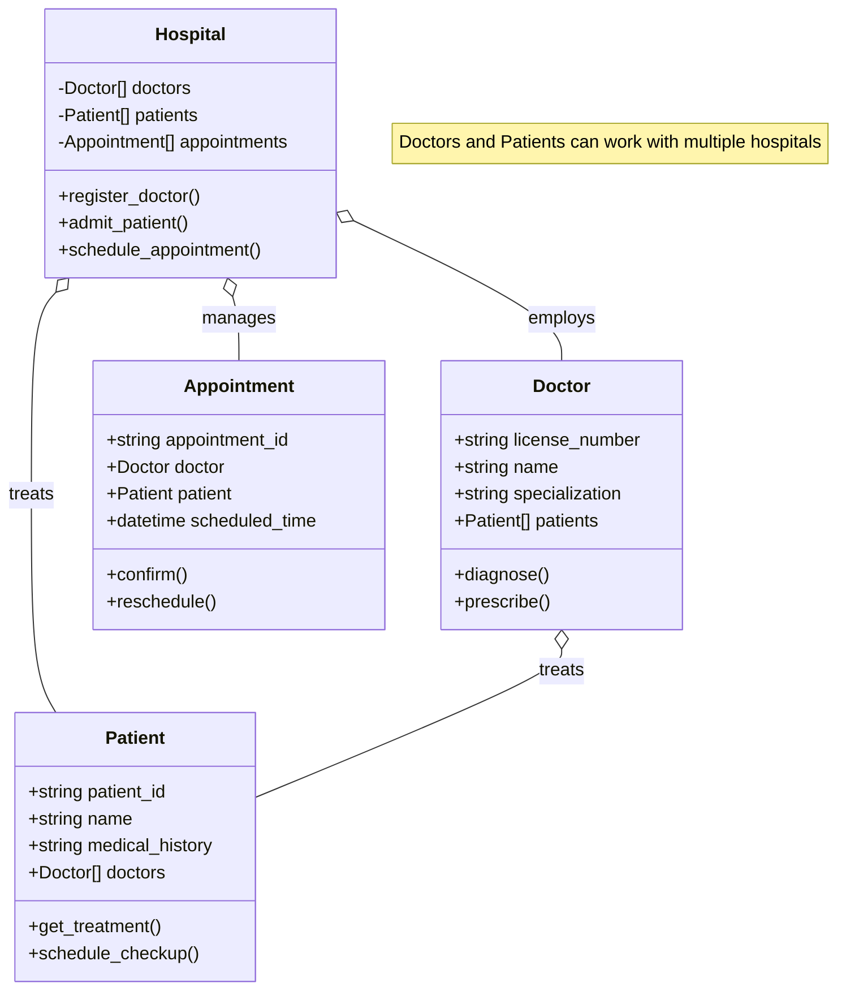

### 3. Hierarchical Aggregation
Nested aggregation relationships.

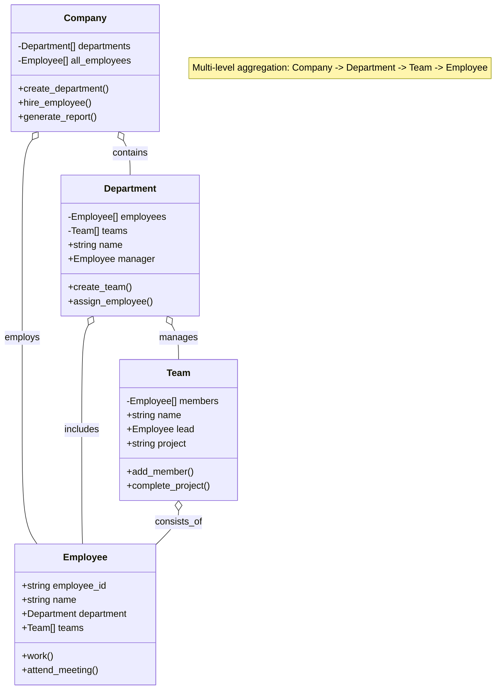

## Key Aggregation Concepts

### 1. Lifecycle Independence
Objects in aggregation maintain their own lifecycle.

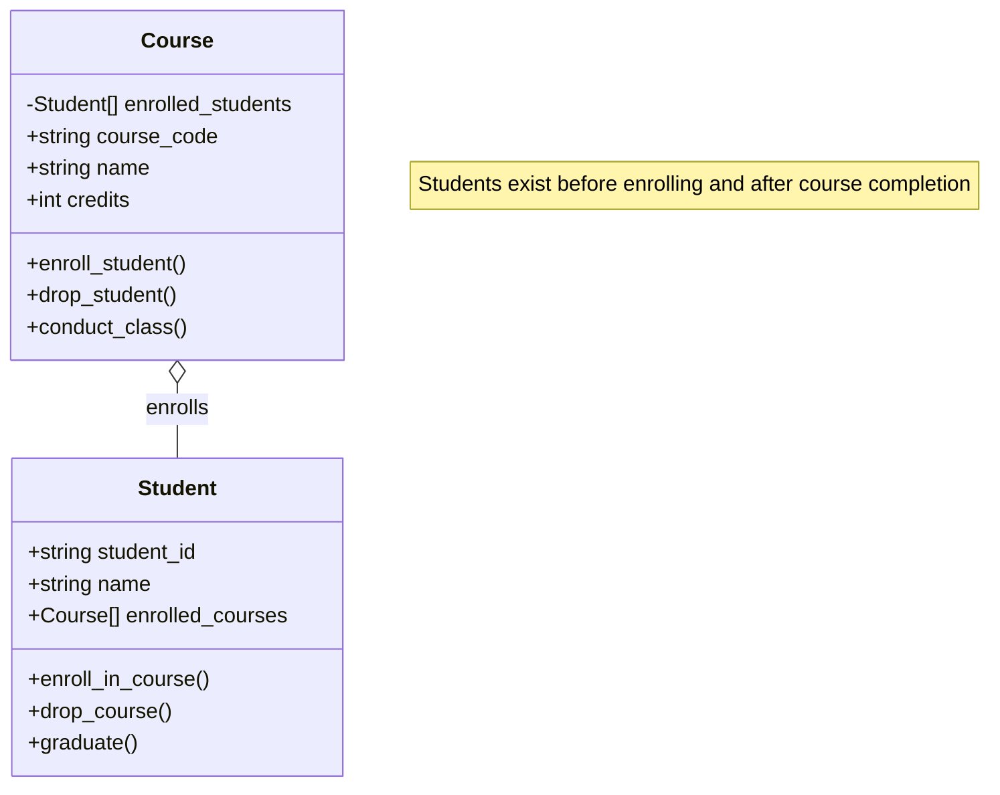

### 2. Shared Ownership
Objects can belong to multiple aggregates.

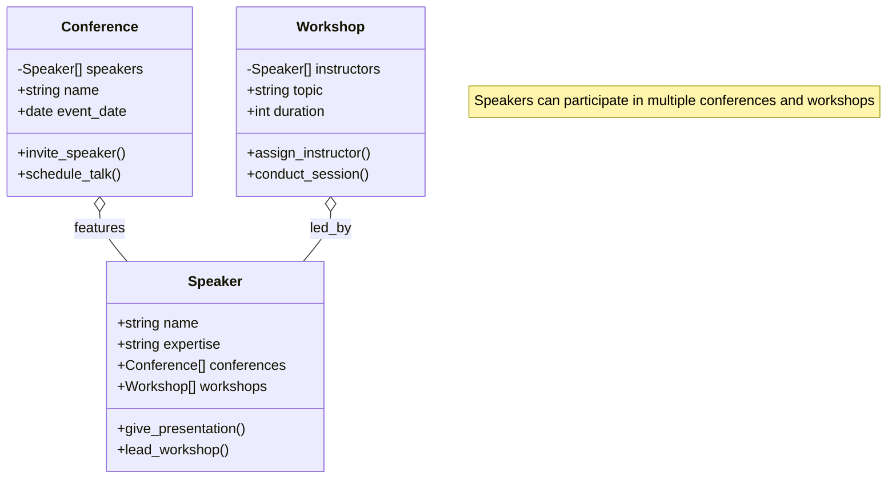

### 3. Dynamic Membership
Objects can join or leave aggregates at runtime.

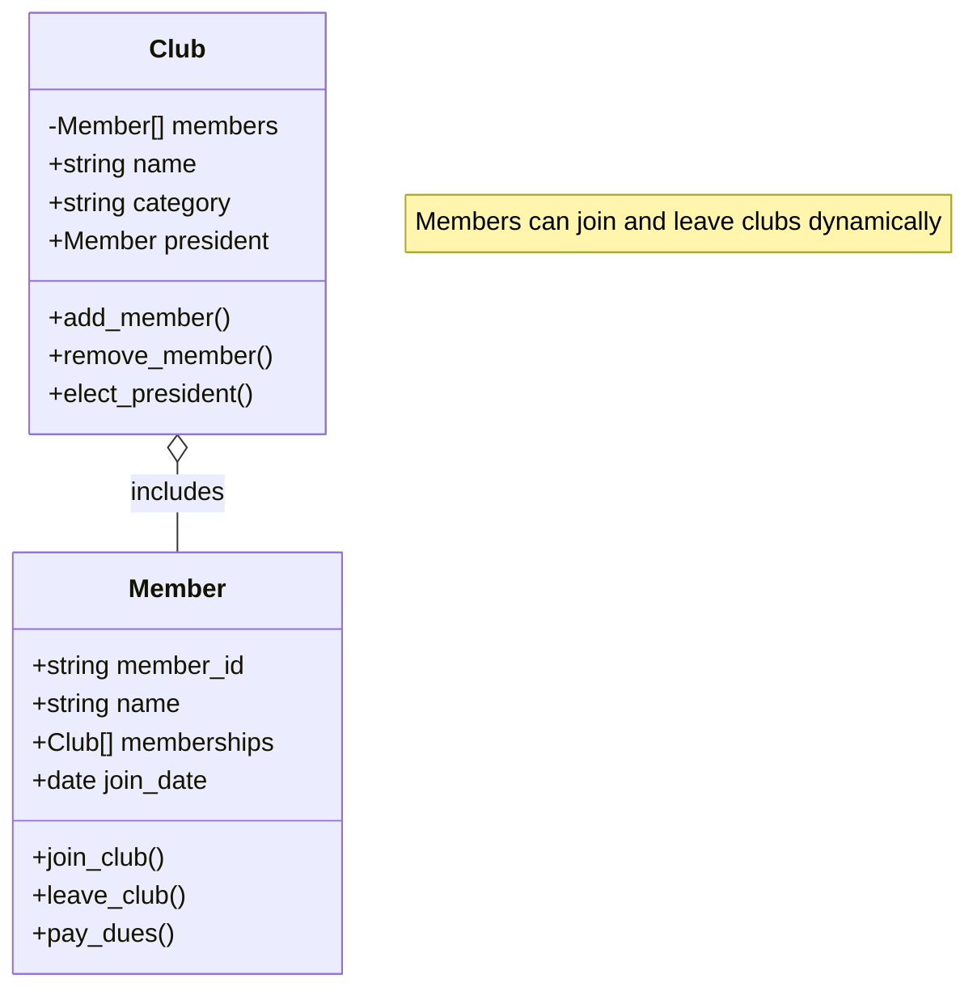

## When to Use Aggregation

### Use Aggregation When:

1. **Objects have independent lifecycles**
   - Students and Universities
   - Employees and Departments
   - Books and Libraries

2. **Shared ownership is natural**
   - Authors and Books
   - Actors and Movies
   - Players and Teams

3. **Relationships are temporary or changeable**
   - Project assignments
   - Committee memberships
   - Course enrollments

4. **Objects existed before the relationship**
   - Adding existing employees to a team
   - Including existing songs in a playlist
   - Inviting existing users to a group

5. **Many-to-many relationships**
   - Students enroll in multiple courses
   - Doctors work at multiple hospitals
   - Authors write for multiple publishers

### Don't Use Aggregation When:

1. **Parts cannot exist without the whole**
   - Rooms in a House (use Composition)
   - Chapters in a Book (use Composition)
   - Organs in a Body (use Composition)

2. **Identity relationship exists**
   - Employee is a Person (use Inheritance)
   - Circle is a Shape (use Inheritance)
   - Dog is an Animal (use Inheritance)

3. **Exclusive ownership is required**
   - Car and Engine (use Composition)
   - Document and Pages (use Composition)
   - Computer and CPU (use Composition)

## Benefits of Aggregation

### 1. **Flexibility**
- Objects can be easily added or removed
- Relationships can change at runtime
- Support for dynamic system reconfiguration

### 2. **Reusability**
- Objects can participate in multiple relationships
- No need to duplicate objects for different contexts
- Efficient resource utilization

### 3. **Independence**
- Objects maintain their own state and behavior
- Changes to one object don't necessarily affect others
- Easier to test and maintain individual objects

### 4. **Scalability**
- Easy to add new objects to existing aggregates
- Support for large-scale distributed systems
- Minimal impact when scaling up or down

### 5. **Real-world Modeling**
- Natural representation of many real-world relationships
- Intuitive for stakeholders to understand
- Easier to map business requirements to code

## Best Practices

### 1. **Clear Ownership Semantics**
- Define who is responsible for managing the relationship
- Establish clear rules for adding/removing objects
- Document lifecycle management responsibilities

### 2. **Maintain Referential Integrity**
- Ensure references remain valid when objects are moved
- Handle cleanup when objects are removed
- Implement proper error handling for invalid references

### 3. **Use Appropriate Data Structures**
- Choose collections that support your access patterns
- Consider performance implications of different containers
- Use weak references when appropriate to avoid memory leaks

### 4. **Design for Change**
- Make it easy to modify relationships
- Provide clear APIs for relationship management
- Consider versioning for evolving aggregation structures

### 5. **Document Relationship Semantics**
- Clearly specify the nature of the aggregation
- Document multiplicity constraints
- Explain business rules governing the relationship

## Common Pitfalls to Avoid

### 1. **Confusing Aggregation with Composition**
- Don't use aggregation when objects cannot exist independently
- Avoid aggregation for exclusive ownership relationships
- Consider the lifecycle implications carefully

### 2. **Memory Management Issues**
- Be careful with circular references
- Use weak references appropriately
- Implement proper cleanup procedures

### 3. **Inconsistent State**
- Maintain bidirectional relationships consistently
- Implement proper synchronization in concurrent environments
- Validate relationship constraints

### 4. **Performance Problems**
- Consider the cost of maintaining large aggregations
- Optimize for common access patterns
- Use lazy loading when appropriate

### 5. **Over-engineering**
- Don't use aggregation when simple references suffice
- Avoid unnecessary complexity in simple scenarios
- Keep the design as simple as possible while meeting requirements

## Language-Specific Considerations

### Python
```python
class Team:
    def __init__(self, name):
        self.name = name
        self.players = []  # Aggregation - players exist independently

    def add_player(self, player):
        if player not in self.players:
            self.players.append(player)
            player.teams.append(self)

    def remove_player(self, player):
        if player in self.players:
            self.players.remove(player)
            player.teams.remove(self)

class Player:
    def __init__(self, name):
        self.name = name
        self.teams = []  # Can be part of multiple teams
```

### Key Language Features for Aggregation:
- **Collections**: Lists, sets, dictionaries for managing aggregated objects
- **Weak References**: To avoid circular reference problems
- **Event Systems**: To notify objects of relationship changes
- **Iterators**: To efficiently traverse aggregated objects

Remember: Aggregation is about modeling relationships where objects collaborate while maintaining their independence. It provides flexibility and reflects many real-world scenarios where entities can exist independently while temporarily or permanently associating with other entities.