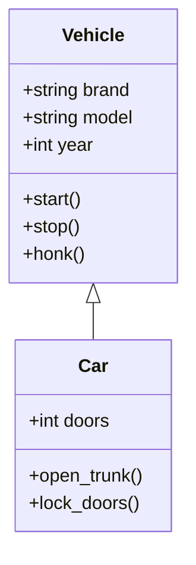
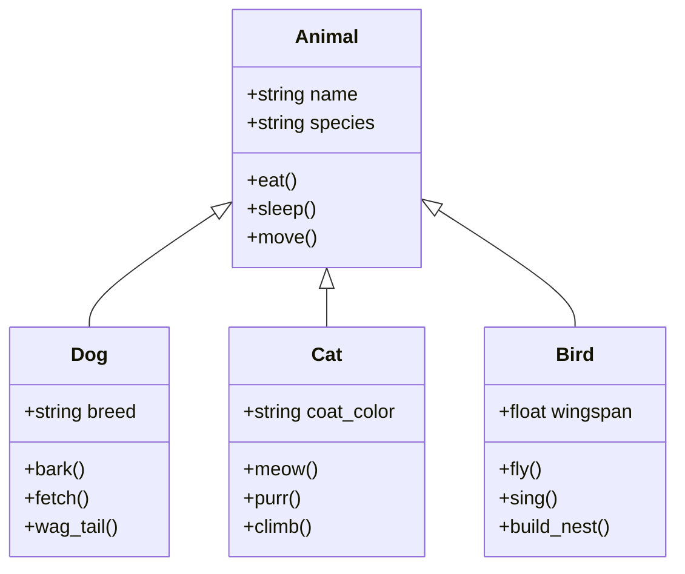
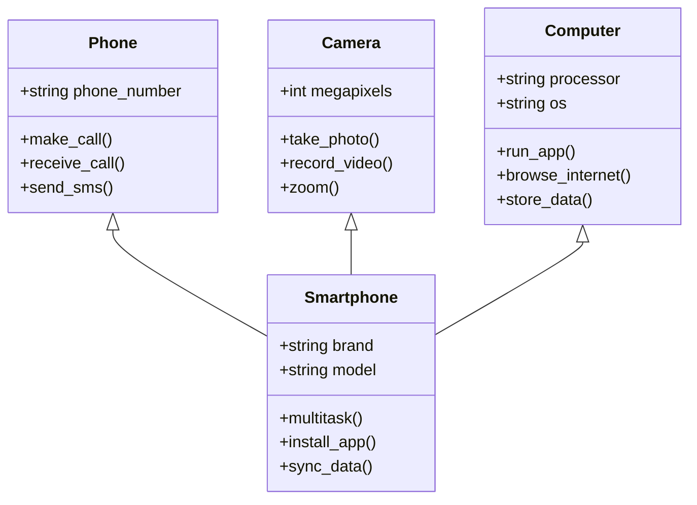
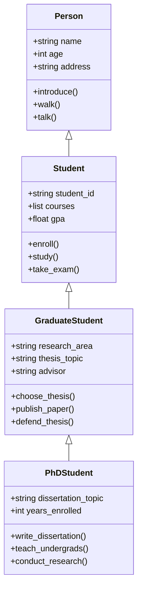
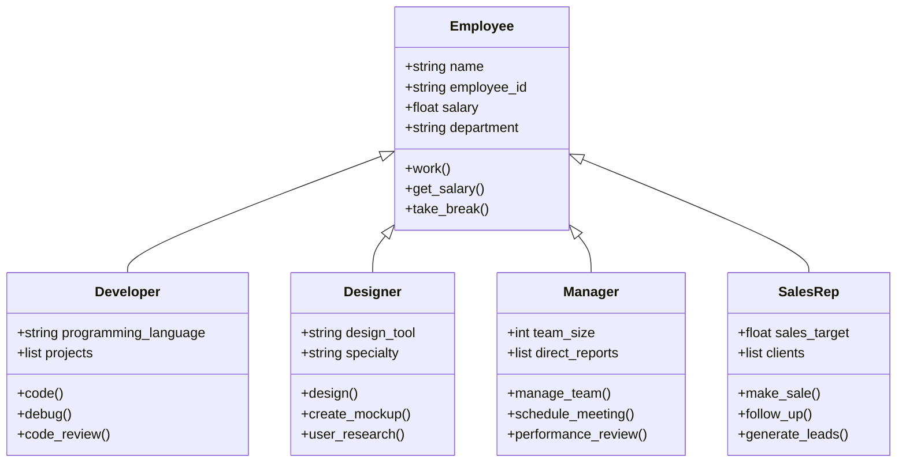
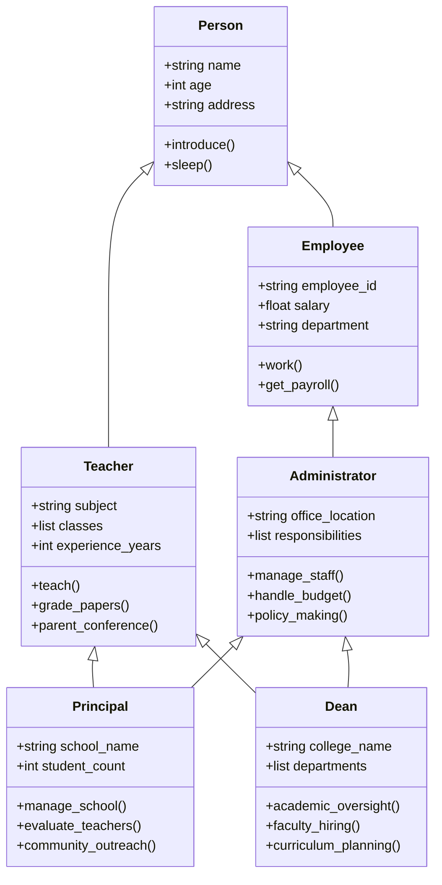
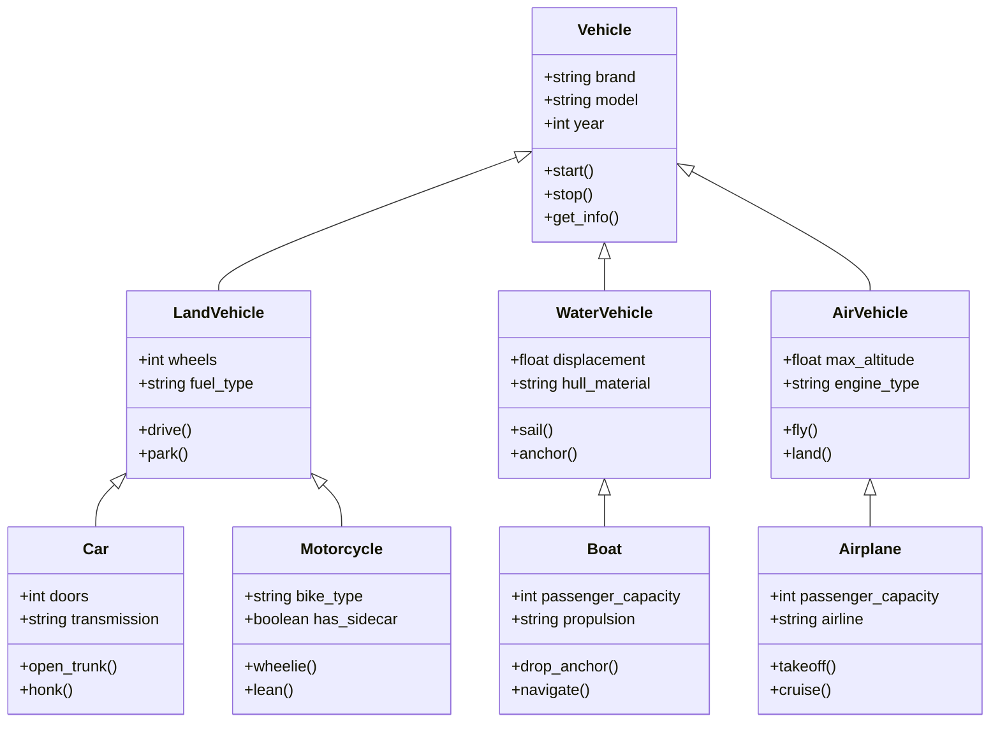
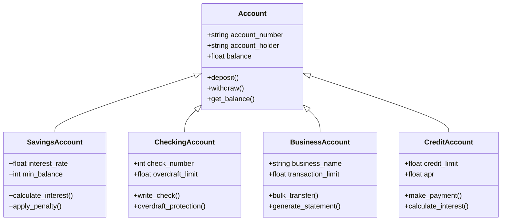
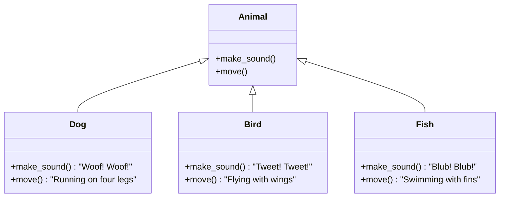
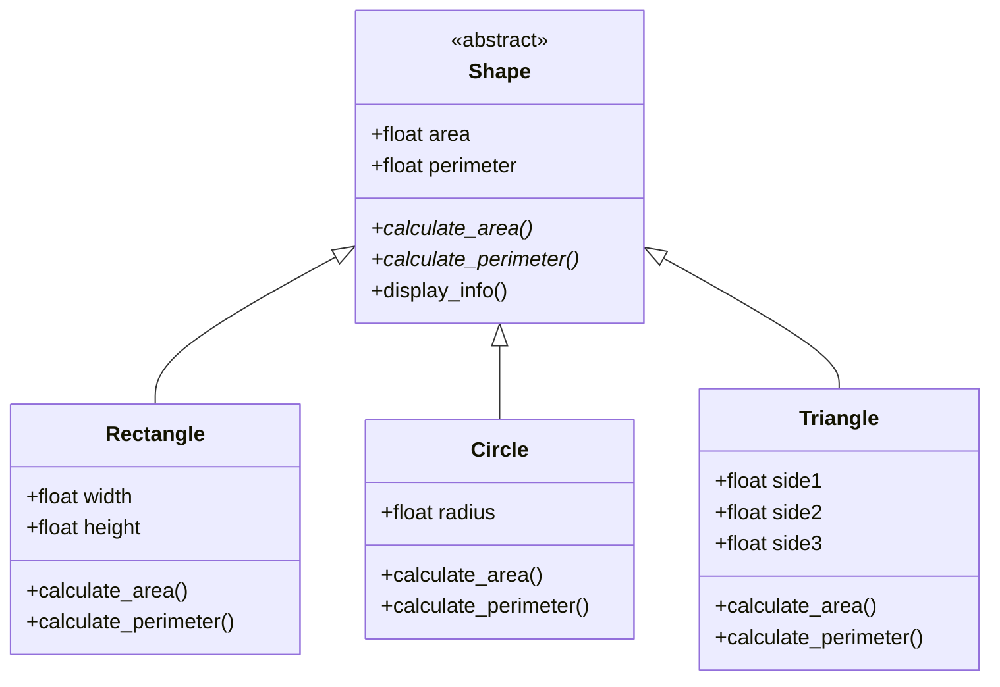

# Object-Oriented Programming: Inheritance

## What is Inheritance?

Inheritance is a fundamental concept in Object-Oriented Programming (OOP) that allows a class to inherit properties and methods from another class. Think of it like a family tree - children inherit traits from their parents, and grandchildren inherit traits from both parents and grandparents.

## Real-Life Analogy

Imagine you're designing a system for different types of vehicles:

- All vehicles have common properties: `brand`, `model`, `year`
- All vehicles can perform common actions: `start()`, `stop()`, `honk()`
- But each type of vehicle has specific features:
    - Cars have `doors` and can `open_trunk()`
    - Motorcycles have `engine_type` and can `pop_wheelie()`
    - Trucks have `cargo_capacity` and can `load_cargo()`

Instead of writing separate classes with duplicate code, inheritance lets us create a base `Vehicle` class and have specific vehicle types inherit from it.

## Basic Inheritance Concept

The arrow `<|--` shows inheritance relationship: Car inherits from Vehicle.
- Car gets all properties and methods from Vehicle
- Car adds its own specific properties and methods
- Car can override Vehicle methods if needed

## Types of Inheritance

### 1. Single Inheritance

One child class inherits from one parent class.

**Real-life example: Animal hierarchy**

### 2. Multiple Inheritance

One child class inherits from multiple parent classes.

**Real-life example: Modern devices**

### 3. Multilevel Inheritance

A chain of inheritance where a class inherits from another class, which itself inherits from another class.

**Real-life example: Academic hierarchy**

### 4. Hierarchical Inheritance

Multiple child classes inherit from the same parent class.

**Real-life example: Employee types in a company**

### 5. Hybrid Inheritance

A combination of multiple inheritance types.

**Real-life example: Academic and administrative roles**

## Inheritance Relationships in Real World

### Transportation System

### Banking System

## Key Concepts to Implement

### Method Overriding
Child classes can override parent methods to provide specific implementations.

### Abstract Base Classes
Some classes are meant to be inherited from, not instantiated directly.

## Benefits of Inheritance

1. **Code Reusability**: Write common code once in the parent class
2. **Maintainability**: Changes to common functionality only need to be made in one place
3. **Extensibility**: Easy to add new types without modifying existing code
4. **Polymorphism**: Different objects can be treated uniformly through their common interface
5. **Hierarchical Organization**: Natural way to organize related classes

## Best Practices

1. **Use inheritance for "is-a" relationships**: A car "is-a" vehicle, a dog "is-an" animal
2. **Keep inheritance hierarchies shallow**: Avoid deep inheritance chains (3-4 levels max)
3. **Use composition for "has-a" relationships**: A car "has-a" engine (don't inherit from engine)
4. **Override methods meaningfully**: Only override when you need different behavior
5. **Follow the Liskov Substitution Principle**: Child objects should be replaceable with parent objects
6. **Use abstract base classes when appropriate**: For classes that shouldn't be instantiated directly

## Common Pitfalls to Avoid

1. **Diamond Problem**: In multiple inheritance, be careful about method resolution order
2. **Tight Coupling**: Don't create overly dependent relationships between classes
3. **Inappropriate Inheritance**: Not every relationship should use inheritance
4. **Deep Hierarchies**: Too many levels make code hard to understand and maintain
5. **Overusing Inheritance**: Sometimes composition or interfaces are better choices

Remember: Inheritance is a powerful tool, but use it wisely. Always ask yourself: "Does this relationship make sense? Is there a simpler way to achieve this?" Focus on creating logical, maintainable hierarchies that reflect real-world relationships.
