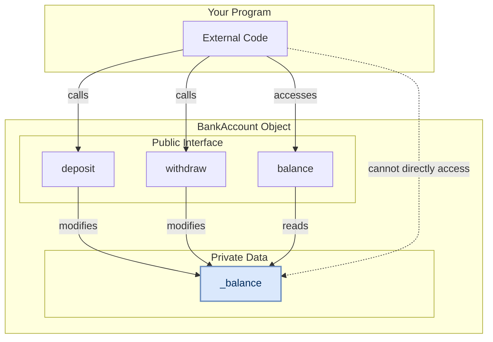

# Object-Oriented Programming: Encapsulation

## What is Encapsulation?

Encapsulation means bundling data (attributes) and the methods that work on that data into a single unit (a class). 

More importantly, it involves **protecting** that data by controlling access to it. Instead of letting other parts of your code change the data directly, you provide safe, public methods to do so.

Think of it as a protective "capsule" around your object's important data.

## A Real-World Analogy: The Bank Account

This is the perfect analogy for encapsulation.

-   **Your Data:** The account balance.
-   **The Problem:** You can't just walk into the bank vault and scribble a new number on your account record. That would be chaos!
-   **The Solution:** You must use a controlled interface—the bank teller. You can ask to `deposit` or `withdraw` money. The teller follows strict rules (e.g., "you can't withdraw more money than you have").

Encapsulation works the same way: it protects your object's data (`balance`) by forcing code to use safe methods (`deposit`, `withdraw`) instead of changing the data directly.

## Naming Conventions for Encapsulation

In Python, we use the prefix of a variable name to indicate how it should be treated. Here is a simple guide:

| Feature                  | `_single_underscore` (Protected)                                                                       | `__double_underscore` (Private)                                                     |
|:-------------------------|:-------------------------------------------------------------------------------------------------------|:------------------------------------------------------------------------------------|
| **What it's called**     | "Protected" by convention.                                                                             | "Private" by convention.                                                            |
| **Main Purpose**         | A **hint** to other developers that a variable or method is intended for internal use only.            | To **avoid name clashes** in child classes when using inheritance.                  |
| **How Python treats it** | **It does nothing.** This is purely a naming convention; the variable is still fully accessible.       | **Name Mangling.** Python automatically changes the name to `_ClassName__variable`. |
| **Can you access it?**   | **Yes**, you can access it directly (e.g., `my_obj._my_var`), but you shouldn't. It's an honor system. | **No, not directly.** Trying `my_obj.__my_var` will cause an `AttributeError`.      |
| **Example**              | `self._balance = 100`                                                                                  | A class `Car` with `self.__vin` becomes accessible as `my_car._Car__vin`.           |

> **Note:** For this tutorial, we will focus on the single underscore (`_`), which is the most common convention for encapsulation.

## Encapsulation in Code: A `BankAccount` Class

Let's see why we need protection for our object's data.

### The Problem: Uncontrolled Access

Without encapsulation, any part of the program could directly change an account's balance to an invalid value, like a negative number. This would put the object in a broken state.

Our object is now in an invalid state. We need to protect the `balance`.

### Solution A: The General Approach (Getter & Setter Methods)

One common way to solve this, especially in other languages, is to use explicit "getter" and "setter" methods. We make the attribute "private" with an underscore and require all access to go through these methods.

This approach involves making the `balance` variable private and creating two public methods: a `get_balance()` method to read the value, and a `set_balance()` method. The `set_balance()` method contains logic to check if a new amount is valid (e.g., greater than or equal to zero) before making the change.
This works and our data is safe. However, it's a bit verbose to call methods like `get_balance()` all the time.

### Solution B: The Pythonic Approach (`@property`)

Python provides a more elegant way to do the exact same thing. The `@property` decorator lets us create getter and setter logic but access the variable as if it were a simple attribute.

Python's preferred solution uses a 'property'. It allows you to hide the private `balance` variable but still access it using the simple `account.balance` syntax. Behind the scenes, your validation logic automatically runs whenever the balance is changed, providing protection without the need for explicit `get_` and `set_` methods.
With `@property`, we get the best of both worlds: the simple, clean syntax of direct access, combined with the safety and control of getter and setter methods.

## Visualizing Encapsulation

The public methods and properties form a protective barrier around the internal data.

## Key Takeaways

-   **Encapsulation bundles data and methods together.**
-   **It protects data.** You control how attributes are read and changed.
-   In Python, use a single underscore (`_`) to mark data as internal (e.g., `_balance`).
-   Use `@property` and `@*.setter` to create a safe, public way to access that internal data.on, use a single underscore (`_`) to mark data as internal (e.g., `_balance`).
-   Use `@property` and `@*.setter` to create a safe, public way to access that internal data.le E fill:#dae8fc,stroke:#6c8ebf,stroke-width:2px,color:#002b5c

## Key Takeaways

-   **Encapsulation bundles data and methods together.**
-   **It protects data.** You control how attributes are read and changed.
-   In Python, use a single underscore (`_`) to mark data as internal (e.g., `_balance`).
-   Use `@property` and `@*.setter` to create a safe, public way to access that internal data.
