# Object-Oriented Programming: Composition

## What is Composition?

Composition is a fundamental design principle in Object-Oriented Programming (OOP) where objects are built by combining other objects as components. Instead of inheriting behavior from parent classes, composition creates complex objects by assembling simpler objects that work together.

Think of composition as building something from parts - like assembling a computer from CPU, RAM, and storage components, or building a car from an engine, wheels, and transmission.

## Real-Life Analogy

Imagine you're building a house:

**Inheritance approach** would be like saying:
- A house "is-a" building
- A mansion "is-a" house
- A cottage "is-a" house

**Composition approach** would be like saying:
- A house "has-a" roof
- A house "has-a" foundation
- A house "has-a" kitchen
- A house "has-a" bedroom

With composition, you can mix and match components: a house can have a modern kitchen, traditional bedrooms, and a solar roof - all independent components working together.

## Composition vs. Inheritance

### Key Differences

| Aspect       | Inheritance                 | Composition                          |
|--------------|-----------------------------|--------------------------------------|
| Relationship | "is-a" relationship         | "has-a" relationship                 |
| Coupling     | Tight coupling              | Loose coupling                       |
| Flexibility  | Fixed at compile time       | Can change at runtime                |
| Code Reuse   | Through class hierarchy     | Through object delegation            |
| Testing      | Harder to test in isolation | Easier to test components separately |
| Dependency   | Child depends on parent     | Components are independent           |

### Inheritance Example
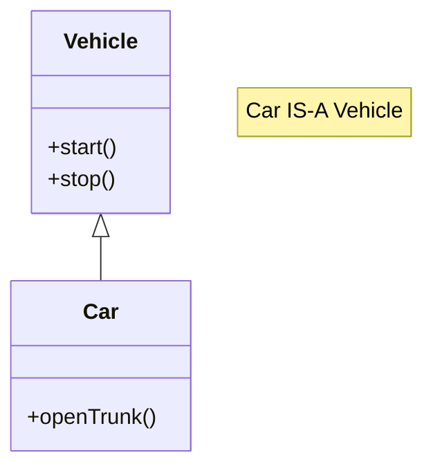

### Composition Example
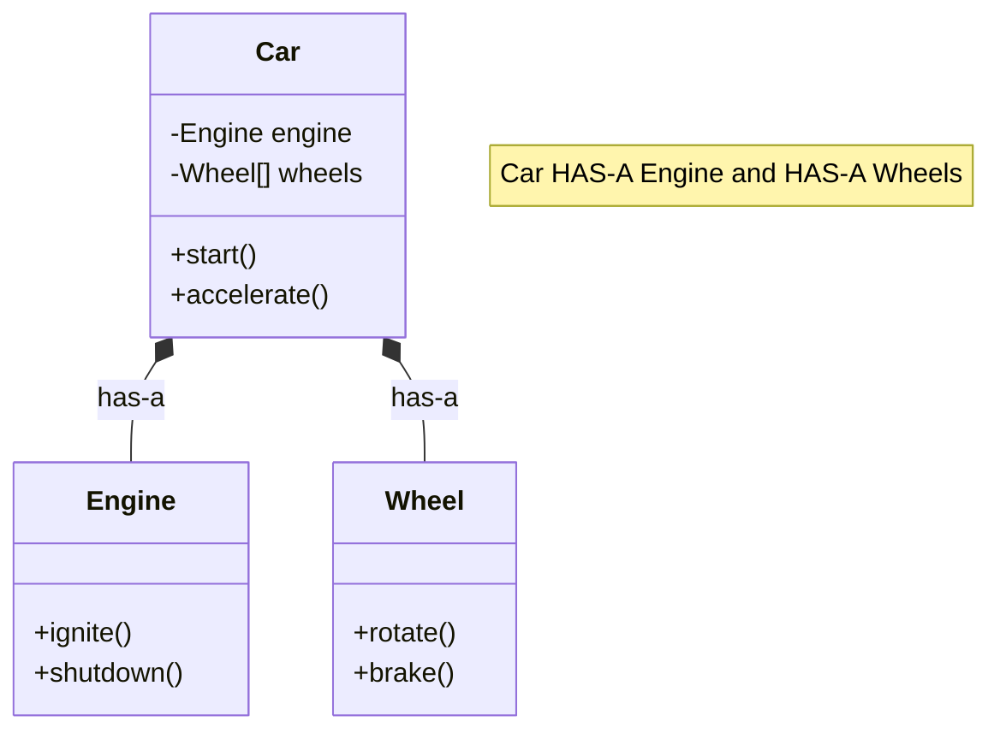

## Types of Composition Relationships

### 1. Composition (Strong "Has-A")
The contained objects cannot exist without the container. When the container is destroyed, all its components are also destroyed.

**Real-life example: House and Rooms**

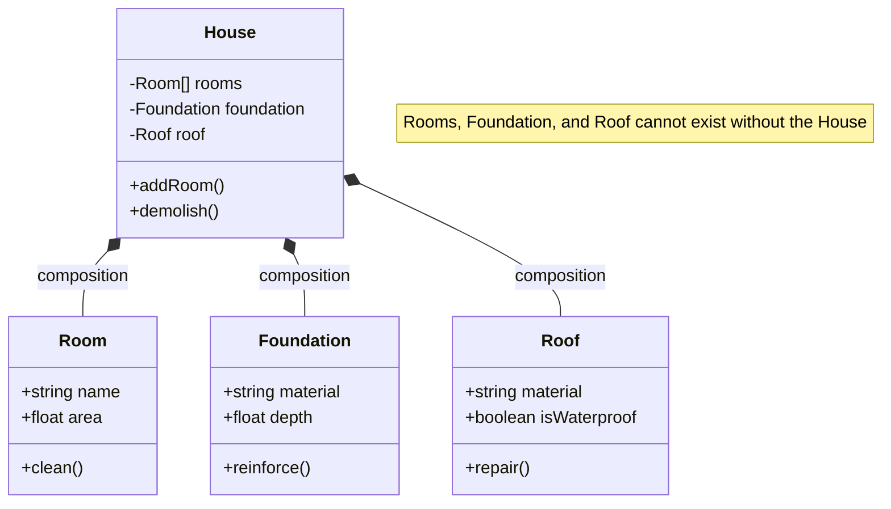

### 2. Aggregation (Weak "Has-A")
The contained objects can exist independently of the container. When the container is destroyed, the components can still exist.

**Real-life example: Department and Employees**

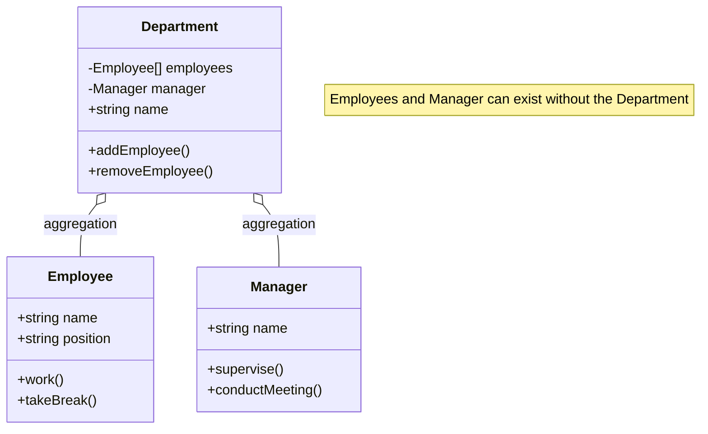

## Real-World Composition Examples

### Computer System

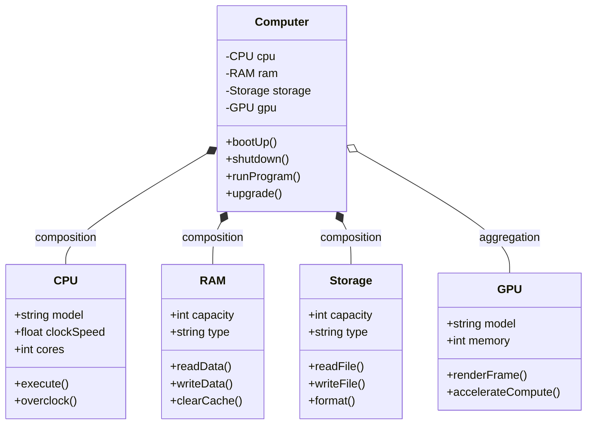

### Automotive System

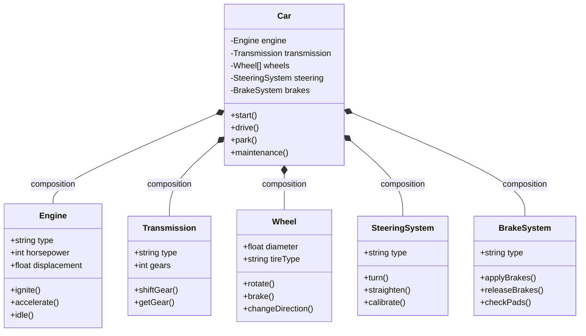

### Library Management System

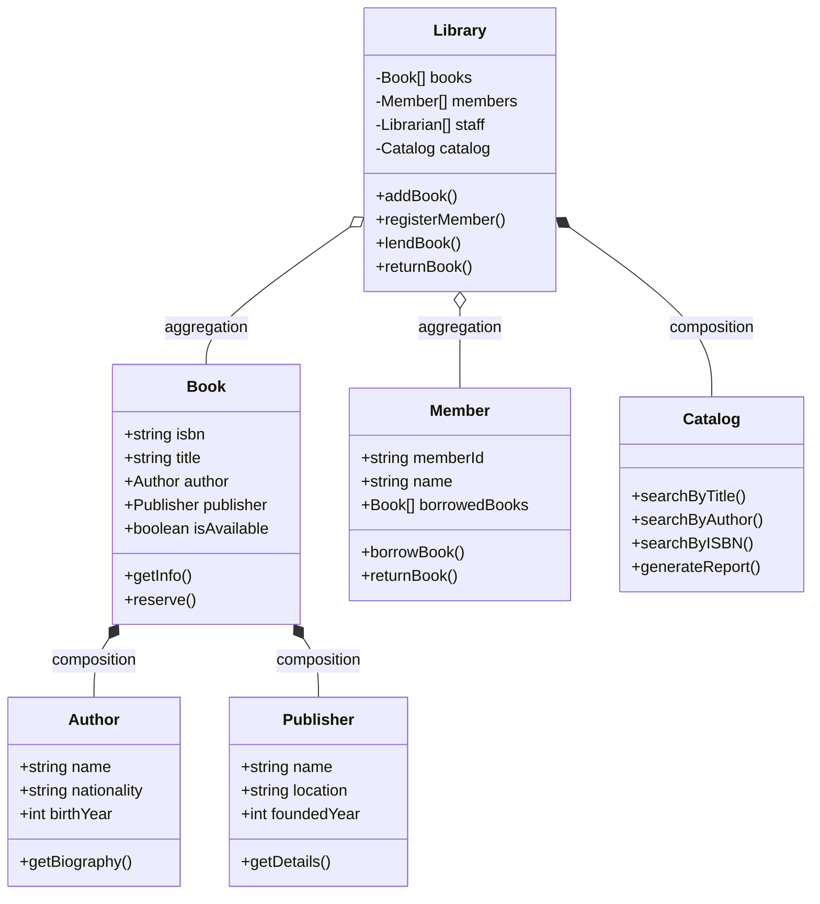

### University System

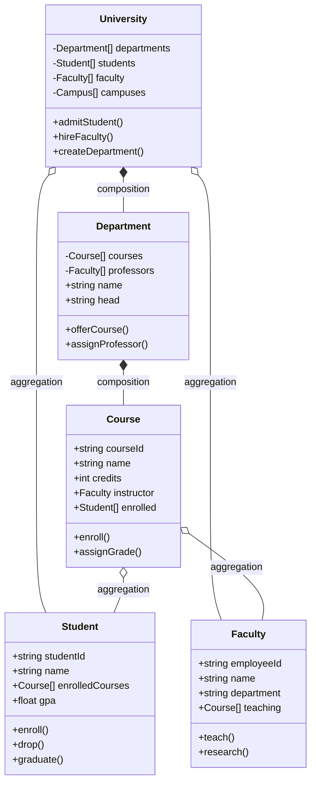

## Key Composition Concepts

### 1. Dependency Injection
Components are provided from outside rather than created internally.

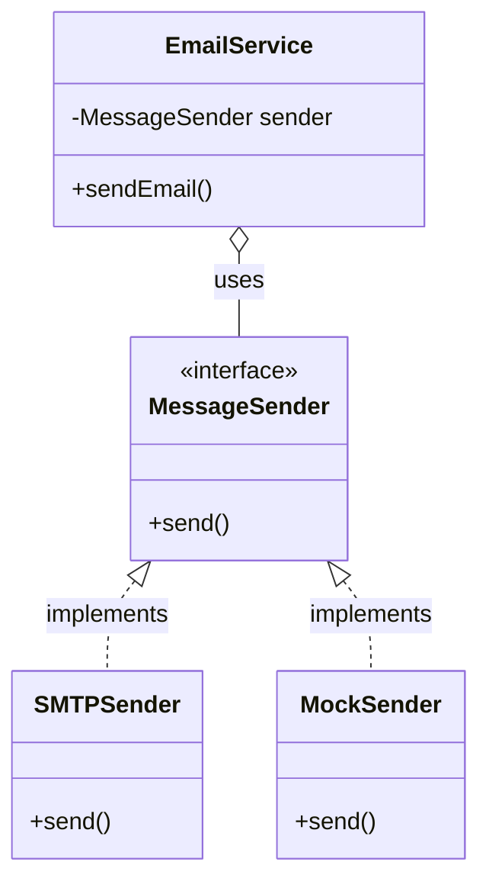

### 2. Strategy Pattern via Composition
Different algorithms can be swapped at runtime.

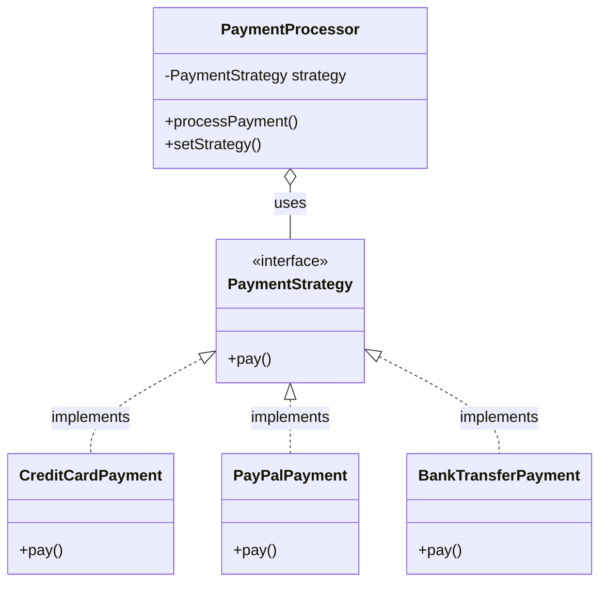

### 3. Decorator Pattern via Composition
Add behavior to objects without altering their structure.

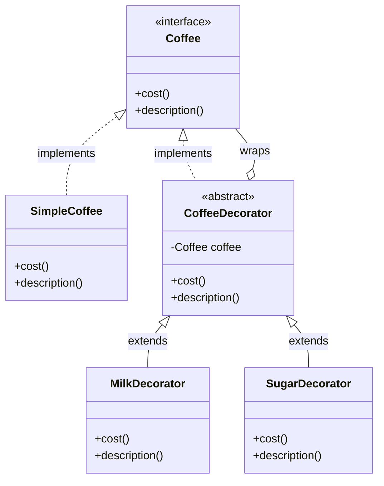

## When to Choose Which

### Use Composition When:

1. **"Has-a" relationship exists**
   - A car has an engine
   - A computer has a CPU
   - A person has an address

2. **You need flexibility at runtime**
   - Changing payment methods
   - Switching database providers
   - Swapping algorithms

3. **Components can be reused**
   - Engine can be used in a car, boat, or generator
   - Payment processor can handle multiple payment types
   - Logger can be used across different modules

4. **You want loose coupling**
   - Components are independent
   - Easy to test in isolation
   - Changes don't ripple through the hierarchy

5. **Multiple inheritances would be needed**
   - A smartphone has phone, camera, and computer capabilities
   - An employee can be both manager and developer
   - A vehicle can be both electric and autonomous

### Use Inheritance When:

1. **"Is-a" relationship exists**
   - A dog is an animal
   - A circle is a shape
   - A manager is an employee

2. **You have a stable hierarchy**
   - Animal -> Mammal -> Dog
   - Shape -> 2D Shape -> Circle
   - Vehicle -> Land Vehicle -> Car

3. **Polymorphism is needed**
   - Treating all shapes uniformly
   - Processing different animals the same way
   - Handling various employee types

4. **Code reuse through hierarchy makes sense**
   - Common animal behaviors
   - Shared shape calculations
   - Basic employee functionality

### Decision Framework

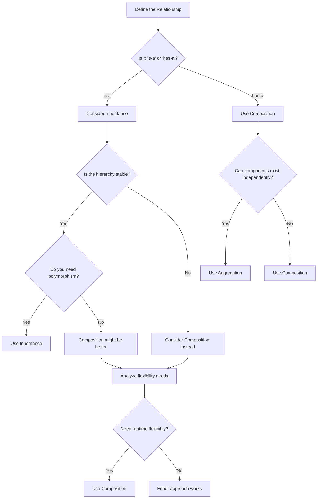

## Programming Languages Support

### Inheritance and Composition Support by Language

| Language       | Inheritance     | Interface/Traits    | Composition | Primary Paradigm     |
|----------------|-----------------|---------------------|-------------|----------------------|
| **Python**     | ✅/✅             | ❌ No (Duck typing)  | ✅ Yes       | Multi-paradigm       |
| **Go**         | ❌/❌             | ✅ Interfaces        | ✅ Yes       | Composition-focused  |
| **C**          | ❌/❌             | ❌ No                | ✅ Yes       | Procedural           |
| **Rust**       | ❌/❌             | ✅ Traits            | ✅ Yes       | Systems + Functional |
| **Zig**        | ❌/❌             | ✅ Comptime          | ✅ Yes       | Systems Programming  |
| **C++**        | ✅/✅             | ❌ No (pure virtual) | ✅ Yes       | Multi-paradigm       |
| **Java/C#**    | ✅/❌             | ✅ Interfaces        | ✅ Yes       | OOP-focused          |
| **TypeScript** | ✅/❌             | ✅ Interfaces        | ✅ Yes       | OOP + Functional     |
| **JavaScript** | ✅/❌ (Prototype) | ❌ No (Mixins)       | ✅ Yes       | Multi-paradigm       |

### Language-Specific Notes

| Language                  | Inheritance Support               | Composition Features                  | Key Characteristics                                                 |
|---------------------------|-----------------------------------|---------------------------------------|---------------------------------------------------------------------|
| **Python**                | ✅ Multiple inheritance (MRO)      | ✅ Instance variables, duck typing     | Flexible composition; no formal interfaces needed                   |
| **Go**                    | ❌ No inheritance                  | ✅ Embedding, implicit interfaces      | Composition-first design; simple and explicit                       |
| **C**                     | ❌ No OOP features                 | ✅ Struct embedding, function pointers | Purely procedural; manual memory management; foundation for C++ OOP |
| **Rust**                  | ❌ No inheritance                  | ✅ Traits, struct fields               | Zero-cost abstractions; memory safety through ownership             |
| **Zig**                   | ❌ No inheritance                  | ✅ Struct composition, comptime        | Simplicity-focused; compile-time interfaces; explicit behavior      |
| **C++**                   | ✅ Multiple inheritance + virtual  | ✅ RAII, smart pointers                | Complex inheritance; strong composition with resource management    |
| **Java/C#**               | ✅ Single inheritance + interfaces | ✅ Dependency injection, strong typing | Interface segregation encouraged; enterprise-focused                |
| **JavaScript/TypeScript** | ✅ Prototype/class-based           | ✅ Object properties, mixins           | Flexible composition; TypeScript adds static typing                 |

## Benefits of Composition

### 1. **Flexibility**
- Components can be swapped at runtime
- Easy to modify behavior without changing class hierarchy
- Support for multiple behaviors without multiple inheritance

### 2. **Testability**
- Components can be tested in isolation
- Easy to mock dependencies
- Reduced test complexity

### 3. **Maintainability**
- Changes localized to specific components
- No fragile base class problem
- Clear separation of concerns

### 4. **Reusability**
- Components can be used across different contexts
- No tight coupling to specific hierarchies
- Promotes single responsibility principle

### 5. **Loose Coupling**
- Components interact through well-defined interfaces
- Reduced dependencies between classes
- Better adherence to SOLID principles

## Common Composition Patterns

### 1. **Strategy Pattern**
Encapsulate algorithms and make them interchangeable.

### 2. **Decorator Pattern**
Add responsibilities to objects dynamically.

### 3. **Observer Pattern**
Define one-to-many dependencies between objects.

### 4. **Command Pattern**
Encapsulate requests as objects.

### 5. **State Pattern**
Allow objects to alter behavior when the internal state changes.

### 6. **Bridge Pattern**
Separate abstraction from implementation.

## Best Practices

### 1. **Favor Composition Over Inheritance**
- Use inheritance only when you have a true "is-a" relationship
- Prefer composition for flexibility and maintainability
- Consider the long-term evolution of your system

### 2. **Define Clear Interfaces**
- Use interfaces or abstract base classes for components
- Keep interfaces focused and cohesive
- Follow interface segregation principle

### 3. **Manage Dependencies Carefully**
- Use dependency injection when possible
- Avoid circular dependencies
- Keep component lifecycles clear

### 4. **Design for Testability**
- Make components easily mockable
- Avoid hard dependencies
- Use factories or builders for complex object creation

### 5. **Consider Performance Implications**
- Composition can add slight overhead
- Consider object creation costs
- Balance flexibility with performance needs

## Common Pitfalls to Avoid

### 1. **Over-composition**
- Not every relationship needs composition
- Simple inheritance might be clearer for obvious "is-a" relationships

### 2. **Complex Object Graphs**
- Avoid deeply nested composition hierarchies
- Keep object relationships understandable

### 3. **Premature Abstraction**
- Don't create interfaces until you need flexibility
- Start simple and refactor when needed

### 4. **Ignoring Lifecycle Management**
- Clearly define who owns and manages component lifecycles
- Avoid memory leaks in languages without garbage collection

### 5. **Breaking Encapsulation**
- Don't expose internal components unnecessarily
- Maintain clear boundaries between components

Remember: Both composition and inheritance are valuable tools. The key is understanding when to use each approach. Composition provides flexibility and loose coupling, while inheritance provides polymorphism and code reuse through hierarchical relationships. Choose based on your specific requirements and the nature of the relationships in your domain.
