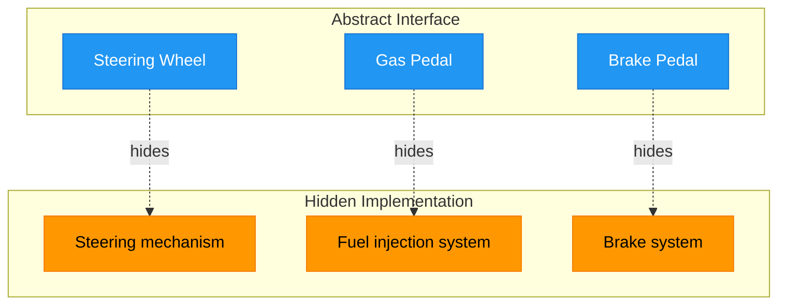
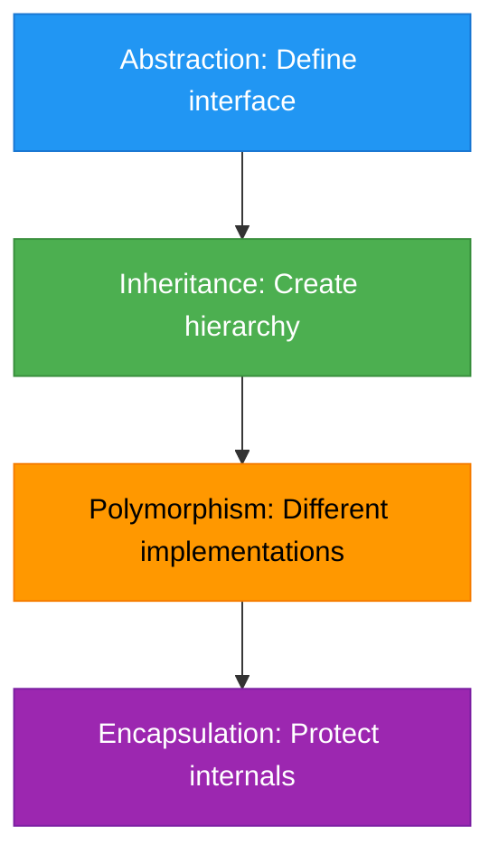
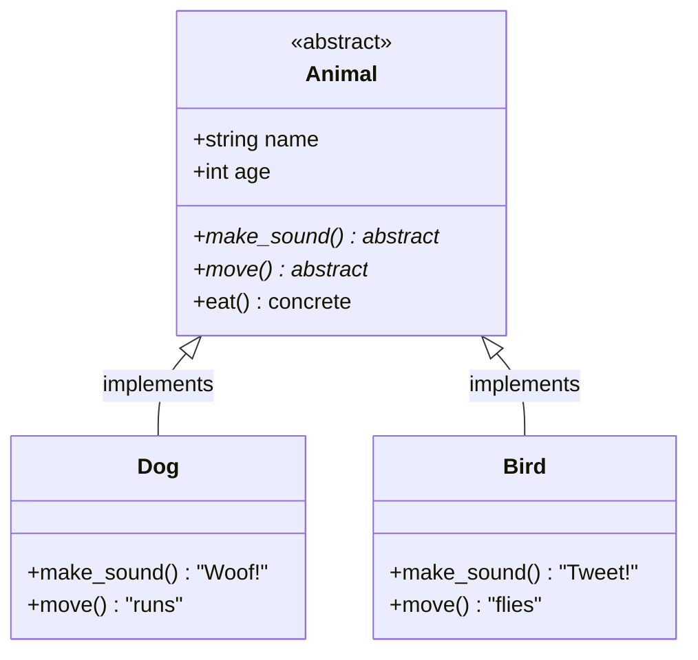

# Object-Oriented Programming: Abstraction

## What is Abstraction?

**Abstraction** means hiding complex implementation details and showing only the essential features. It's about defining **"what"** something does, not **"how"** it does it.

Think of abstraction as creating a **contract** or **blueprint** that says: "Any class that implements this must have these specific methods" — but each class can implement them in its own way.

**Key Insight:** Abstraction forces you to think about the interface (what methods exist) before the implementation (how they work).

## Real-World Analogy: Car Dashboard

When you drive a car, you interact with a simple interface without knowing the complex implementation:



**Why this is abstraction:**
- You know **what** each control does (turn, accelerate, stop)
- You don't need to know **how** it works internally
- Different cars implement these differently (electric vs gas), but the interface is the same

## Abstraction vs Other OOP Concepts

| Concept           | Purpose                             | Focus                                   |
|-------------------|-------------------------------------|-----------------------------------------|
| **Encapsulation** | Hide data, control access           | Protecting attributes with methods      |
| **Inheritance**   | Reuse code, create hierarchies      | Parent-child relationships              |
| **Abstraction**   | Hide complexity, define contracts   | Defining "what" without "how"           |
| **Polymorphism**  | Same interface, different behaviors | Multiple implementations of same method |

**How they work together:**


## Abstract Classes in Python

Python provides the `abc` module (Abstract Base Classes) to create abstraction.

### Basic Abstract Class

```python
from abc import ABC, abstractmethod


class Animal(ABC):
    """Abstract base class - cannot be instantiated directly"""
    
    def __init__(self, name, age):
        self.name = name
        self.age = age
    
    @abstractmethod
    def make_sound(self):
        """Every animal MUST implement this"""
        pass
    
    @abstractmethod
    def move(self):
        """Every animal MUST implement this"""
        pass
    
    def eat(self):
        """Concrete method - inherited by all"""
        return f"{self.name} is eating"


class Dog(Animal):
    def make_sound(self):
        return f"{self.name} says: Woof!"
    
    def move(self):
        return f"{self.name} runs on four legs"


class Bird(Animal):
    def make_sound(self):
        return f"{self.name} says: Tweet tweet!"
    
    def move(self):
        return f"{self.name} flies through the air"


# Cannot instantiate abstract class
# animal = Animal("Generic", 5)  # TypeError!

# But concrete classes work fine
dog = Dog("Buddy", 3)
bird = Bird("Tweety", 1)

print(dog.make_sound())   # Buddy says: Woof!
print(bird.move())        # Tweety flies through the air
print(dog.eat())          # Buddy is eating (inherited)
```

**Key Components:**
1. **`ABC`**: Inherit from this to make a class abstract
2. **`@abstractmethod`**: Decorator marking methods that MUST be implemented
3. **Concrete methods**: Regular methods with implementation (like `eat()`)
4. **Child classes**: Must implement ALL abstract methods

### Abstract Class Flow



## Why Use Abstraction?

### Benefit 1: Enforces Implementation

Abstract classes guarantee that all child classes implement required methods.

```python
from abc import ABC, abstractmethod


class Shape(ABC):
    """Abstract base for all shapes"""
    
    def __init__(self, color):
        self.color = color
    
    @abstractmethod
    def area(self):
        """Must be implemented by all shapes"""
        pass
    
    @abstractmethod
    def perimeter(self):
        """Must be implemented by all shapes"""
        pass


class Rectangle(Shape):
    def __init__(self, color, width, height):
        super().__init__(color)
        self.width = width
        self.height = height
    
    def area(self):
        return self.width * self.height
    
    def perimeter(self):
        return 2 * (self.width + self.height)


class Circle(Shape):
    def __init__(self, color, radius):
        super().__init__(color)
        self.radius = radius
    
    def area(self):
        import math
        return math.pi * self.radius ** 2
    
    def perimeter(self):
        import math
        return 2 * math.pi * self.radius


# If you forget to implement required methods:
class IncompleteShape(Shape):
    def area(self):
        return 0
    # Forgot perimeter()!

# incomplete = IncompleteShape("red")  # TypeError!
```

### Benefit 2: Clear Contracts

Abstract classes define clear contracts for what methods must exist.

```python
from abc import ABC, abstractmethod


class PaymentProcessor(ABC):
    """Contract: all payment processors must implement these methods"""
    
    @abstractmethod
    def validate_payment(self, amount):
        pass
    
    @abstractmethod
    def process_payment(self, amount):
        pass
    
    @abstractmethod
    def refund_payment(self, transaction_id):
        pass
```

### Benefit 3: Shared Code

Abstract classes can provide common functionality via concrete methods.

```python
from abc import ABC, abstractmethod


class Vehicle(ABC):
    def __init__(self, brand, model):
        self.brand = brand
        self.model = model
    
    @abstractmethod
    def start_engine(self):
        """Each vehicle starts differently"""
        pass
    
    def get_info(self):
        """Shared implementation"""
        return f"{self.brand} {self.model}"


class ElectricCar(Vehicle):
    def start_engine(self):
        return "Electric motor activated silently"


class GasCar(Vehicle):
    def start_engine(self):
        return "Vroom! Gas engine started"


tesla = ElectricCar("Tesla", "Model 3")
toyota = GasCar("Toyota", "Camry")

print(tesla.start_engine())  # Electric motor activated silently
print(tesla.get_info())      # Tesla Model 3 (inherited)
print(toyota.start_engine()) # Vroom! Gas engine started
```

## Abstract Methods vs Concrete Methods

```python
from abc import ABC, abstractmethod


class DataStore(ABC):
    """Abstract interface for data storage"""
    
    # ABSTRACT - must be implemented
    @abstractmethod
    def connect(self):
        pass
    
    @abstractmethod
    def save(self, key, value):
        pass
    
    @abstractmethod
    def load(self, key):
        pass
    
    # CONCRETE - inherited as-is, can be overridden
    def log(self, message):
        print(f"[LOG] {message}")


class FileStorage(DataStore):
    def connect(self):
        return "Connected to file system"
    
    def save(self, key, value):
        return f"Saved {key}={value} to file"
    
    def load(self, key):
        return f"Loaded {key} from file"
    
    # Uses inherited log() method


class DatabaseStorage(DataStore):
    def connect(self):
        return "Connected to database"
    
    def save(self, key, value):
        return f"INSERT INTO data VALUES ('{key}', '{value}')"
    
    def load(self, key):
        return f"SELECT value FROM data WHERE key='{key}'"
```

## Real-World Example: Notification System

```python
from abc import ABC, abstractmethod
from datetime import datetime


class NotificationService(ABC):
    """Abstract base for all notification services"""
    
    def __init__(self, service_name):
        self.service_name = service_name
        self.sent_count = 0
    
    @abstractmethod
    def validate_recipient(self, recipient):
        """Each service validates differently"""
        pass
    
    @abstractmethod
    def send(self, recipient, message):
        """Each service sends differently"""
        pass
    
    @abstractmethod
    def get_cost(self):
        """Each service has different pricing"""
        pass
    
    def log_notification(self, recipient, status):
        """Shared logging for all services"""
        timestamp = datetime.now().strftime("%Y-%m-%d %H:%M:%S")
        print(f"[{timestamp}] {self.service_name}: {recipient} - {status}")
        if status == "SUCCESS":
            self.sent_count += 1


class EmailNotification(NotificationService):
    def __init__(self):
        super().__init__("Email Service")
    
    def validate_recipient(self, recipient):
        return '@' in recipient
    
    def send(self, recipient, message):
        if not self.validate_recipient(recipient):
            self.log_notification(recipient, "FAILED")
            return False
        print(f"Sending email to {recipient}: {message}")
        self.log_notification(recipient, "SUCCESS")
        return True
    
    def get_cost(self):
        return 0.001


class SMSNotification(NotificationService):
    def __init__(self):
        super().__init__("SMS Service")
    
    def validate_recipient(self, recipient):
        return recipient.startswith('+')
    
    def send(self, recipient, message):
        if not self.validate_recipient(recipient):
            self.log_notification(recipient, "FAILED")
            return False
        print(f"Sending SMS to {recipient}: {message}")
        self.log_notification(recipient, "SUCCESS")
        return True
    
    def get_cost(self):
        return 0.05


# Function that works with ANY notification service
def send_batch(service: NotificationService, recipients, message):
    """Works with any service - relies on abstract interface"""
    for recipient in recipients:
        service.send(recipient, message)
    print(f"Total sent: {service.sent_count}")
    print(f"Total cost: ${service.sent_count * service.get_cost():.2f}")


# Use different services
email = EmailNotification()
sms = SMSNotification()

send_batch(email, ["user@example.com", "admin@test.com"], "Hello!")
send_batch(sms, ["+1234567890", "+9876543210"], "Hello!")
```

## Abstract Properties

You can also make properties abstract:

```python
from abc import ABC, abstractmethod


class Product(ABC):
    def __init__(self, name, base_price):
        self.name = name
        self.base_price = base_price
    
    @property
    @abstractmethod
    def final_price(self):
        """Each product calculates price differently"""
        pass


class DigitalProduct(Product):
    @property
    def final_price(self):
        return self.base_price  # No tax


class PhysicalProduct(Product):
    @property
    def final_price(self):
        return self.base_price * 1.08  # 8% tax


ebook = DigitalProduct("Python Guide", 29.99)
book = PhysicalProduct("Python Guide (Print)", 49.99)

print(f"{ebook.name}: ${ebook.final_price:.2f}")
print(f"{book.name}: ${book.final_price:.2f}")
```

## When to Use Abstraction

### Use Abstract Classes When:

1. **You want to enforce a contract**
   - All payment processors must have `process_payment()`
   - All shapes must have `area()` and `perimeter()`

2. **You have shared code among related classes**
   - Common `__init__()` logic
   - Shared helper methods

3. **You're designing a framework or library**
   - Define interfaces for users to implement

4. **Multiple implementations of the same concept**
   - Different database connections
   - Various notification services

### Consider Alternatives When:

1. **You only have one implementation** - Abstraction is overkill
2. **Classes are unrelated** - Abstraction works best with related concepts
3. **You need simple duck typing** - Python doesn't always require formal interfaces

## Common Pattern: Template Method

Define workflow in abstract class, let children implement specific steps:

```python
from abc import ABC, abstractmethod


class DataProcessor(ABC):
    """Template for data processing workflow"""
    
    def process(self, data):
        """Template method - defines workflow"""
        print("Starting processing...")
        loaded = self.load_data(data)
        transformed = self.transform_data(loaded)
        result = self.save_data(transformed)
        print("Processing complete!")
        return result
    
    @abstractmethod
    def load_data(self, source):
        pass
    
    @abstractmethod
    def transform_data(self, data):
        pass
    
    @abstractmethod
    def save_data(self, data):
        pass


class CSVProcessor(DataProcessor):
    def load_data(self, source):
        return f"Loaded CSV from {source}"
    
    def transform_data(self, data):
        return f"Transformed: {data}"
    
    def save_data(self, data):
        return f"Saved CSV: {data}"


class JSONProcessor(DataProcessor):
    def load_data(self, source):
        return f"Loaded JSON from {source}"
    
    def transform_data(self, data):
        return f"Transformed: {data}"
    
    def save_data(self, data):
        return f"Saved JSON: {data}"


# Same workflow, different implementations
csv_proc = CSVProcessor()
json_proc = JSONProcessor()

csv_proc.process("data.csv")
json_proc.process("data.json")
```

## Key Takeaways

**Abstraction = Defining "what" without "how"**

- Abstract classes create contracts that child classes must fulfill
- Use `ABC` and `@abstractmethod` to enforce implementation
- Abstract methods MUST be implemented by all child classes
- Concrete methods provide shared functionality
- Cannot instantiate abstract classes directly
- Prepares code for polymorphism by ensuring consistent interfaces

**Remember:** Abstraction is about creating clear interfaces and enforcing contracts. It ensures that all implementations of a concept have the required methods, making your code more predictable and maintainable.
