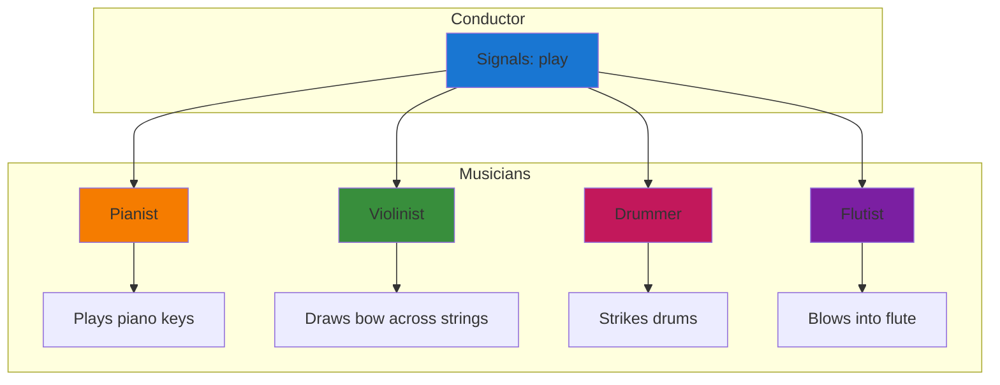
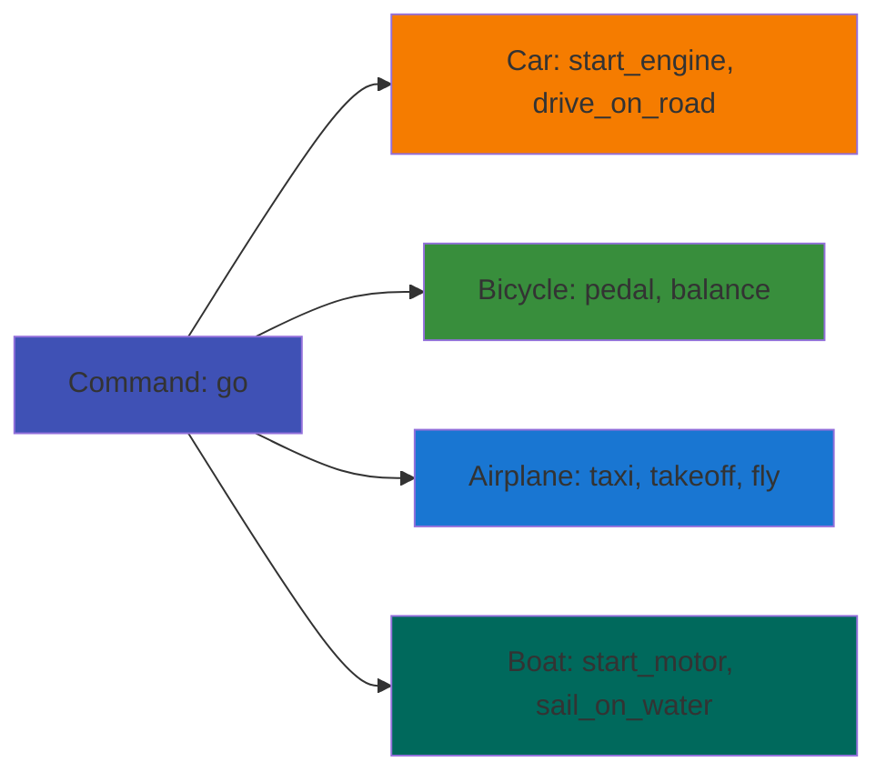
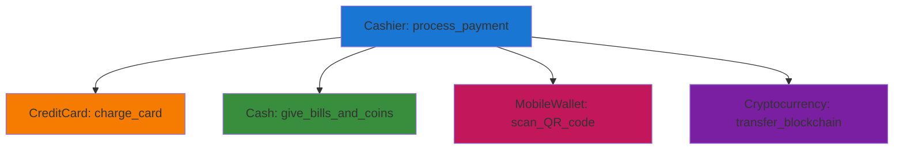
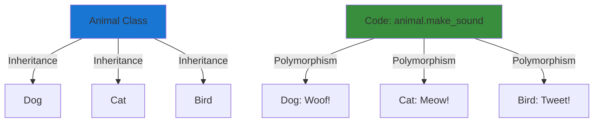
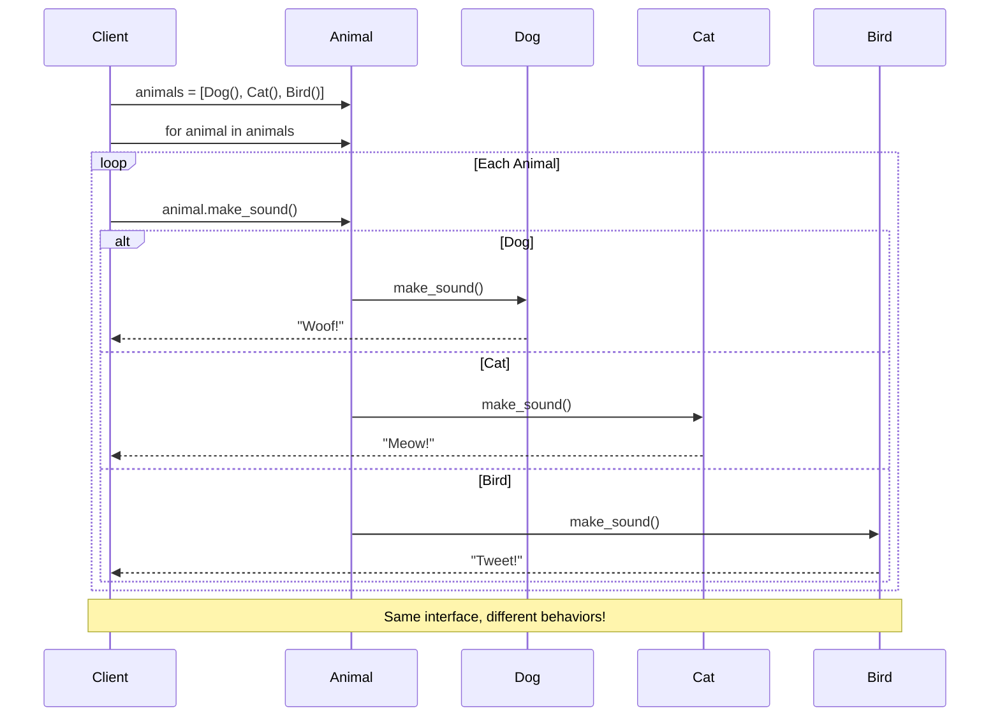

# Object-Oriented Programming: Polymorphism

## What is Polymorphism?

**Polymorphism** means "many forms" (from Greek: *poly* = many, *morph* = form). In programming, it's the ability of different objects to respond to the same method call in their own unique way.

Think of it this way: When you press the "play" button on different devices (TV, radio, game console), they all "play" something, but each device plays differently. The same action ("play"), but many different implementations.

**Key Insight:** Polymorphism allows you to write code that works with a general type, but automatically uses the specific behavior of the actual object type at runtime.

## Real-Life Analogies 🌍

### 🎵 Musical Instruments: The Orchestra Analogy

Imagine conducting an orchestra. You signal "play()" to all musicians:



**The polymorphic magic:**
- **Same interface:** All musicians respond to "play()"
- **Different implementations:** Each plays their unique instrument
- **Conductor doesn't care:** You don't tell the pianist HOW to play piano, you just say "play()"

### 🚗 Transportation: The "Go()" Method

You need to get somewhere. You can use different modes of transportation:



All respond to "go()", but each implements it differently based on their nature.

### 📱 Payment Systems: Real-World Polymorphism

When you check out at a store, the cashier doesn't care HOW you pay, just that you can `pay()`:



The cashier's code is simple: `payment_method.pay(amount)`. Polymorphism handles the rest.

## Polymorphism vs Inheritance

**Inheritance** and **polymorphism** work together but serve different purposes:

| Concept | Purpose | Question it Answers |
|---------|---------|-------------------|
| **Inheritance** | Code reuse and relationships | "What is it?" (Is-A relationship) |
| **Polymorphism** | Flexible interfaces | "What can it do?" (Can-Do relationship) |



- **Inheritance says:** "A Dog IS-A Animal"
- **Polymorphism says:** "All Animals CAN make_sound(), but each does it differently"

## Types of Polymorphism in Python

### 1. Method Overriding (Runtime Polymorphism)

The most common form. Child classes override parent methods with their own implementation.

```python
class Animal:
    def __init__(self, name):
        self.name = name
    
    def make_sound(self):
        """Base implementation - can be overridden"""
        return "Some generic animal sound"
    
    def move(self):
        """Base implementation"""
        return f"{self.name} is moving"


class Dog(Animal):
    def make_sound(self):
        """Override with Dog-specific behavior"""
        return f"{self.name} says: Woof! Woof!"
    
    def move(self):
        """Override with Dog-specific behavior"""
        return f"{self.name} is running on four legs"


class Cat(Animal):
    def make_sound(self):
        """Override with Cat-specific behavior"""
        return f"{self.name} says: Meow!"
    
    def move(self):
        """Override with Cat-specific behavior"""
        return f"{self.name} is prowling silently"


class Bird(Animal):
    def make_sound(self):
        """Override with Bird-specific behavior"""
        return f"{self.name} says: Tweet tweet!"
    
    def move(self):
        """Override with Bird-specific behavior"""
        return f"{self.name} is flying through the air"


# === Polymorphism in Action ===
# Same interface, different behaviors
animals = [
    Dog("Buddy"),
    Cat("Whiskers"),
    Bird("Tweety"),
    Dog("Max")
]

print("=== Animal Sounds ===")
for animal in animals:
    # Same method call works for all types
    print(animal.make_sound())
    print(animal.move())
    print()

# Output:
# Buddy says: Woof! Woof!
# Buddy is running on four legs
#
# Whiskers says: Meow!
# Whiskers is prowling silently
#
# Tweety says: Tweet tweet!
# Tweety is flying through the air
#
# Max says: Woof! Woof!
# Max is running on four legs
```

**Why this is powerful:**
- Write code once: `animal.make_sound()`
- Works with any animal type
- No need to check "if dog, do this; if cat, do that"
- Add new animals without changing existing code

### 2. Duck Typing (Python's Special Power)

In Python, you don't need inheritance for polymorphism. If it "walks like a duck and quacks like a duck," it's treated as a duck.

```python
class Dog:
    def speak(self):
        return "Woof!"


class Cat:
    def speak(self):
        return "Meow!"


class Robot:
    """No inheritance, but has speak() method"""
    def speak(self):
        return "Beep boop!"


class Person:
    """Also no inheritance, but has speak() method"""
    def speak(self):
        return "Hello!"


# Function that works with ANY object that can speak()
def make_it_speak(thing):
    """Polymorphic function - works with anything that has speak()"""
    return thing.speak()


# All work without inheritance!
dog = Dog()
cat = Cat()
robot = Robot()
person = Person()

print(make_it_speak(dog))      # Woof!
print(make_it_speak(cat))      # Meow!
print(make_it_speak(robot))    # Beep boop!
print(make_it_speak(person))   # Hello!
```

**Duck Typing Philosophy:**
> "If it walks like a duck and quacks like a duck, it must be a duck."
> — We don't care about the TYPE, we care about the BEHAVIOR

### 3. Operator Overloading

Python lets you define how operators work with your custom objects.

```python
class Money:
    def __init__(self, amount, currency="USD"):
        self.amount = amount
        self.currency = currency
    
    def __add__(self, other):
        """Define what + means for Money objects"""
        if isinstance(other, Money):
            if self.currency == other.currency:
                return Money(self.amount + other.amount, self.currency)
            else:
                raise ValueError("Cannot add different currencies")
        return Money(self.amount + other, self.currency)
    
    def __str__(self):
        """Define how Money appears when printed"""
        return f"{self.currency} ${self.amount:.2f}"
    
    def __lt__(self, other):
        """Define what < means (less than)"""
        if isinstance(other, Money) and self.currency == other.currency:
            return self.amount < other.amount
        return NotImplemented
    
    def __eq__(self, other):
        """Define what == means (equality)"""
        if isinstance(other, Money):
            return self.amount == other.amount and self.currency == other.currency
        return False


# Polymorphic operators in action
price1 = Money(10.50)
price2 = Money(5.25)
total = price1 + price2  # Uses __add__

print(total)             # Uses __str__: USD $15.75
print(price1 < price2)   # Uses __lt__: False
print(price1 == price2)  # Uses __eq__: False
```

## Polymorphism with Abstract Base Classes

Sometimes you want to enforce that child classes MUST implement certain methods. Abstract Base Classes (ABC) provide this guarantee.

```python
from abc import ABC, abstractmethod


class Shape(ABC):
    """Abstract base class - cannot be instantiated directly"""
    
    def __init__(self, color):
        self.color = color
    
    @abstractmethod
    def area(self):
        """Every shape MUST implement area calculation"""
        pass
    
    @abstractmethod
    def perimeter(self):
        """Every shape MUST implement perimeter calculation"""
        pass
    
    def describe(self):
        """Concrete method - inherited by all shapes"""
        return f"I am a {self.color} {self.__class__.__name__}"


class Rectangle(Shape):
    def __init__(self, color, width, height):
        super().__init__(color)
        self.width = width
        self.height = height
    
    def area(self):
        """Rectangle-specific implementation"""
        return self.width * self.height
    
    def perimeter(self):
        """Rectangle-specific implementation"""
        return 2 * (self.width + self.height)


class Circle(Shape):
    def __init__(self, color, radius):
        super().__init__(color)
        self.radius = radius
    
    def area(self):
        """Circle-specific implementation"""
        import math
        return math.pi * self.radius ** 2
    
    def perimeter(self):
        """Circle-specific implementation (circumference)"""
        import math
        return 2 * math.pi * self.radius


class Triangle(Shape):
    def __init__(self, color, base, height, side1, side2, side3):
        super().__init__(color)
        self.base = base
        self.height = height
        self.side1 = side1
        self.side2 = side2
        self.side3 = side3
    
    def area(self):
        """Triangle-specific implementation"""
        return 0.5 * self.base * self.height
    
    def perimeter(self):
        """Triangle-specific implementation"""
        return self.side1 + self.side2 + self.side3


# Polymorphic function - works with any Shape
def print_shape_info(shape):
    """This function works with ANY shape!"""
    print(f"{shape.describe()}")
    print(f"  Area: {shape.area():.2f}")
    print(f"  Perimeter: {shape.perimeter():.2f}")
    print()


# Create different shapes
shapes = [
    Rectangle("red", 10, 5),
    Circle("blue", 7),
    Triangle("green", 6, 4, 5, 5, 6)
]

# Same function, different behaviors
print("=== Shape Information ===")
for shape in shapes:
    print_shape_info(shape)

# Output:
# I am a red Rectangle
#   Area: 50.00
#   Perimeter: 30.00
#
# I am a blue Circle
#   Area: 153.94
#   Perimeter: 43.98
#
# I am a green Triangle
#   Area: 12.00
#   Perimeter: 16.00
```

**Benefits of ABC:**
- **Enforces contract:** Child classes MUST implement abstract methods
- **Clear interface:** Defines what methods all shapes need
- **Prevents mistakes:** Can't accidentally forget to implement required methods
- **Documentation:** Shows what's required for the class hierarchy

## Real-World Example: Payment Processing System

Let's build a realistic payment system demonstrating polymorphism:

```python
from abc import ABC, abstractmethod
from datetime import datetime


class PaymentMethod(ABC):
    """Abstract base class for all payment methods"""
    
    def __init__(self, account_holder):
        self.account_holder = account_holder
        self.transaction_history = []
    
    @abstractmethod
    def process_payment(self, amount, merchant):
        """Each payment method must implement this"""
        pass
    
    @abstractmethod
    def validate(self):
        """Each payment method must validate itself"""
        pass
    
    def add_transaction(self, amount, merchant, status):
        """Common functionality for all payment methods"""
        transaction = {
            'timestamp': datetime.now(),
            'amount': amount,
            'merchant': merchant,
            'status': status
        }
        self.transaction_history.append(transaction)
    
    def get_history(self):
        """Common functionality - get transaction history"""
        return self.transaction_history


class CreditCard(PaymentMethod):
    def __init__(self, account_holder, card_number, cvv, expiry_date):
        super().__init__(account_holder)
        self.card_number = card_number
        self.cvv = cvv
        self.expiry_date = expiry_date
    
    def validate(self):
        """Credit card specific validation"""
        # Simplified validation
        if len(self.card_number) != 16:
            return False, "Invalid card number length"
        if len(self.cvv) != 3:
            return False, "Invalid CVV"
        # Check expiry date
        return True, "Valid"
    
    def process_payment(self, amount, merchant):
        """Credit card specific payment processing"""
        is_valid, message = self.validate()
        if not is_valid:
            self.add_transaction(amount, merchant, f"FAILED: {message}")
            return False, message
        
        # Simulate credit card processing
        masked_card = f"****-****-****-{self.card_number[-4:]}"
        print(f"💳 Processing ${amount:.2f} via Credit Card {masked_card}")
        print(f"   Merchant: {merchant}")
        print(f"   Cardholder: {self.account_holder}")
        
        self.add_transaction(amount, merchant, "SUCCESS")
        return True, "Payment successful"


class PayPal(PaymentMethod):
    def __init__(self, account_holder, email, password):
        super().__init__(account_holder)
        self.email = email
        self.password = password
        self.balance = 1000.0  # Simplified
    
    def validate(self):
        """PayPal specific validation"""
        if '@' not in self.email:
            return False, "Invalid email"
        if len(self.password) < 6:
            return False, "Password too short"
        return True, "Valid"
    
    def process_payment(self, amount, merchant):
        """PayPal specific payment processing"""
        is_valid, message = self.validate()
        if not is_valid:
            self.add_transaction(amount, merchant, f"FAILED: {message}")
            return False, message
        
        if self.balance < amount:
            self.add_transaction(amount, merchant, "FAILED: Insufficient funds")
            return False, "Insufficient PayPal balance"
        
        # Process payment
        self.balance -= amount
        print(f"💰 Processing ${amount:.2f} via PayPal")
        print(f"   Email: {self.email}")
        print(f"   Merchant: {merchant}")
        print(f"   Remaining balance: ${self.balance:.2f}")
        
        self.add_transaction(amount, merchant, "SUCCESS")
        return True, "Payment successful"


class Cryptocurrency(PaymentMethod):
    def __init__(self, account_holder, wallet_address, crypto_type="Bitcoin"):
        super().__init__(account_holder)
        self.wallet_address = wallet_address
        self.crypto_type = crypto_type
    
    def validate(self):
        """Cryptocurrency specific validation"""
        if len(self.wallet_address) < 26:
            return False, "Invalid wallet address"
        return True, "Valid"
    
    def process_payment(self, amount, merchant):
        """Cryptocurrency specific payment processing"""
        is_valid, message = self.validate()
        if not is_valid:
            self.add_transaction(amount, merchant, f"FAILED: {message}")
            return False, message
        
        # Convert USD to crypto (simplified)
        crypto_amount = amount / 50000  # Assuming 1 BTC = $50,000
        
        print(f"₿ Processing ${amount:.2f} via {self.crypto_type}")
        print(f"   Amount: {crypto_amount:.8f} {self.crypto_type}")
        print(f"   Wallet: {self.wallet_address[:10]}...{self.wallet_address[-6:]}")
        print(f"   Merchant: {merchant}")
        print(f"   Confirming on blockchain...")
        
        self.add_transaction(amount, merchant, "SUCCESS")
        return True, "Payment successful"


# === The Power of Polymorphism ===

def checkout(cart_total, payment_method, merchant_name):
    """
    This function works with ANY payment method!
    It doesn't need to know whether it's a credit card, PayPal, or crypto.
    """
    print(f"\n{'='*60}")
    print(f"CHECKOUT - {merchant_name}")
    print(f"Total: ${cart_total:.2f}")
    print(f"{'='*60}")
    
    # Polymorphic call - works differently for each payment type
    success, message = payment_method.process_payment(cart_total, merchant_name)
    
    if success:
        print(f"✅ {message}")
    else:
        print(f"❌ {message}")
    
    print(f"{'='*60}\n")
    return success


# Create different payment methods
credit_card = CreditCard("John Doe", "1234567812345678", "123", "12/25")
paypal = PayPal("Jane Smith", "jane@email.com", "secure123")
crypto = Cryptocurrency("Bob Wilson", "1A1zP1eP5QGefi2DMPTfTL5SLmv7DivfNa", "Bitcoin")

# Create a shopping cart
cart_items = [
    ("Laptop", 999.99),
    ("Mouse", 29.99),
    ("Keyboard", 79.99)
]
total = sum(price for _, price in cart_items)

# Process payments with different methods
# Same function call, different implementations!
checkout(total, credit_card, "TechStore Inc.")
checkout(total, paypal, "TechStore Inc.")
checkout(total, crypto, "TechStore Inc.")
```

**Key Polymorphic Benefits:**
1. **Single interface:** `checkout()` function doesn't care about payment type
2. **Easy to extend:** Add new payment methods without changing `checkout()`
3. **Maintainable:** Each payment method manages its own logic
4. **Testable:** Can test each payment method independently

## Polymorphism Design Patterns

### Strategy Pattern

Different algorithms for the same task:

```python
from abc import ABC, abstractmethod


class CompressionStrategy(ABC):
    """Abstract strategy for file compression"""
    
    @abstractmethod
    def compress(self, file_data):
        pass


class ZipCompression(CompressionStrategy):
    def compress(self, file_data):
        return f"ZIP compressed: {file_data[:20]}... [compressed]"


class RarCompression(CompressionStrategy):
    def compress(self, file_data):
        return f"RAR compressed: {file_data[:20]}... [compressed]"


class GzipCompression(CompressionStrategy):
    def compress(self, file_data):
        return f"GZIP compressed: {file_data[:20]}... [compressed]"


class FileCompressor:
    def __init__(self, strategy):
        self.strategy = strategy
    
    def compress_file(self, file_data):
        """Uses polymorphism to apply different compression strategies"""
        return self.strategy.compress(file_data)
    
    def change_strategy(self, new_strategy):
        """Can dynamically change compression method"""
        self.strategy = new_strategy


# Use different strategies polymorphically
file_data = "This is a large file with lots of data..."

compressor = FileCompressor(ZipCompression())
print(compressor.compress_file(file_data))

compressor.change_strategy(RarCompression())
print(compressor.compress_file(file_data))

compressor.change_strategy(GzipCompression())
print(compressor.compress_file(file_data))
```

### Factory Pattern with Polymorphism

Create objects without specifying exact classes:

```python
from abc import ABC, abstractmethod


class Notification(ABC):
    @abstractmethod
    def send(self, message, recipient):
        pass


class EmailNotification(Notification):
    def send(self, message, recipient):
        return f"📧 Email to {recipient}: {message}"


class SMSNotification(Notification):
    def send(self, message, recipient):
        return f"📱 SMS to {recipient}: {message}"


class PushNotification(Notification):
    def send(self, message, recipient):
        return f"🔔 Push to {recipient}: {message}"


class NotificationFactory:
    """Factory that creates notifications polymorphically"""
    
    @staticmethod
    def create_notification(notification_type):
        """Returns different notification objects"""
        if notification_type == "email":
            return EmailNotification()
        elif notification_type == "sms":
            return SMSNotification()
        elif notification_type == "push":
            return PushNotification()
        else:
            raise ValueError(f"Unknown notification type: {notification_type}")


# Use factory to create notifications
def send_notification(notification_type, message, recipient):
    """Polymorphic notification sending"""
    notification = NotificationFactory.create_notification(notification_type)
    return notification.send(message, recipient)


# All use the same function, different implementations
print(send_notification("email", "Hello!", "user@example.com"))
print(send_notification("sms", "Hello!", "+1234567890"))
print(send_notification("push", "Hello!", "User123"))
```

## Common Pitfalls and Best Practices

### ❌ Pitfall 1: Type Checking Defeats Polymorphism

```python
# BAD - Defeats the purpose of polymorphism
def make_sound(animal):
    if isinstance(animal, Dog):
        return "Woof!"
    elif isinstance(animal, Cat):
        return "Meow!"
    elif isinstance(animal, Bird):
        return "Tweet!"
    # Need to add more checks for each new animal type

# GOOD - Let polymorphism do its job
def make_sound(animal):
    return animal.speak()  # Each animal handles its own sound
```

### ❌ Pitfall 2: Not Using Abstract Methods When Needed

```python
# BAD - No enforcement
class Shape:
    def area(self):
        pass  # Subclasses might forget to implement

# GOOD - Enforces implementation
from abc import ABC, abstractmethod

class Shape(ABC):
    @abstractmethod
    def area(self):
        pass  # Subclasses MUST implement or Python raises error
```

### ✅ Best Practice 1: Program to Interfaces, Not Implementations

```python
# Define what objects can do, not what they are
def process_items(items):
    """Works with any iterable"""
    for item in items:
        print(item)

# Works with lists, tuples, sets, generators, etc.
process_items([1, 2, 3])
process_items((4, 5, 6))
process_items({7, 8, 9})
```

### ✅ Best Practice 2: Keep Polymorphic Interfaces Consistent

```python
# All payment methods should have the same interface
class PaymentMethod(ABC):
    @abstractmethod
    def process_payment(self, amount):
        """Same signature for all payment types"""
        pass
```

## Visualizing Polymorphism Flow



## When to Use Polymorphism

### ✅ Use Polymorphism When:

1. **Multiple objects need to respond to the same operation differently**
   - Animals making sounds
   - Shapes calculating areas
   - Payment methods processing payments

2. **You want to add new types without changing existing code**
   - Add new payment method → no changes to checkout process
   - Add new animal → no changes to animal display code

3. **You need flexible, maintainable code**
   - Single function works with many types
   - Easy to test and extend

4. **You're implementing design patterns**
   - Strategy pattern
   - Factory pattern
   - Template method pattern

### 🤔 Consider Alternatives When:

1. **Objects have completely different interfaces**
   - Not just different implementations of the same method
   
2. **Simple if-else is clearer**
   - Don't over-engineer simple problems

3. **Performance is critical**
   - Polymorphic calls have slight overhead (usually negligible)

## Polymorphism Checklist

Before implementing polymorphism, ask:

- [ ] Do I have multiple objects that need to do similar things differently?
- [ ] Can I define a common interface (method names and signatures)?
- [ ] Will this make my code more flexible and maintainable?
- [ ] Am I avoiding type checking (isinstance) in client code?
- [ ] Should I use an abstract base class to enforce the interface?

## Key Takeaways

🎯 **Polymorphism = "Many forms"** - Same interface, different implementations

🔧 **Core benefit:** Write code once, works with many types

🏗️ **Three main types in Python:**
   - Method overriding (runtime polymorphism)
   - Duck typing (if it quacks like a duck...)
   - Operator overloading (custom behavior for +, -, etc.)

🛡️ **Abstract Base Classes** enforce that child classes implement required methods

🎨 **Design patterns** heavily rely on polymorphism for flexibility

⚡ **Best practice:** Program to interfaces, not implementations

🚫 **Avoid:** Type checking that defeats polymorphism's purpose

**Remember:** Polymorphism is about letting objects handle their own behavior while providing a consistent interface to the outside world. It's one of the most powerful concepts in OOP for writing flexible, maintainable code!
