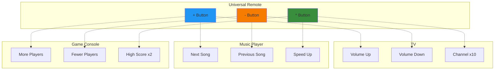

# Object-Oriented Programming: Operator Overloading

## What is Operator Overloading?

**Operator overloading** allows you to define how standard Python operators (`+`, `-`, `*`, `/`, `==`, `<`, etc.) work with your custom classes. It's about giving custom meaning to operators when they're used with your objects.

Think of it this way: When you write `3 + 5`, Python knows how to add integers. When you write `"Hello" + "World"`, Python knows how to concatenate strings. With operator overloading, you can teach Python how to add your own custom objects, like `Vector2D(1, 2) + Vector2D(3, 4)`.

**Key Insight:** Operator overloading makes your custom classes feel like built-in types, creating more intuitive and readable code.

## Real-World Analogy: The Universal Remote

Imagine you have a universal remote control:



**Why this is operator overloading:**
- The same button (`+`) does different things with different devices
- The operator (`+`) has different meanings depending on the object type
- The interface is consistent, but the behavior is customized

## Common Magic Methods for Operator Overloading

Python uses special "magic methods" (also called "dunder methods" for double underscore) to implement operator overloading:

### Arithmetic Operators

| Operator | Method | Example | Description |
|----------|--------|---------|-------------|
| `+` | `__add__(self, other)` | `a + b` | Addition |
| `-` | `__sub__(self, other)` | `a - b` | Subtraction |
| `*` | `__mul__(self, other)` | `a * b` | Multiplication |
| `/` | `__truediv__(self, other)` | `a / b` | Division |
| `//` | `__floordiv__(self, other)` | `a // b` | Floor division |
| `%` | `__mod__(self, other)` | `a % b` | Modulo |
| `**` | `__pow__(self, other)` | `a ** b` | Power |

### Comparison Operators

| Operator | Method | Example | Description |
|----------|--------|---------|-------------|
| `==` | `__eq__(self, other)` | `a == b` | Equal to |
| `!=` | `__ne__(self, other)` | `a != b` | Not equal to |
| `<` | `__lt__(self, other)` | `a < b` | Less than |
| `<=` | `__le__(self, other)` | `a <= b` | Less than or equal |
| `>` | `__gt__(self, other)` | `a > b` | Greater than |
| `>=` | `__ge__(self, other)` | `a >= b` | Greater than or equal |

### Unary Operators

| Operator | Method | Example | Description |
|----------|--------|---------|-------------|
| `-` | `__neg__(self)` | `-a` | Negation |
| `+` | `__pos__(self)` | `+a` | Unary plus |
| `abs()` | `__abs__(self)` | `abs(a)` | Absolute value |

### String Representation

| Method | Function | Description |
|--------|----------|-------------|
| `__str__(self)` | `str(obj)` or `print(obj)` | Human-readable string |
| `__repr__(self)` | `repr(obj)` | Developer-friendly representation |

### In-Place Operators

| Operator | Method | Example | Description |
|----------|--------|---------|-------------|
| `+=` | `__iadd__(self, other)` | `a += b` | In-place addition |
| `-=` | `__isub__(self, other)` | `a -= b` | In-place subtraction |
| `*=` | `__imul__(self, other)` | `a *= b` | In-place multiplication |
| `/=` | `__itruediv__(self, other)` | `a /= b` | In-place division |

## Basic Example: Money Class

Let's start with a simple example that shows why operator overloading is useful:

```python
class Money:
    def __init__(self, amount, currency="USD"):
        self.amount = amount
        self.currency = currency
    
    def __add__(self, other):
        """Define how to add two Money objects"""
        if isinstance(other, Money):
            if self.currency != other.currency:
                raise ValueError(f"Cannot add {self.currency} and {other.currency}")
            return Money(self.amount + other.amount, self.currency)
        elif isinstance(other, (int, float)):
            return Money(self.amount + other, self.currency)
        return NotImplemented
    
    def __sub__(self, other):
        """Define how to subtract Money objects"""
        if isinstance(other, Money):
            if self.currency != other.currency:
                raise ValueError(f"Cannot subtract {other.currency} from {self.currency}")
            return Money(self.amount - other.amount, self.currency)
        elif isinstance(other, (int, float)):
            return Money(self.amount - other, self.currency)
        return NotImplemented
    
    def __mul__(self, scalar):
        """Define how to multiply Money by a number"""
        if isinstance(scalar, (int, float)):
            return Money(self.amount * scalar, self.currency)
        return NotImplemented
    
    def __truediv__(self, scalar):
        """Define how to divide Money by a number"""
        if isinstance(scalar, (int, float)):
            if scalar == 0:
                raise ZeroDivisionError("Cannot divide by zero")
            return Money(self.amount / scalar, self.currency)
        return NotImplemented
    
    def __eq__(self, other):
        """Define equality comparison"""
        if isinstance(other, Money):
            return self.amount == other.amount and self.currency == other.currency
        return False
    
    def __lt__(self, other):
        """Define less than comparison"""
        if isinstance(other, Money):
            if self.currency != other.currency:
                raise ValueError(f"Cannot compare {self.currency} and {other.currency}")
            return self.amount < other.amount
        return NotImplemented
    
    def __str__(self):
        """Human-readable representation"""
        return f"{self.currency} ${self.amount:.2f}"
    
    def __repr__(self):
        """Developer-friendly representation"""
        return f"Money({self.amount}, '{self.currency}')"


# Using the Money class with operators
price1 = Money(10.50)
price2 = Money(5.25)

# Addition
total = price1 + price2
print(total)  # USD $15.75

# Subtraction
change = price1 - price2
print(change)  # USD $5.25

# Multiplication
double = price1 * 2
print(double)  # USD $21.00

# Division
half = price1 / 2
print(half)  # USD $5.25

# Comparison
print(price1 > price2)  # True
print(price1 == Money(10.50))  # True

# This reads like natural math!
budget = Money(100)
spent = Money(25) + Money(30) + Money(15)
remaining = budget - spent
print(f"Remaining: {remaining}")  # Remaining: USD $30.00
```

## Example: Vector2D Class

Vectors are a perfect use case for operator overloading:

```python
import math


class Vector2D:
    def __init__(self, x, y):
        self.x = x
        self.y = y
    
    def __add__(self, other):
        """Vector addition: (x1, y1) + (x2, y2) = (x1+x2, y1+y2)"""
        if isinstance(other, Vector2D):
            return Vector2D(self.x + other.x, self.y + other.y)
        return NotImplemented
    
    def __sub__(self, other):
        """Vector subtraction"""
        if isinstance(other, Vector2D):
            return Vector2D(self.x - other.x, self.y - other.y)
        return NotImplemented
    
    def __mul__(self, scalar):
        """Scalar multiplication: multiply vector by a number"""
        if isinstance(scalar, (int, float)):
            return Vector2D(self.x * scalar, self.y * scalar)
        return NotImplemented
    
    def __rmul__(self, scalar):
        """Right multiplication: allows '2 * vector' syntax"""
        return self.__mul__(scalar)
    
    def __truediv__(self, scalar):
        """Scalar division"""
        if isinstance(scalar, (int, float)):
            if scalar == 0:
                raise ZeroDivisionError("Cannot divide vector by zero")
            return Vector2D(self.x / scalar, self.y / scalar)
        return NotImplemented
    
    def __neg__(self):
        """Negation: -vector"""
        return Vector2D(-self.x, -self.y)
    
    def __abs__(self):
        """Magnitude of the vector"""
        return math.sqrt(self.x**2 + self.y**2)
    
    def __eq__(self, other):
        """Equality comparison"""
        if isinstance(other, Vector2D):
            return self.x == other.x and self.y == other.y
        return False
    
    def __str__(self):
        """Human-readable string"""
        return f"({self.x}, {self.y})"
    
    def __repr__(self):
        """Developer representation"""
        return f"Vector2D({self.x}, {self.y})"


# Using Vector2D with natural operator syntax
v1 = Vector2D(3, 4)
v2 = Vector2D(1, 2)

# Addition
v3 = v1 + v2
print(v3)  # (4, 6)

# Subtraction
v4 = v1 - v2
print(v4)  # (2, 2)

# Scalar multiplication
v5 = v1 * 2
print(v5)  # (6, 8)

# Right multiplication
v6 = 3 * v1
print(v6)  # (9, 12)

# Division
v7 = v1 / 2
print(v7)  # (1.5, 2.0)

# Negation
v8 = -v1
print(v8)  # (-3, -4)

# Magnitude
print(abs(v1))  # 5.0

# Comparison
print(v1 == Vector2D(3, 4))  # True

# Complex expressions work naturally!
result = (v1 + v2) * 2 - v1 / 2
print(result)  # (6.5, 8.0)
```

## Example: Fraction Class

Implementing fractions with operator overloading:

```python
import math


class Fraction:
    def __init__(self, numerator, denominator=1):
        if denominator == 0:
            raise ZeroDivisionError("Denominator cannot be zero")
        
        # Reduce to lowest terms
        gcd = math.gcd(abs(numerator), abs(denominator))
        self.numerator = numerator // gcd
        self.denominator = denominator // gcd
        
        # Keep denominator positive
        if self.denominator < 0:
            self.numerator = -self.numerator
            self.denominator = -self.denominator
    
    def __add__(self, other):
        """Add two fractions: a/b + c/d = (ad + bc)/bd"""
        if isinstance(other, Fraction):
            num = self.numerator * other.denominator + other.numerator * self.denominator
            den = self.denominator * other.denominator
            return Fraction(num, den)
        elif isinstance(other, int):
            return self + Fraction(other)
        return NotImplemented
    
    def __sub__(self, other):
        """Subtract fractions"""
        if isinstance(other, Fraction):
            num = self.numerator * other.denominator - other.numerator * self.denominator
            den = self.denominator * other.denominator
            return Fraction(num, den)
        elif isinstance(other, int):
            return self - Fraction(other)
        return NotImplemented
    
    def __mul__(self, other):
        """Multiply fractions: (a/b) * (c/d) = (ac)/(bd)"""
        if isinstance(other, Fraction):
            return Fraction(
                self.numerator * other.numerator,
                self.denominator * other.denominator
            )
        elif isinstance(other, int):
            return Fraction(self.numerator * other, self.denominator)
        return NotImplemented
    
    def __truediv__(self, other):
        """Divide fractions: (a/b) / (c/d) = (ad)/(bc)"""
        if isinstance(other, Fraction):
            if other.numerator == 0:
                raise ZeroDivisionError("Cannot divide by zero")
            return Fraction(
                self.numerator * other.denominator,
                self.denominator * other.numerator
            )
        elif isinstance(other, int):
            if other == 0:
                raise ZeroDivisionError("Cannot divide by zero")
            return Fraction(self.numerator, self.denominator * other)
        return NotImplemented
    
    def __eq__(self, other):
        """Check equality"""
        if isinstance(other, Fraction):
            return (self.numerator == other.numerator and 
                    self.denominator == other.denominator)
        elif isinstance(other, int):
            return self.numerator == other and self.denominator == 1
        return False
    
    def __lt__(self, other):
        """Less than comparison"""
        if isinstance(other, Fraction):
            return (self.numerator * other.denominator < 
                    other.numerator * self.denominator)
        return NotImplemented
    
    def __float__(self):
        """Convert to float"""
        return self.numerator / self.denominator
    
    def __str__(self):
        """Human-readable representation"""
        if self.denominator == 1:
            return str(self.numerator)
        return f"{self.numerator}/{self.denominator}"
    
    def __repr__(self):
        """Developer representation"""
        return f"Fraction({self.numerator}, {self.denominator})"


# Using Fraction with operators
f1 = Fraction(1, 2)  # 1/2
f2 = Fraction(1, 3)  # 1/3

# Addition
f3 = f1 + f2
print(f3)  # 5/6

# Subtraction
f4 = f1 - f2
print(f4)  # 1/6

# Multiplication
f5 = f1 * f2
print(f5)  # 1/6

# Division
f6 = f1 / f2
print(f6)  # 3/2

# Comparison
print(f1 > f2)  # True
print(f1 == Fraction(2, 4))  # True (automatically reduced)

# Complex calculations
result = Fraction(1, 2) + Fraction(1, 3) + Fraction(1, 6)
print(result)  # 1
```

## Right-Hand and In-Place Operations

### Right-Hand Operations (`__radd__`, `__rmul__`, etc.)

When Python evaluates `a + b`, it first tries `a.__add__(b)`. If that returns `NotImplemented`, it tries `b.__radd__(a)`. This is useful when the left operand doesn't support the operation:

```python
class Temperature:
    def __init__(self, celsius):
        self.celsius = celsius
    
    def __add__(self, other):
        """Add temperatures or numbers"""
        if isinstance(other, Temperature):
            return Temperature(self.celsius + other.celsius)
        elif isinstance(other, (int, float)):
            return Temperature(self.celsius + other)
        return NotImplemented
    
    def __radd__(self, other):
        """Right-hand addition: allows 5 + temperature"""
        return self.__add__(other)
    
    def __str__(self):
        return f"{self.celsius}°C"


temp = Temperature(20)
result1 = temp + 5      # Uses __add__
result2 = 5 + temp      # Uses __radd__
print(result1, result2)  # 25°C 25°C
```

### In-Place Operations (`__iadd__`, `__imul__`, etc.)

In-place operators like `+=` can be optimized:

```python
class Counter:
    def __init__(self, value=0):
        self.value = value
    
    def __add__(self, other):
        """Regular addition creates a new Counter"""
        if isinstance(other, Counter):
            return Counter(self.value + other.value)
        elif isinstance(other, int):
            return Counter(self.value + other)
        return NotImplemented
    
    def __iadd__(self, other):
        """In-place addition modifies self"""
        if isinstance(other, Counter):
            self.value += other.value
        elif isinstance(other, int):
            self.value += other
        else:
            return NotImplemented
        return self  # Must return self!
    
    def __str__(self):
        return f"Counter({self.value})"


# Regular addition creates new object
c1 = Counter(10)
c2 = c1 + 5  # New Counter object
print(c1, c2)  # Counter(10) Counter(15)

# In-place addition modifies existing object
c1 += 5  # Uses __iadd__, modifies c1
print(c1)  # Counter(15)
```

## Best Practices for Operator Overloading

### 1. **Follow the Principle of Least Surprise**

Operators should do what users expect:

```python
# ✅ GOOD - Intuitive behavior
class Point:
    def __add__(self, other):
        """Adding points makes sense"""
        return Point(self.x + other.x, self.y + other.y)

# ❌ BAD - Surprising behavior
class Person:
    def __add__(self, other):
        """Adding people? What does this even mean?"""
        return f"{self.name} and {other.name}"  # Confusing!
```

### 2. **Return `NotImplemented` for Unsupported Types**

Let Python try alternative approaches:

```python
def __add__(self, other):
    if isinstance(other, Vector2D):
        return Vector2D(self.x + other.x, self.y + other.y)
    # Don't raise TypeError! Return NotImplemented
    return NotImplemented
```

### 3. **Be Consistent Across Related Operators**

If you implement `__eq__`, consider implementing other comparisons:

```python
class Money:
    def __eq__(self, other):
        return self.amount == other.amount
    
    def __lt__(self, other):
        return self.amount < other.amount
    
    def __le__(self, other):
        return self.amount <= other.amount
    
    # __gt__ and __ge__ are automatically derived
```

### 4. **Implement `__str__` and `__repr__`**

Always provide string representations:

```python
def __str__(self):
    """For end users: print(obj)"""
    return f"Vector({self.x}, {self.y})"

def __repr__(self):
    """For developers: repr(obj)"""
    return f"Vector2D({self.x}, {self.y})"
```

### 5. **Handle Type Errors Gracefully**

Check types and return `NotImplemented`:

```python
def __add__(self, other):
    if isinstance(other, Vector2D):
        return Vector2D(self.x + other.x, self.y + other.y)
    elif isinstance(other, (int, float)):
        # Maybe allow adding a scalar
        return Vector2D(self.x + other, self.y + other)
    return NotImplemented  # Let Python handle the error
```

## Real-World Example: Complex Number Class

Python has built-in complex numbers, but let's implement our own to demonstrate operator overloading:

```python
import math


class ComplexNumber:
    def __init__(self, real, imag=0):
        self.real = real
        self.imag = imag
    
    def __add__(self, other):
        """(a+bi) + (c+di) = (a+c) + (b+d)i"""
        if isinstance(other, ComplexNumber):
            return ComplexNumber(self.real + other.real, self.imag + other.imag)
        elif isinstance(other, (int, float)):
            return ComplexNumber(self.real + other, self.imag)
        return NotImplemented
    
    def __sub__(self, other):
        """(a+bi) - (c+di) = (a-c) + (b-d)i"""
        if isinstance(other, ComplexNumber):
            return ComplexNumber(self.real - other.real, self.imag - other.imag)
        elif isinstance(other, (int, float)):
            return ComplexNumber(self.real - other, self.imag)
        return NotImplemented
    
    def __mul__(self, other):
        """(a+bi) * (c+di) = (ac-bd) + (ad+bc)i"""
        if isinstance(other, ComplexNumber):
            real = self.real * other.real - self.imag * other.imag
            imag = self.real * other.imag + self.imag * other.real
            return ComplexNumber(real, imag)
        elif isinstance(other, (int, float)):
            return ComplexNumber(self.real * other, self.imag * other)
        return NotImplemented
    
    def __truediv__(self, other):
        """Division using complex conjugate"""
        if isinstance(other, ComplexNumber):
            denominator = other.real**2 + other.imag**2
            if denominator == 0:
                raise ZeroDivisionError("Cannot divide by zero")
            real = (self.real * other.real + self.imag * other.imag) / denominator
            imag = (self.imag * other.real - self.real * other.imag) / denominator
            return ComplexNumber(real, imag)
        elif isinstance(other, (int, float)):
            if other == 0:
                raise ZeroDivisionError("Cannot divide by zero")
            return ComplexNumber(self.real / other, self.imag / other)
        return NotImplemented
    
    def __abs__(self):
        """Magnitude: |a+bi| = sqrt(a² + b²)"""
        return math.sqrt(self.real**2 + self.imag**2)
    
    def __eq__(self, other):
        """Equality comparison"""
        if isinstance(other, ComplexNumber):
            return self.real == other.real and self.imag == other.imag
        return False
    
    def __neg__(self):
        """Negation: -(a+bi) = -a-bi"""
        return ComplexNumber(-self.real, -self.imag)
    
    def conjugate(self):
        """Complex conjugate: conj(a+bi) = a-bi"""
        return ComplexNumber(self.real, -self.imag)
    
    def __str__(self):
        """Human-readable representation"""
        if self.imag == 0:
            return f"{self.real}"
        elif self.real == 0:
            return f"{self.imag}i"
        elif self.imag > 0:
            return f"{self.real} + {self.imag}i"
        else:
            return f"{self.real} - {-self.imag}i"
    
    def __repr__(self):
        """Developer representation"""
        return f"ComplexNumber({self.real}, {self.imag})"


# Using ComplexNumber with operators
z1 = ComplexNumber(3, 4)   # 3 + 4i
z2 = ComplexNumber(1, 2)   # 1 + 2i

print(f"z1 = {z1}")        # 3 + 4i
print(f"z2 = {z2}")        # 1 + 2i

# Addition
z3 = z1 + z2
print(f"z1 + z2 = {z3}")   # 4 + 6i

# Subtraction
z4 = z1 - z2
print(f"z1 - z2 = {z4}")   # 2 + 2i

# Multiplication
z5 = z1 * z2
print(f"z1 * z2 = {z5}")   # -5 + 10i

# Division
z6 = z1 / z2
print(f"z1 / z2 = {z6}")   # 2.2 + -0.4i

# Magnitude
print(f"|z1| = {abs(z1)}")  # 5.0

# Negation
z7 = -z1
print(f"-z1 = {z7}")        # -3 - 4i

# Conjugate
z8 = z1.conjugate()
print(f"conj(z1) = {z8}")   # 3 - 4i
```

## Common Pitfalls to Avoid

### ❌ Pitfall 1: Not Returning the Correct Type

```python
# BAD - Returns wrong type
class Vector2D:
    def __add__(self, other):
        return (self.x + other.x, self.y + other.y)  # Returns tuple!

# GOOD - Returns same type
class Vector2D:
    def __add__(self, other):
        return Vector2D(self.x + other.x, self.y + other.y)
```

### ❌ Pitfall 2: Modifying Self in Regular Operators

```python
# BAD - Modifies self
class Point:
    def __add__(self, other):
        self.x += other.x  # Don't modify self!
        return self

# GOOD - Creates new object
class Point:
    def __add__(self, other):
        return Point(self.x + other.x, self.y + other.y)
```

### ❌ Pitfall 3: Raising TypeError Instead of Returning NotImplemented

```python
# BAD - Raises error immediately
class Vector2D:
    def __add__(self, other):
        if not isinstance(other, Vector2D):
            raise TypeError("Can only add Vector2D")
        return Vector2D(self.x + other.x, self.y + other.y)

# GOOD - Returns NotImplemented
class Vector2D:
    def __add__(self, other):
        if isinstance(other, Vector2D):
            return Vector2D(self.x + other.x, self.y + other.y)
        return NotImplemented  # Let Python try __radd__
```

## When to Use Operator Overloading

### ✅ Use Operator Overloading When:

1. **Mathematical objects**
   - Vectors, matrices, complex numbers
   - Fractions, polynomials
   - Coordinates, points

2. **Intuitive operations**
   - Money calculations
   - Time duration arithmetic
   - Physical quantities (distance, temperature)

3. **Standard behavior is clear**
   - Everyone agrees what "adding vectors" means
   - The operation has well-defined semantics

4. **Improves readability**
   - `v1 + v2` is clearer than `v1.add(v2)`
   - Natural, mathematical expressions

### 🤔 Avoid Operator Overloading When:

1. **Meaning is ambiguous**
   - What does "person1 + person2" mean?
   - Multiple reasonable interpretations

2. **Non-intuitive behavior**
   - Using `+` for something that isn't addition-like
   - Surprising side effects

3. **Simple methods are clearer**
   - `user.merge(other_user)` might be clearer than `user + other_user`

## Operator Overloading Checklist

Before implementing operator overloading:

- [ ] Is the operation intuitive and unambiguous?
- [ ] Does it follow mathematical or domain conventions?
- [ ] Have I implemented related operators consistently?
- [ ] Do I return `NotImplemented` for unsupported types?
- [ ] Do I create new objects (not modify self) for regular operators?
- [ ] Have I implemented `__str__` and `__repr__`?
- [ ] Does the behavior match user expectations?

## Key Takeaways

🎯 **Operator overloading = Custom behavior for built-in operators**

🔧 **Magic methods** (`__add__`, `__eq__`, etc.) define operator behavior

🏗️ **Three main categories:**
   - Arithmetic operators (`+`, `-`, `*`, `/`)
   - Comparison operators (`==`, `<`, `>`)
   - Unary operators (`-`, `abs()`)

🛡️ **Return `NotImplemented`** for unsupported types, not TypeError

🎨 **Best for mathematical objects** like vectors, fractions, matrices

⚡ **Follow conventions:** Make operators intuitive and unsurprising

🚫 **Avoid:** Overloading operators when meaning is unclear

✨ **Benefits:**
   - More readable code
   - Natural mathematical expressions
   - Objects feel like built-in types
   - Chainable operations

**Remember:** Operator overloading is about making your classes feel natural and intuitive. Use it to create clean, readable code that follows domain conventions. When in doubt, prefer explicit method names over operator overloading!
