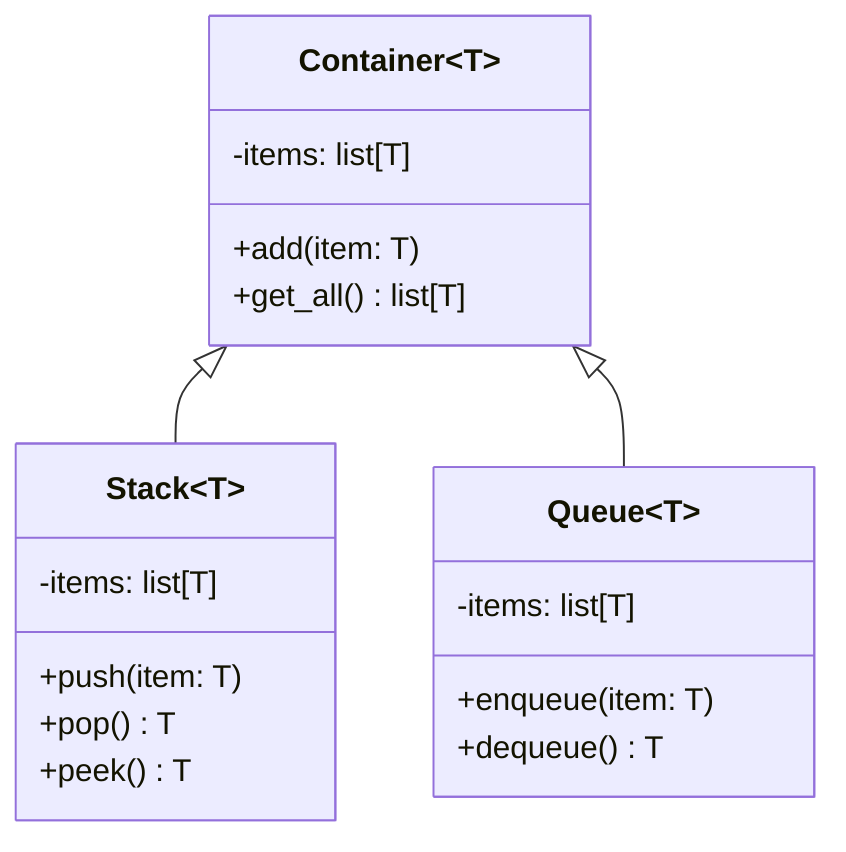
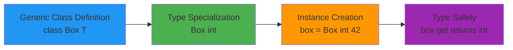
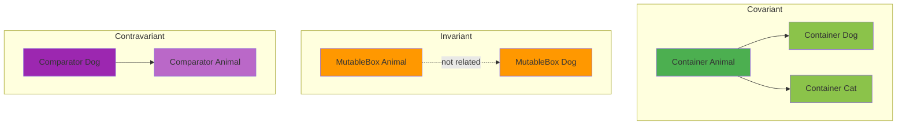

# Python Generics: Type Parameters and Generic Programming

## What Are Generics?

**Generics** allow you to write code that works with multiple types while maintaining type safety. Instead of writing the same code multiple times for different types (one for integers, one for strings, one for custom objects), you write it once with a type parameter that acts as a placeholder.

Think of generics as creating a **blueprint** that works with any type, rather than a specific blueprint for each type.

## Real-World Analogies

### The Container Analogy

Imagine a storage container at a warehouse:
- **Non-generic approach:** You need separate containers labeled "Books Only", "Electronics Only", "Clothes Only" -- one specialized container type for each item category
- **Generic approach:** You have a universal container that can hold ANY type of item, but once you put books in it, it's treated as a "Container of Books"

The generic container knows what type of items it holds, so you can't accidentally put electronics in a book container.

### The Recipe Analogy

A recipe for making a sauce:
- **Non-generic:** Separate recipes for "Tomato Sauce", "Cheese Sauce", "Chocolate Sauce" -- even though the process (heat, stir, thicken) is identical
- **Generic:** One "Sauce[Ingredient]" recipe where Ingredient is a placeholder. Use `Sauce[Tomato]`, `Sauce[Cheese]`, or `Sauce[Chocolate]`

The process stays the same, but the type of ingredient changes.

## Why Use Generics?

### Problem: Without Generics

```python
class IntStack:
    def __init__(self):
        self._items: list[int] = []

    def push(self, item: int) -> None:
        self._items.append(item)

    def pop(self) -> int:
        return self._items.pop()

class StringStack:
    def __init__(self):
        self._items: list[str] = []

    def push(self, item: str) -> None:
        self._items.append(item)

    def pop(self) -> str:
        return self._items.pop()
```

This approach has serious problems:
- **Code duplication:** Same logic repeated for every type
- **Maintenance nightmare:** Fix a bug? Update it in every version
- **Limited types:** Need a stack for floats? Write another class
- **No type safety with Any:** Using `Any` gives up type checking entirely

### Solution: With Generics

```python
class Stack[T]:
    def __init__(self):
        self._items: list[T] = []

    def push(self, item: T) -> None:
        self._items.append(item)

    def pop(self) -> T:
        return self._items.pop()

int_stack = Stack[int]()
int_stack.push(42)

str_stack = Stack[str]()
str_stack.push("hello")
```

**Benefits:**
- **Write once, use everywhere:** One implementation for all types
- **Type safety:** Type checkers verify you're using the right types
- **Maintainability:** Fix bugs in one place
- **Flexibility:** Works with any type without losing type information

## Python 3.12+ Modern Syntax (PEP 695)

Python 3.12 introduced a revolutionary new syntax for generics that makes them much simpler and cleaner.

### Generic Classes

**Modern Syntax (Python 3.12+):**
```python
class Box[T]:
    def __init__(self, value: T):
        self.value = value

    def get(self) -> T:
        return self.value

    def set(self, value: T) -> None:
        self.value = value

int_box = Box[int](42)
str_box = Box[str]("hello")
```

**Legacy Syntax (Python 3.11 and earlier):**
```python
from typing import TypeVar, Generic

T = TypeVar('T')

class Box(Generic[T]):
    def __init__(self, value: T):
        self.value = value

    def get(self) -> T:
        return self.value

    def set(self, value: T) -> None:
        self.value = value
```

**Key Differences:**
- **Modern:** Type parameters defined directly in class declaration `[T]`
- **Modern:** No need to import `TypeVar` or `Generic`
- **Modern:** Cleaner, more intuitive syntax
- **Legacy:** Explicit `TypeVar` creation and `Generic` inheritance

### Generic Functions

**Modern Syntax:**
```python
def first[T](items: list[T]) -> T:
    return items[0]

def last[T](items: list[T]) -> T:
    return items[-1]

def swap[T](a: T, b: T) -> tuple[T, T]:
    return (b, a)

result1 = first[int]([1, 2, 3])
result2 = last[str](["a", "b", "c"])
x, y = swap[float](3.14, 2.71)
```

**Legacy Syntax:**
```python
from typing import TypeVar

T = TypeVar('T')

def first(items: list[T]) -> T:
    return items[0]
```

### Type Aliases

**Modern Syntax:**
```python
type Point2D = tuple[float, float]
type Point3D = tuple[float, float, float]

type ListOrSet[T] = list[T] | set[T]
type Nested[T] = list[list[T]]

type JSON = dict[str, "JSON"] | list["JSON"] | str | int | float | bool | None
```

**Legacy Syntax:**
```python
from typing import TypeAlias, TypeVar

T = TypeVar('T')

Point2D: TypeAlias = tuple[float, float]
ListOrSet: TypeAlias = list[T] | set[T]
```

**Key advantage:** The `type` statement enables self-referential type aliases without quotes (forward references).

## Type Parameters: The Building Blocks

### 1. Basic Type Parameters

A simple placeholder that can be any type:

```python
class Container[T]:
    def __init__(self):
        self._items: list[T] = []

    def add(self, item: T) -> None:
        self._items.append(item)

    def get_all(self) -> list[T]:
        return self._items.copy()

numbers = Container[int]()
numbers.add(42)

words = Container[str]()
words.add("hello")
```

### 2. Bounded Type Parameters

Restrict a type parameter to subclasses of a specific type using `:` (colon):

**Modern Syntax:**
```python
class AnimalShelter[T: Animal]:
    def __init__(self):
        self._animals: list[T] = []

    def add_animal(self, animal: T) -> None:
        self._animals.append(animal)

    def feed_all(self) -> None:
        for animal in self._animals:
            animal.eat()

class Animal:
    def eat(self):
        print("Eating...")

class Dog(Animal):
    def bark(self):
        print("Woof!")

class Cat(Animal):
    def meow(self):
        print("Meow!")

dog_shelter = AnimalShelter[Dog]()
dog_shelter.add_animal(Dog())
```

**Legacy Syntax:**
```python
from typing import TypeVar, Generic

T = TypeVar('T', bound=Animal)

class AnimalShelter(Generic[T]):
    ...
```

**Why use bounds?**
- Ensures type parameter has specific methods/attributes
- Type checker knows `T` supports methods from the bound class
- Provides compile-time safety

### 3. Constrained Type Parameters

Limit a type parameter to a specific set of types:

**Modern Syntax:**
```python
class Adder[T: (int, float)]:
    def add(self, a: T, b: T) -> T:
        return a + b

int_adder = Adder[int]()
print(int_adder.add(5, 10))

float_adder = Adder[float]()
print(float_adder.add(3.14, 2.71))
```

**Legacy Syntax:**
```python
from typing import TypeVar

T = TypeVar('T', int, float)
```

**Difference from bounds:**
- **Bounds:** Allow any subclass (flexible)
- **Constraints:** Only exact types listed (restrictive)

### 4. Multiple Type Parameters

You can use multiple type parameters in a single class or function:

```python
class KeyValueStore[K, V]:
    def __init__(self):
        self._store: dict[K, V] = {}

    def put(self, key: K, value: V) -> None:
        self._store[key] = value

    def get(self, key: K) -> V | None:
        return self._store.get(key)

store = KeyValueStore[str, int]()
store.put("age", 25)
store.put("score", 100)

def pair[T, U](first: T, second: U) -> tuple[T, U]:
    return (first, second)

result = pair[str, int]("answer", 42)
```

### 5. TypeVarTuple: Variadic Generics

For types that need an arbitrary number of type parameters:

**Modern Syntax:**
```python
class Array[*Shape]:
    def __init__(self, data):
        self.data = data

class Tensor[DType, *Shape]:
    pass

tensor1 = Tensor[float, 10, 20, 30]()
```

**Legacy Syntax:**
```python
from typing import TypeVarTuple, Generic

Shape = TypeVarTuple('Shape')

class Array(Generic[*Shape]):
    ...
```

**Use cases:**
- Tensor/array dimensions (NumPy, PyTorch)
- Tuple types with unknown length
- Function signatures with variable arguments

### 6. ParamSpec: Callable Signatures

For preserving function parameter signatures in decorators:

**Modern Syntax:**
```python
from collections.abc import Callable

def log_call[**P, R](func: Callable[P, R]) -> Callable[P, R]:
    def wrapper(*args: P.args, **kwargs: P.kwargs) -> R:
        print(f"Calling {func.__name__}")
        return func(*args, **kwargs)
    return wrapper

@log_call
def greet(name: str, age: int) -> str:
    return f"Hello {name}, you are {age}"
```

**Legacy Syntax:**
```python
from typing import ParamSpec, TypeVar, Callable

P = ParamSpec('P')
R = TypeVar('R')

def log_call(func: Callable[P, R]) -> Callable[P, R]:
    ...
```

## Type Defaults (PEP 696 - Python 3.13+)

Python 3.13 introduced default values for type parameters, similar to default function arguments.

### Basic Type Defaults

```python
class Box[T = int]:
    def __init__(self, value: T):
        self.value = value

box1 = Box(42)
box2 = Box[str]("hello")
```

**Without type argument:** `Box(42)` -> `Box[int]` (uses default)
**With type argument:** `Box[str]("hello")` -> `Box[str]` (overrides default)

### Default Rules

**Ordering Rule:** Non-default type parameters cannot follow defaults:

```python
class Good[T, U = int]:
    pass

class Bad[T = int, U]:
    pass
```

**Type Parameter as Default:**
```python
class Range[StartT = int, StopT = StartT]:
    pass

r1 = Range()
r2 = Range[float]()
```

**Bound Compatibility:** Default must be a subtype of the bound:

```python
class Container[T: Animal = Dog]:
    pass
```

### Real-World Use Cases

**Generator with sensible defaults:**
```python
class Generator[YieldT, SendT = None, ReturnT = None]:
    pass

def simple_gen() -> Generator[int]:
    pass
```

**NumPy-style arrays:**
```python
class Array[DType = float, *Shape]:
    pass

arr1 = Array()
arr2 = Array[int]()
```

## Variance: How Types Relate

Variance describes how type parameters behave in subtyping relationships.

### Variance Types

**Invariant (default):**
- `Box[Dog]` is NOT a subtype of `Box[Animal]`
- Cannot substitute even if `Dog` is a subtype of `Animal`
- Used for mutable containers

**Covariant:**
- `ReadOnlyBox[Dog]` IS a subtype of `ReadOnlyBox[Animal]`
- Subtypes are preserved
- Used for read-only containers

**Contravariant:**
- `Comparator[Animal]` IS a subtype of `Comparator[Dog]`
- Subtypes are reversed
- Used for consumers/callbacks

### Automatic Variance Inference (Python 3.12+)

**Major benefit:** Python 3.12+ infers variance automatically based on usage.

```python
class ReadOnlyBox[T]:
    def __init__(self, value: T):
        self._value = value

    def get(self) -> T:
        return self._value

class MutableBox[T]:
    def __init__(self, value: T):
        self._value = value

    def get(self) -> T:
        return self._value

    def set(self, value: T) -> None:
        self._value = value
```

Type checkers analyze:
- **ReadOnlyBox:** Only returns `T` -> **covariant**
- **MutableBox:** Both reads and writes `T` -> **invariant**

**Legacy approach required manual annotation:**
```python
from typing import TypeVar, Generic

T_co = TypeVar('T_co', covariant=True)
T_contra = TypeVar('T_contra', contravariant=True)
```

## Real-World Examples

### Example 1: Generic Stack

```python
class Stack[T]:
    def __init__(self):
        self._items: list[T] = []

    def push(self, item: T) -> None:
        self._items.append(item)

    def pop(self) -> T:
        if not self._items:
            raise IndexError("Stack is empty")
        return self._items.pop()

    def peek(self) -> T:
        if not self._items:
            raise IndexError("Stack is empty")
        return self._items[-1]

    def is_empty(self) -> bool:
        return len(self._items) == 0

    def size(self) -> int:
        return len(self._items)

int_stack = Stack[int]()
int_stack.push(1)
int_stack.push(2)
print(int_stack.pop())
```

### Example 2: Generic Repository Pattern

```python
class Repository[T]:
    def __init__(self):
        self._items: dict[int, T] = {}
        self._next_id = 1

    def add(self, item: T) -> int:
        item_id = self._next_id
        self._items[item_id] = item
        self._next_id += 1
        return item_id

    def get(self, item_id: int) -> T | None:
        return self._items.get(item_id)

    def get_all(self) -> list[T]:
        return list(self._items.values())

    def delete(self, item_id: int) -> bool:
        if item_id in self._items:
            del self._items[item_id]
            return True
        return False

class User:
    def __init__(self, name: str, email: str):
        self.name = name
        self.email = email

user_repo = Repository[User]()
user_id = user_repo.add(User("Alice", "alice@example.com"))
user = user_repo.get(user_id)
```

### Example 3: Generic Pair

```python
class Pair[T, U]:
    def __init__(self, first: T, second: U):
        self.first = first
        self.second = second

    def swap(self) -> 'Pair[U, T]':
        return Pair(self.second, self.first)

    def __repr__(self) -> str:
        return f"Pair({self.first}, {self.second})"

p1 = Pair[str, int]("age", 25)
p2 = p1.swap()
```

### Example 4: Generic Builder Pattern

```python
class Builder[T]:
    def __init__(self, constructor):
        self._constructor = constructor
        self._kwargs = {}

    def with_attr(self, name: str, value) -> 'Builder[T]':
        self._kwargs[name] = value
        return self

    def build(self) -> T:
        return self._constructor(**self._kwargs)

class Person:
    def __init__(self, name: str, age: int, city: str):
        self.name = name
        self.age = age
        self.city = city

person = (Builder[Person](Person)
    .with_attr("name", "Alice")
    .with_attr("age", 30)
    .with_attr("city", "NYC")
    .build())
```

### Example 5: Generic Data Validator

```python
from collections.abc import Callable

class Validator[T]:
    def __init__(self):
        self._rules: list[tuple[Callable[[T], bool], str]] = []

    def add_rule(self, rule: Callable[[T], bool], message: str) -> None:
        self._rules.append((rule, message))

    def validate(self, value: T) -> list[str]:
        errors = []
        for rule, message in self._rules:
            if not rule(value):
                errors.append(message)
        return errors

string_validator = Validator[str]()
string_validator.add_rule(lambda s: len(s) > 0, "String cannot be empty")
string_validator.add_rule(lambda s: len(s) < 100, "String too long")

errors = string_validator.validate("Hello")
print(errors)
```

## Visualizing Generics

### Generic Class Hierarchy



### Type Parameter Flow



### Variance Relationships



## Best Practices

### 1. Use Generics When You Have Type-Agnostic Logic

**Good use case:**
```python
class Cache[K, V]:
    def __init__(self, max_size: int):
        self._cache: dict[K, V] = {}
        self._max_size = max_size
```

**Bad use case:**
```python
class Calculator[T]:
    def add(self, a: T, b: T) -> T:
        return a + b
```

### 2. Prefer Type Parameters Over `Any`

```python
from typing import Any

def first_bad(items: list[Any]) -> Any:
    return items[0]

def first_good[T](items: list[T]) -> T:
    return items[0]
```

### 3. Use Bounds for Common Interfaces

```python
from collections.abc import Sized

class Measurable[T: Sized]:
    def __init__(self, item: T):
        self.item = item

    def get_size(self) -> int:
        return len(self.item)
```

### 4. Don't Over-Genericize

```python
class Person[T]:
    pass
```

Not everything needs to be generic. Use generics when you genuinely need type flexibility.

### 5. Provide Sensible Defaults (Python 3.13+)

```python
class Response[T = dict]:
    def __init__(self, data: T, status_code: int):
        self.data = data
        self.status_code = status_code
```

## Common Patterns

### Pattern 1: Generic Factory

```python
class Factory[T]:
    def __init__(self, constructor: type[T]):
        self._constructor = constructor

    def create(self, *args, **kwargs) -> T:
        return self._constructor(*args, **kwargs)

class Product:
    def __init__(self, name: str):
        self.name = name

factory = Factory[Product](Product)
product = factory.create("Widget")
```

### Pattern 2: Generic Result Type

```python
class Result[T, E]:
    def __init__(self, value: T | None, error: E | None):
        self.value = value
        self.error = error

    def is_ok(self) -> bool:
        return self.error is None

    def unwrap(self) -> T:
        if self.error:
            raise ValueError(f"Result has error: {self.error}")
        return self.value

def divide(a: int, b: int) -> Result[float, str]:
    if b == 0:
        return Result[float, str](None, "Division by zero")
    return Result[float, str](a / b, None)
```

### Pattern 3: Generic Decorator

```python
from collections.abc import Callable

def memoize[**P, R](func: Callable[P, R]) -> Callable[P, R]:
    cache: dict = {}

    def wrapper(*args: P.args, **kwargs: P.kwargs) -> R:
        key = (args, tuple(sorted(kwargs.items())))
        if key not in cache:
            cache[key] = func(*args, **kwargs)
        return cache[key]

    return wrapper

@memoize
def fibonacci(n: int) -> int:
    if n <= 1:
        return n
    return fibonacci(n - 1) + fibonacci(n - 2)
```

## Common Pitfalls

### Pitfall 1: Using `Any` Instead of Generics

```python
from typing import Any

def process(items: list[Any]) -> Any:
    return items[0]
```

### Pitfall 2: Not Constraining When Needed

```python
class Comparable[T]:
    def max(self, a: T, b: T) -> T:
        return a if a > b else b
```

### Pitfall 3: Over-Complicating Simple Code

```python
class SimpleList[T, U, V]:
    pass
```

### Pitfall 4: Ignoring Variance

```python
def add_dog(animals: list[Animal]) -> None:
    animals.append(Dog())

dogs: list[Dog] = [Dog()]
add_dog(dogs)
```

## Comparison: Legacy vs Modern Syntax

| Feature | Legacy (<=3.11) | Modern (>=3.12) |
|---------|----------------|----------------|
| **Class** | `class Box(Generic[T]):` | `class Box[T]:` |
| **Function** | `def first(items: list[T]) -> T:` | `def first[T](items: list[T]) -> T:` |
| **Type Alias** | `ListOrSet: TypeAlias = list[T] | set[T]` | `type ListOrSet[T] = list[T] | set[T]` |
| **Bounds** | `T = TypeVar('T', bound=str)` | `class Box[T: str]:` |
| **Constraints** | `T = TypeVar('T', int, str)` | `class Box[T: (int, str)]:` |
| **Variadic** | `Shape = TypeVarTuple('Shape')` | `class Array[*Shape]:` |
| **ParamSpec** | `P = ParamSpec('P')` | `def log[**P, R](f: Callable[P, R]):` |
| **Defaults** | Not available | `class Box[T = int]:` |
| **Variance** | `T_co = TypeVar('T_co', covariant=True)` | Automatic inference |

## When to Use Generics

### Use Generics When:

1. **You need type-safe containers**
   - Lists, stacks, queues, trees
   - Caches, repositories, stores

2. **You have reusable algorithms**
   - Sorting, searching, filtering
   - Mapping, reducing, folding

3. **You're building libraries/frameworks**
   - Generic interfaces users will implement
   - Type-safe APIs

4. **You need multiple implementations of the same interface**
   - Repository pattern for different databases
   - Strategy pattern with different algorithms

### Avoid Generics When:

1. **The code is specific to one type**
   - No need to make it generic

2. **Type relationships are complex**
   - Might make code harder to understand

3. **Simple code becomes complicated**
   - Don't over-engineer

## Key Takeaways

**Generics = Type Parameters = Blueprints for Multiple Types**

- Write once, use with many types
- Type safety without code duplication
- Python 3.12+ syntax is dramatically simpler
- Use bounds when you need specific methods/attributes
- Use constraints when you need exact types
- Variance is inferred automatically in modern Python
- Type defaults (3.13+) provide sensible fallbacks
- Prefer generics over `Any` for type safety

**Remember:** Generics make your code more flexible and maintainable while preserving type information. The new syntax in Python 3.12+ makes them easier to use than ever before. Use them when you have logic that truly works across multiple types, but don't over-complicate simple code.
