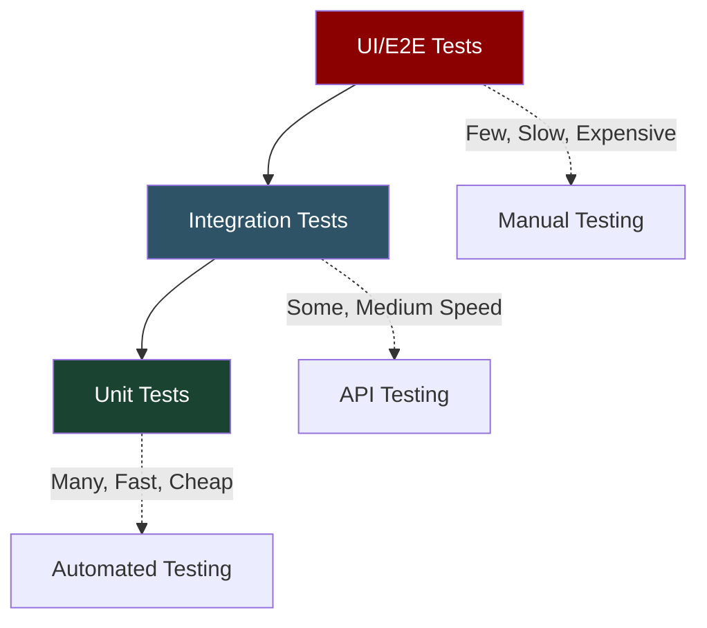
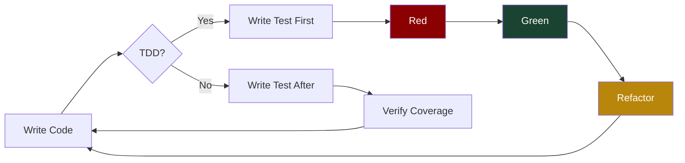
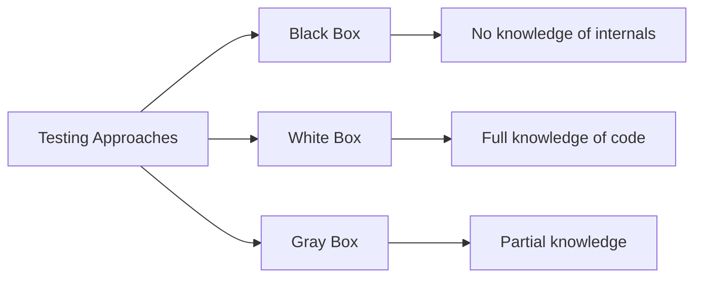
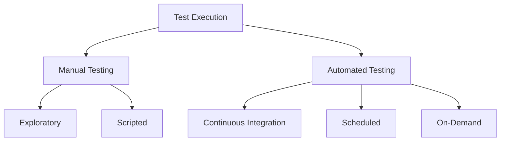
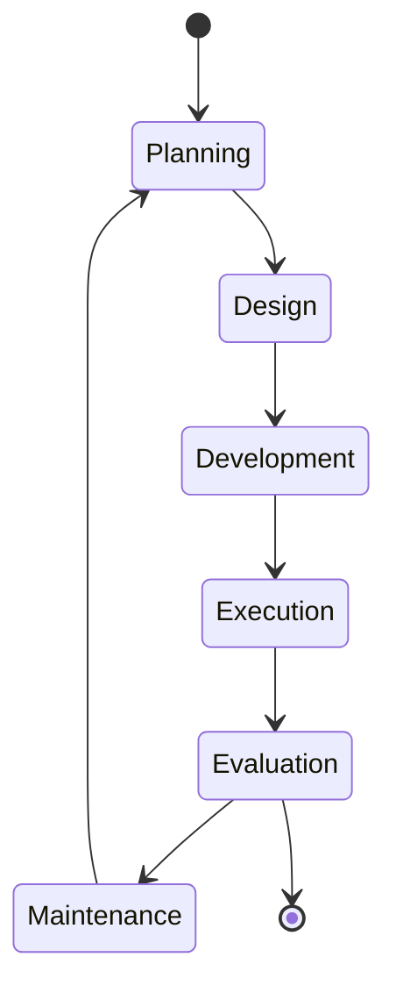
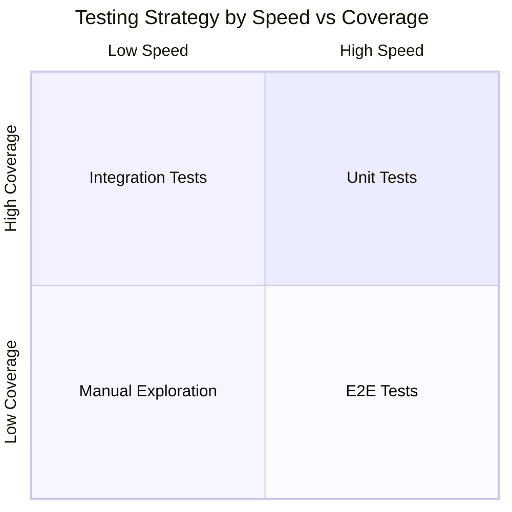

# Types of Tests

## Overview

Software testing can be categorized in multiple ways based on different criteria such as scope, approach, and execution method. This guide covers the most common types of tests used in modern software development.

## Test Pyramid



## Primary Test Types

### Unit Tests
- Test individual functions, methods, or classes in isolation
- Fast execution, easy to debug
- Foundation of the test pyramid
- Mock external dependencies

### Integration Tests
- Test interaction between components
- Verify data flow between modules
- Test database connections, API calls
- More complex setup than unit tests

### End-to-End (E2E) Tests
- **Purpose**: Test complete user workflows
- **Scope**: Entire application flow
- **Speed**: Slow
- **Maintenance**: High
- **Example**: Testing user registration and login flow

## Testing Strategies



## Classification by Approach



### Black Box Testing
Tests functionality without knowing internal implementation

### White Box Testing
Tests with full knowledge of code structure and logic

### Gray Box Testing
Combines both approaches with partial knowledge

## Classification by Execution



## Functional vs Non-Functional

### Functional Tests
- **Unit Tests**
- **Integration Tests**
- **System Tests**
- **Acceptance Tests**
- **Smoke Tests**
- **Sanity Tests**
- **Regression Tests**

### Non-Functional Tests
- **Performance Tests**
    - Load Testing
    - Stress Testing
    - Spike Testing
- **Security Tests**
- **Usability Tests**
- **Compatibility Tests**
- **Accessibility Tests**

## Test Lifecycle



## Specialized Test Types

### Smoke Tests
Quick tests to verify basic functionality works after deployment

### Regression Tests
Ensure new changes don't break existing functionality

### Mutation Tests
Test the quality of test suite by introducing bugs deliberately

### Property-Based Tests
Generate random inputs to test properties and invariants

### Contract Tests
Verify agreements between services in microservices architecture

## Testing Strategy Matrix



## Python Testing Framework Ecosystem

| Type        | Framework          | Description                                         | Popularity |
|-------------|--------------------|-----------------------------------------------------|------------|
| Unit        | `pytest`           | Most popular framework, simple syntax, rich plugins | ⭐⭐⭐⭐⭐      |
| Unit        | `unittest`         | Built-in standard library, JUnit-inspired           | ⭐⭐⭐⭐       |
| Property    | `hypothesis`       | Automatic test case generation, edge case discovery | ⭐⭐⭐        |
| Mock        | `unittest.mock`    | Test isolation, mock objects (built-in since 3.3)   | ⭐⭐⭐⭐       |
| Coverage    | `coverage.py`      | Test coverage measurement and reporting             | ⭐⭐⭐⭐       |
| Performance | `pytest-benchmark` | Performance regression testing                      | ⭐⭐⭐        |
| BDD         | `behave`           | Behavior-driven development                         | ⭐⭐         |
| Load        | `locust`           | Load testing and performance                        | ⭐⭐⭐        |

## Test Design Patterns

### Arrange-Act-Assert (AAA)
```python
def test_calculate_area():
    # Arrange
    radius = 5
    expected = 78.54

    # Act
    result = circle_area(radius)

    # Assert
    assert abs(result - expected) < 0.01
```

### Given-When-Then (BDD)
```python
def test_bank_withdrawal():
    # Given: account with $100
    account = Account(100)

    # When: withdraw $30
    account.withdraw(30)

    # Then: balance is $70
    assert account.balance == 70
```

## Test Coverage Guidelines

| Test Type         | Target Coverage | Description                  |
|-------------------|-----------------|------------------------------|
| Unit Tests        | 80-90%          | Individual functions/methods |
| Integration Tests | 60-80%          | Component interactions       |
| E2E Tests         | 40-60%          | Critical user journeys       |
| Overall Code      | 80%+            | Production code coverage     |


*Note: These are guidelines, not rigid rules. Focus on testing critical paths and business logic.*

## Best Practices

1. **Follow the Test Pyramid**: More unit tests, fewer E2E tests
2. **Automate Repetitive Tests**: Save manual testing for exploratory work
3. **Test Early and Often**: Shift-left testing approach
4. **Maintain Test Independence**: Tests shouldn't depend on each other
5. **Keep Tests Simple**: One assertion per test when possible
6. **Use Meaningful Names**: Test names should describe what they verify

## Quick Reference

| Test Type   | Speed | Isolation | Reliability | Maintenance |
|-------------|-------|-----------|-------------|-------------|
| Unit        | ⚡⚡⚡   | High      | High        | Low         |
| Integration | ⚡⚡    | Medium    | Medium      | Medium      |
| E2E         | ⚡     | Low       | Low         | High        |
| Performance | ⚡⚡    | Medium    | Medium      | Medium      |
| Security    | ⚡     | Low       | High        | High        |

## Common Anti-Patterns

- **Test Coupling**: Tests that depend on each other
- **Brittle Tests**: Tests that break with minor code changes
- **Slow Tests**: Tests that take too long to execute
- **Unclear Tests**: Tests that don't clearly express intent
- **Testing Implementation**: Testing how instead of what

## Conclusion

Choosing the right mix of test types depends on your project's needs, team size, and quality requirements. A balanced testing strategy typically includes multiple types of tests at different levels of the application stack.
