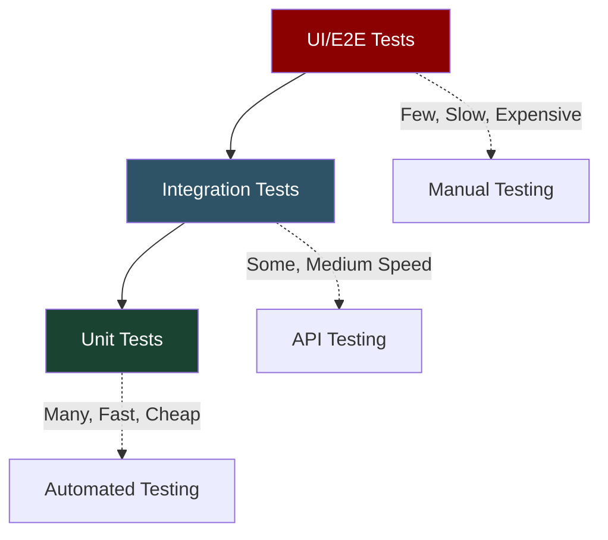
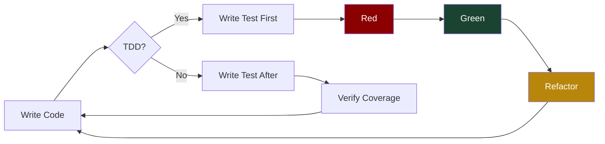
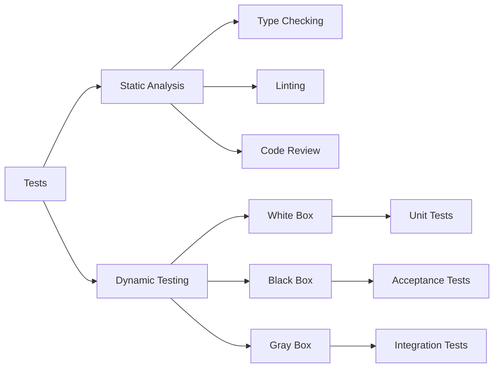

# Types of Tests

## Test Pyramid



## Primary Test Types

### Unit Tests
- Test individual functions, methods, or classes in isolation
- Fast execution, easy to debug
- Foundation of the test pyramid
- Mock external dependencies

### Integration Tests
- Test interaction between components
- Verify data flow between modules
- Test database connections, API calls
- More complex setup than unit tests

### Functional Tests
- Test complete features end-to-end
- Verify business requirements
- User-focused scenarios
- Often use real data and systems

## Testing Strategies



## Test Categories by Scope



## Python Testing Framework Ecosystem

| Type        | Framework          | Description                                         | Popularity |
|-------------|--------------------|-----------------------------------------------------|------------|
| Unit        | `pytest`           | Most popular framework, simple syntax, rich plugins | ⭐⭐⭐⭐⭐      |
| Unit        | `unittest`         | Built-in standard library, JUnit-inspired           | ⭐⭐⭐⭐       |
| Property    | `hypothesis`       | Automatic test case generation, edge case discovery | ⭐⭐⭐        |
| Mock        | `unittest.mock`    | Test isolation, mock objects (built-in since 3.3)   | ⭐⭐⭐⭐       |
| Coverage    | `coverage.py`      | Test coverage measurement and reporting             | ⭐⭐⭐⭐       |
| Performance | `pytest-benchmark` | Performance regression testing                      | ⭐⭐⭐        |
| BDD         | `behave`           | Behavior-driven development                         | ⭐⭐         |
| Load        | `locust`           | Load testing and performance                        | ⭐⭐⭐        |

## Test Design Patterns

### Arrange-Act-Assert (AAA)
```python
def test_calculate_area():
    # Arrange
    radius = 5
    expected = 78.54

    # Act
    result = circle_area(radius)

    # Assert
    assert abs(result - expected) < 0.01
```

### Given-When-Then (BDD)
```python
def test_bank_withdrawal():
    # Given: account with $100
    account = Account(100)

    # When: withdraw $30
    account.withdraw(30)

    # Then: balance is $70
    assert account.balance == 70
```

## Test Coverage Guidelines

| Test Type         | Target Coverage | Description                  |
|-------------------|-----------------|------------------------------|
| Unit Tests        | 80-90%          | Individual functions/methods |
| Integration Tests | 60-80%          | Component interactions       |
| E2E Tests         | 40-60%          | Critical user journeys       |
| Overall Code      | 80%+            | Production code coverage     |


*Note: These are guidelines, not rigid rules. Focus on testing critical paths and business logic.*

## Best Practices

1. **Test Naming**: Use descriptive names that explain what is being tested
2. **Independence**: Tests should not depend on each other
3. **Repeatability**: The same input should always produce the same result
4. **Fast Feedback**: Unit tests should execute quickly
5. **One Assertion**: Focus each test on a single behavior
6. **Test Data**: Use meaningful, realistic test data

## Common Anti-Patterns

- **Test Coupling**: Tests that depend on each other
- **Brittle Tests**: Tests that break with minor code changes
- **Slow Tests**: Tests that take too long to execute
- **Unclear Tests**: Tests that don't clearly express intent
- **Testing Implementation**: Testing how instead of what
