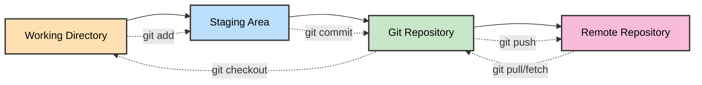
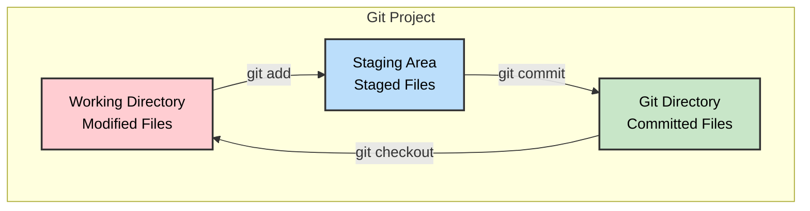
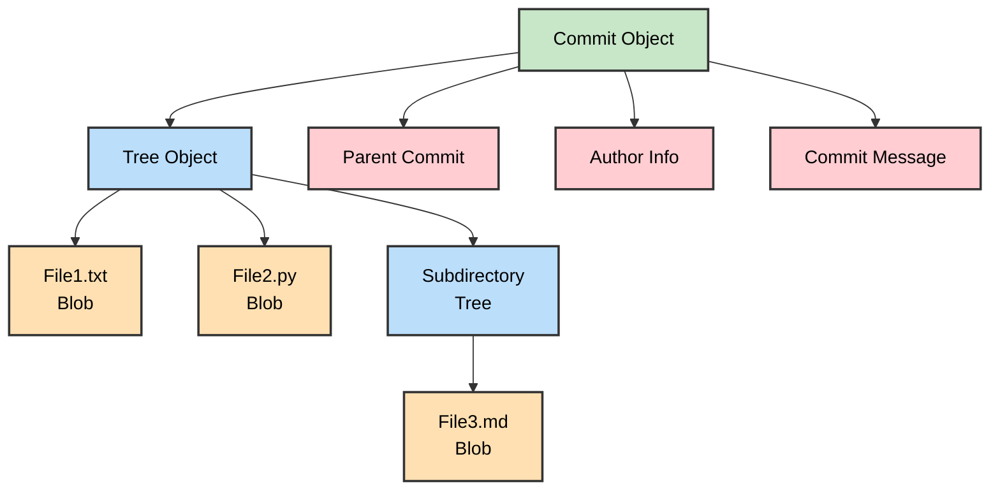
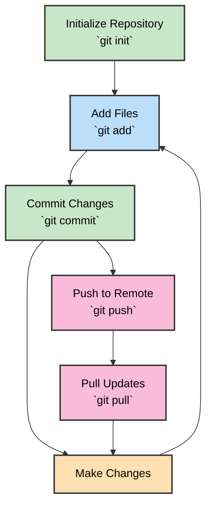
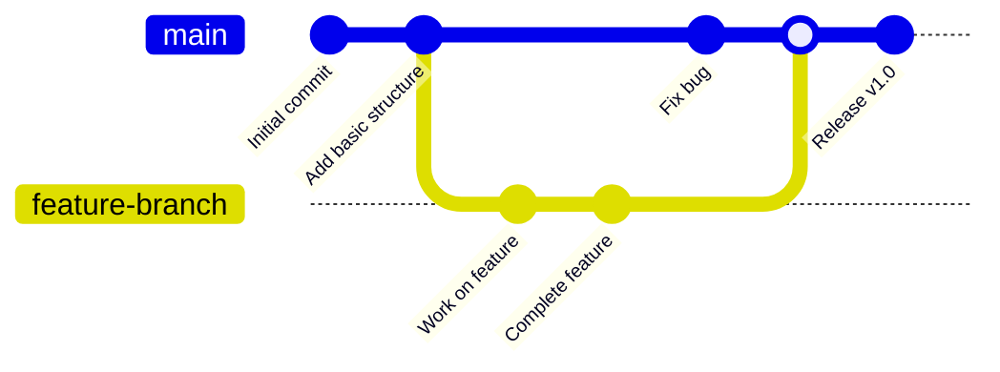
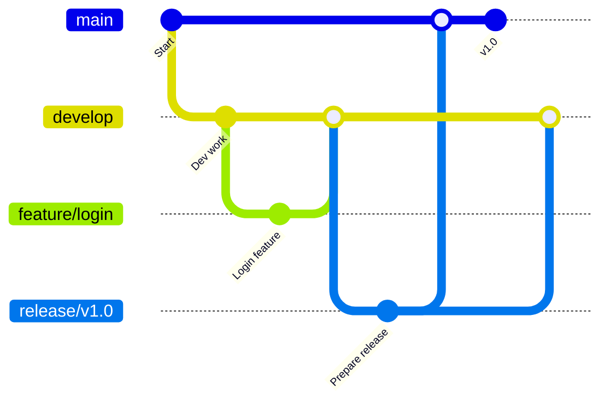
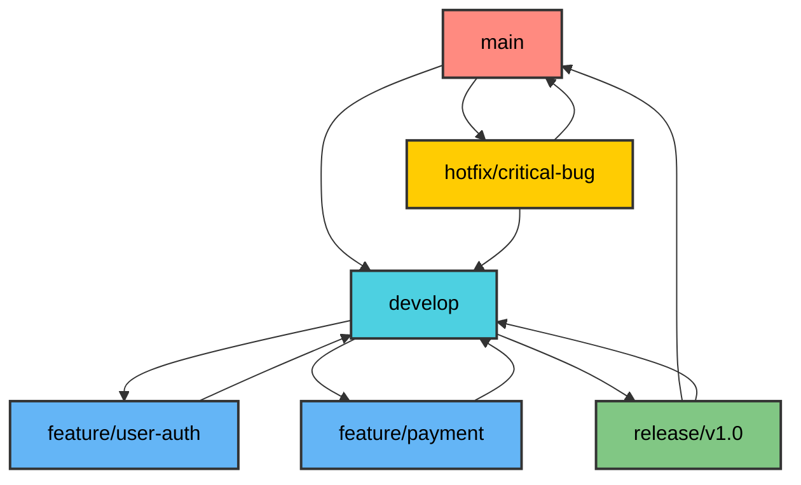
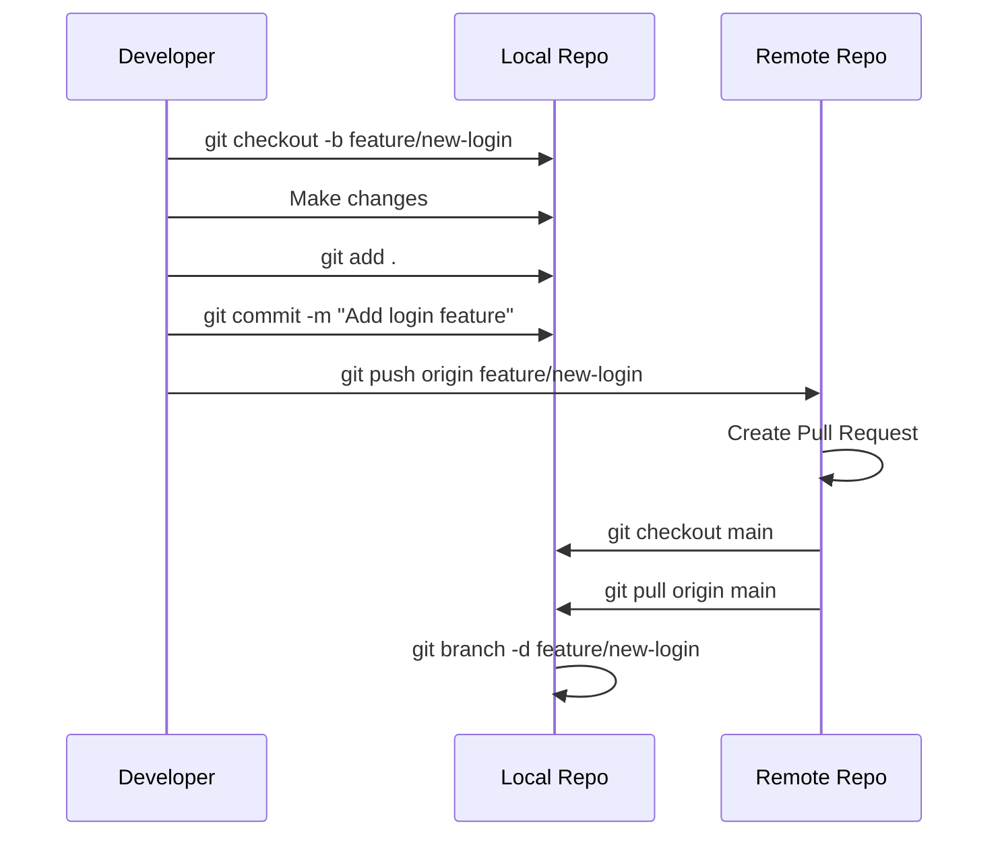
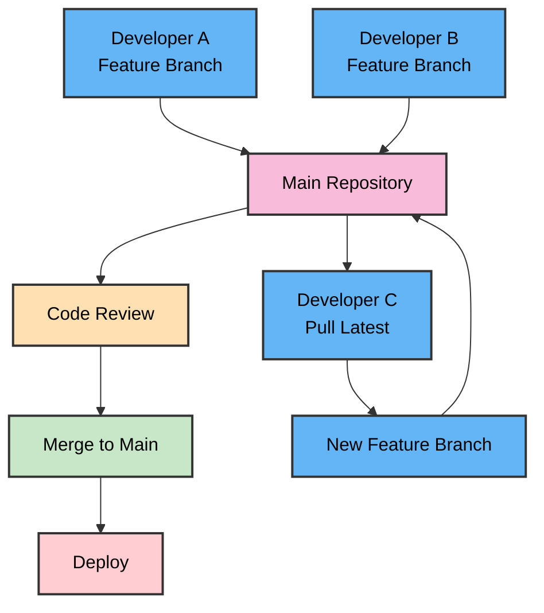

# Git - Distributed Version Control System

## Table of Contents

1. [What is Git?](#what-is-git)
2. [Git Fundamentals](#git-fundamentals)
3. [Git Workflow](#git-workflow)
4. [Branching and Merging](#branching-and-merging)
5. [Common Git Commands](#common-git-commands)
6. [Best Practices](#best-practices)
7. [Git Workflow Examples](#git-workflow-examples)
8. [Troubleshooting Common Issues](#troubleshooting-common-issues)

## What is Git?

**Git** is a distributed version control system created by Linus Torvalds in 2005. It's designed to handle everything
from small to huge projects with speed and efficiency.

### Key Features of Git:

- **Distributed**: Every clone is a full backup
- **Fast**: Local operations are lightning fast
- **Data Integrity**: Everything has checksum
- **Branching**: Lightweight branching and merging
- **Staging Area**: Intermediate area for preparing commits



## Git Fundamentals

### The Three States

Git has three main states that your files can reside in:

1. **Modified**: Changed but not committed to the database
2. **Staged**: Marked to go into the next commit snapshot
3. **Committed**: Safely stored in the local database

### Git Areas



### Git Object Types

Git stores four types of objects:

1. **Blob**: File content
2. **Tree**: Directory structure
3. **Commit**: Snapshot with metadata
4. **Tag**: Named reference to a commit



## Git Workflow

### Basic Git Workflow



### Detailed Workflow Steps

1. **Initialize**: Create a new Git repository
2. **Add**: Stage changes for commit
3. **Commit**: Save changes to a local repository
4. **Push**: Upload changes to a remote repository
5. **Pull**: Download changes from a remote repository
6. **Merge**: Combine different branches

## Branching and Merging

### What is Branching?

Branching allows you to diverge from the main line of development and work on features independently.



### Branch Types

1. **Main/Master**: Primary development branch
2. **Feature Branches**: For developing new features
3. **Hotfix Branches**: For critical bug fixes
4. **Release Branches**: For preparing releases

### Git Flow Model



## Common Git Commands

### Repository Setup

```bash
# Initialize a new repository
git init

# Clone an existing repository
git clone <repository-url>

# Add remote repository
git remote add origin <repository-url>
```

### Basic Operations

```bash
# Check status
git status

# Add files to staging area
git add <file>
git add .  # Add all files

# Commit changes
git commit -m "Commit message"

# Push to remote repository
git push origin main

# Pull from remote repository
git pull origin main
```

### Branching Commands

```bash
# List branches
git branch

# Create new branch
git branch <branch-name>

# Switch to branch
git checkout <branch-name>

# Create and switch to new branch
git checkout -b <branch-name>

# Merge branch
git merge <branch-name>

# Delete branch
git branch -d <branch-name>
```

### History and Logs

```bash
# View commit history
git log

# View compact history
git log --oneline

# View changes
git diff

# View staged changes
git diff --staged
```

### Working with Remotes

```bash
# View remote repositories
git remote -v

# Add remote
git remote add upstream <url>

# Fetch from remote
git fetch origin

# Push to different remote
git push upstream main
```

## Best Practices

### Commit Messages

- Use present tense ("Add feature" not "Added feature")
- Keep the first line under 50 characters
- Use imperative mood
- Be descriptive but concise

```
Good commit messages:
✓ Add user authentication system
✓ Fix memory leak in data processor
✓ Update README with installation instructions

Bad commit messages:
✗ Fixed stuff
✗ Working on it
✗ asdfgh
```

### Branching Strategy



### Modern Python Project Structure

```
project/
├── .git/                   # Git repository
│   ├── objects/            # Git object database (blobs, trees, commits)
│   ├── refs/               # Branch and tag references
│   │   ├── heads/          # Local branches
│   │   └── remotes/        # Remote tracking branches
│   ├── HEAD                # Current branch pointer
│   ├── config              # Repository configuration
│   └── index               # Staging area
├── .venv/                  # Virtual environment (uv)
├── src/                    # Source code
├── .gitignore              # Files to ignore
├── pyproject.toml          # Project metadata and dependencies (uv)
├── README.md               # Project documentation
└── uv.lock                 # Dependency lockfile (uv)
```

## Git Workflow Examples

### Feature Development Workflow



### Collaboration Workflow



## Troubleshooting Common Issues

### Merge Conflicts

When Git can't automatically merge changes:

```bash
# See conflicted files
git status

# Edit files to resolve conflicts
# Look for conflict markers: <<<<<<< ======= >>>>>>>

# Add resolved files
git add <resolved-file>

# Complete the merge
git commit
```

### Undoing Changes

```bash
# Unstage files
git reset HEAD <file>

# Discard local changes
git checkout -- <file>

# Undo last commit (keep changes)
git reset --soft HEAD^

# Undo last commit (discard changes)
git reset --hard HEAD^
```

---

## Summary

Git is a powerful distributed version control system that provides:

- **History Tracking**: Complete history of all changes
- **Branching**: Parallel development of features
- **Distributed**: Every clone is a complete backup
- **Speed**: Local operations are fast
- **Data Integrity**: Everything is checksummed

### Key Takeaways

1. Always commit frequently with meaningful messages
2. Use branches for features and experiments
3. Keep your main branch stable
4. Use `.gitignore` to exclude unnecessary files
5. Follow consistent naming conventions
6. Understand the three states: modified, staged, committed
7. Learn to resolve merge conflicts
8. Use proper branching strategies for team collaboration
