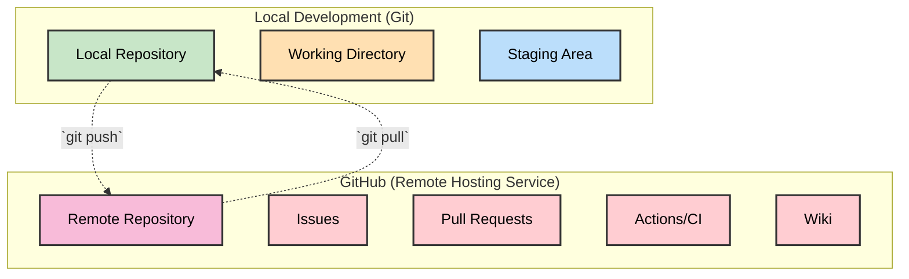
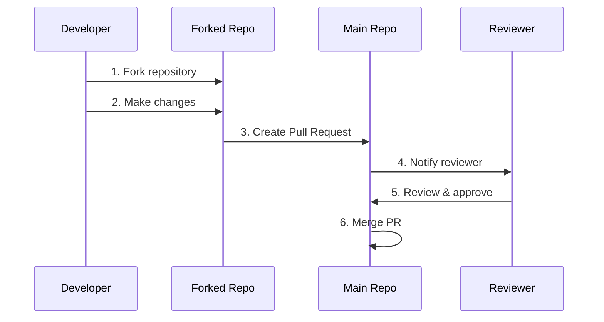
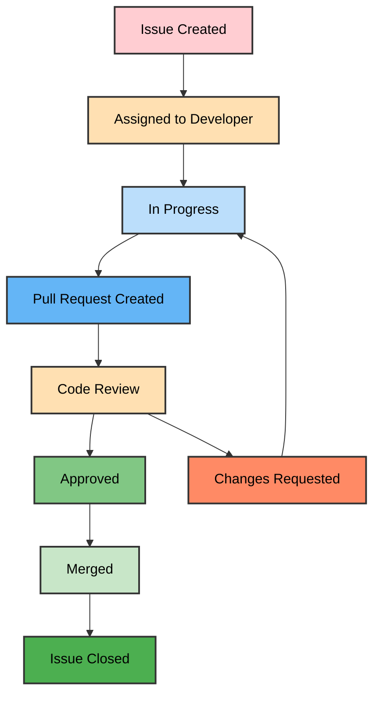
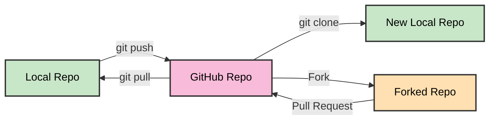
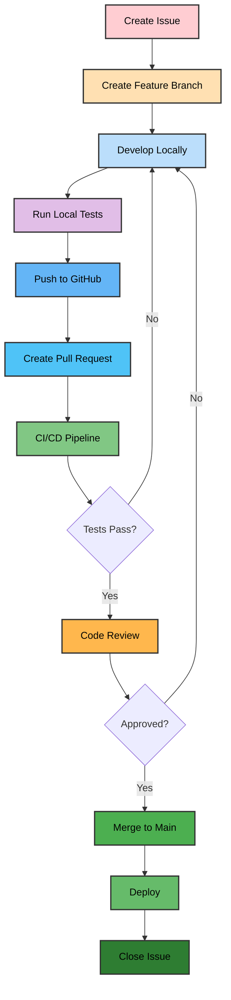

# GitHub - Git Repository Hosting and Collaboration Platform

## Table of Contents

1. [What is GitHub?](#what-is-github)
2. [GitHub Features](#github-features)
3. [Pull Requests](#pull-requests)
4. [Issues and Project Management](#issues-and-project-management)
5. [GitHub Actions (CI/CD)](#github-actions-cicd)
6. [Repository Operations](#repository-operations)
7. [Modern GitHub Workflow](#modern-github-workflow)
8. [Best Practices](#best-practices)

## What is GitHub?

**GitHub** is a web-based hosting service for Git repositories. It provides:

- Repository hosting
- Collaboration tools
- Issue tracking
- Pull requests
- Project management
- CI/CD integration



## GitHub Features

### Core Features

- **Repository Hosting**: Store and manage Git repositories
- **Collaboration**: Multiple developers working together
- **Issue Tracking**: Bug reports and feature requests
- **Pull Requests**: Code review and merge workflow
- **Project Boards**: Kanban-style project management
- **Wiki**: Documentation hosting
- **Releases**: Version management and distribution

### Advanced Features

- **GitHub Actions**: CI/CD workflows
- **Code Spaces**: Cloud-based development environment
- **Security**: Dependency scanning, secret detection
- **Insights**: Repository analytics and metrics
- **Discussions**: Community conversations
- **Sponsors**: Financial support for maintainers

## Pull Requests

A pull request is a way to propose changes to a repository.



### Pull Request Workflow

1. **Fork**: Create a personal copy of the repository
2. **Branch**: Create a feature branch for your changes
3. **Commit**: Make changes and commit them
4. **Push**: Push your branch to your fork
5. **PR**: Create a pull request to the main repository
6. **Review**: Code review and discussion
7. **Merge**: Merge approved changes

## Issues and Project Management

### Issues

- **Bug Reports**: Track software defects
- **Feature Requests**: Propose new functionality
- **Tasks**: Track work items
- **Questions**: Ask for help or clarification

### Project Management Tools

- **Milestones**: Group issues by goals or releases
- **Projects**: Kanban-style project boards
- **Labels**: Categorize and filter issues/PRs
- **Assignees**: Delegate responsibility
- **Due Dates**: Set deadlines for milestones



## GitHub Actions (CI/CD)

GitHub Actions automate workflows triggered by repository events.

### Basic Python Workflow

```yaml
name: Python CI

on:
  push:
    branches: [ main, develop ]
  pull_request:
    branches: [ main ]

jobs:
  test:
    runs-on: ubuntu-latest
    strategy:
      matrix:
        python-version: [3.9, 3.10, 3.11, 3.12]

    steps:
    - uses: actions/checkout@v4

    - name: Install uv
      uses: astral-sh/setup-uv@v3
      with:
        version: "latest"

    - name: Set up Python ${{ matrix.python-version }}
      run: uv python install ${{ matrix.python-version }}

    - name: Install dependencies
      run: uv sync

    - name: Run ruff check
      run: uv run ruff check

    - name: Run ruff format
      run: uv run ruff format --check

    - name: Run tests
      run: uv run pytest
```

### Advanced Workflow with Modern Tools

```yaml
name: Modern Python Workflow

on:
  push:
    branches: [ main ]
  pull_request:
    branches: [ main ]

jobs:
  quality:
    runs-on: ubuntu-latest
    steps:
    - uses: actions/checkout@v4

    - name: Install uv
      uses: astral-sh/setup-uv@v3

    - name: Set up Python
      run: uv python install

    - name: Install dependencies
      run: uv sync

    - name: Run pre-commit hooks
      run: uv run pre-commit run --all-files

    - name: Run tests with coverage
      run: uv run pytest --cov=src --cov-report=xml

    - name: Upload coverage to Codecov
      uses: codecov/codecov-action@v3

  security:
    runs-on: ubuntu-latest
    steps:
    - uses: actions/checkout@v4

    - name: Run Bandit Security Scan
      run: uv run bandit -r src/

    - name: Run Safety Check
      run: uv run safety check
```

## Repository Operations



### Common GitHub Operations

```bash
# Clone a repository
git clone https://github.com/username/repository.git

# Add GitHub as remote
git remote add origin https://github.com/username/repository.git

# Push to GitHub
git push origin main

# Create and push new branch
git checkout -b feature/new-feature
git push -u origin feature/new-feature

# Fork workflow - add upstream remote
git remote add upstream https://github.com/original/repository.git
git fetch upstream
git checkout main
git merge upstream/main
```

## Modern GitHub Workflow

### Development Process



### Branch Protection Rules

Modern repositories should use branch protection:

```yaml
# .github/branch-protection.yml (via GitHub UI)
restrictions:
  - require_status_checks: true
  - require_up_to_date: true
  - required_status_checks:
    - "Python CI"
    - "Security Scan"
  - enforce_admins: true
  - require_pull_request_reviews:
    - required_approving_review_count: 2
    - dismiss_stale_reviews: true
  - restrict_pushes: true
```

## Best Practices

### Repository Setup

1. **README.md**: Clear project description and setup instructions
2. **LICENSE**: Choose appropriate open-source license
3. **pyproject.toml**: Modern Python project configuration
4. **.gitignore**: Exclude unnecessary files
5. **CONTRIBUTING.md**: Guidelines for contributors
6. **CODE_OF_CONDUCT.md**: Community standards

### Modern Python Project Structure

```
repository/
├── .github/
│   ├── ISSUE_TEMPLATE/         # Issue templates
│   ├── workflows/
│   │   ├── ci.yml              # CI pipeline
│   │   ├── release.yml         # Release automation
│   │   └── security.yml        # Security scanning
│   ├── dependabot.yml          # Dependency updates
│   └── PULL_REQUEST_TEMPLATE.md
├── .vscode/                    # VS Code settings (optional)
├── docs/                       # Documentation
├── src/                        # Source code
│   └── package_name/
├── tests/                      # Test files
├── .gitignore                  # Git ignore rules
├── .pre-commit-config.yaml     # Pre-commit hooks
├── CONTRIBUTING.md             # Contribution guidelines
├── lefthook.yml                # Git hooks (alternative to pre-commit)
├── LICENSE                     # License file
├── pyproject.toml              # Project configuration (uv/ruff)
├── README.md                   # Project documentation
└── uv.lock                     # Dependency lockfile
```

### Pull Request Best Practices

1. **Small, Focused PRs**: One feature or fix per PR
2. **Descriptive Titles**: Clear summary of changes
3. **Detailed Description**: What, why, and how
4. **Link Issues**: Reference related issues
5. **Tests**: Include tests for new functionality
6. **Documentation**: Update docs as needed

### Issue Management

1. **Templates**: Use issue templates for consistency
2. **Labels**: Categorize issues (bug, feature, documentation)
3. **Milestones**: Group issues by release or sprint
4. **Assignees**: Clear ownership
5. **Triaging**: Regular review and prioritization

### Security Best Practices

1. **Branch Protection**: Protect main branch
2. **Required Reviews**: Mandate code reviews
3. **Status Checks**: Require CI to pass
4. **Dependency Scanning**: Automated security checks
5. **Secret Scanning**: Prevent credential leaks
6. **Two-Factor Authentication**: Secure account access

---

## Summary

GitHub is a powerful platform that extends Git with:

- **Collaboration Tools**: Issues, PRs, project boards
- **Automation**: GitHub Actions for CI/CD
- **Security**: Built-in scanning and protection
- **Community**: Open source collaboration features

### Key Takeaways

1. Use pull requests for all code changes
2. Set up comprehensive CI/CD pipelines
3. Implement branch protection rules
4. Use issues for project management
5. Leverage GitHub Actions for automation
6. Follow security best practices
7. Maintain good documentation
8. Use modern Python tooling (uv, ruff, lefthook)