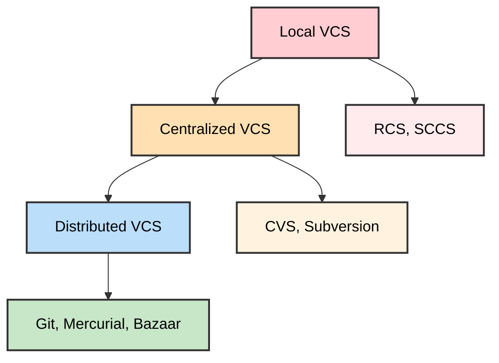

# Version Control Systems

## Table of Contents

1. [Introduction to Version Control Systems](#introduction-to-version-control-systems)
2. [Types of Version Control Systems](#types-of-version-control-systems)
3. [Why Use Version Control?](#why-use-version-control)
4. [Getting Started](#getting-started)
5. [Related Documentation](#related-documentation)

## Introduction to Version Control Systems

A **Version Control System (VCS)** is a tool that helps you manage changes to files over time. It allows you to:

- Track changes to your code
- Collaborate with other developers
- Revert to previous versions
- Create branches for different features
- Merge changes from multiple contributors



## Types of Version Control Systems

1. **Local Version Control Systems**
   - Store changes in a local database
   - Example: RCS (Revision Control System)

2. **Centralized Version Control Systems**
   - Single server contains all versioned files
   - Examples: CVS, Subversion (SVN)

3. **Distributed Version Control Systems**
   - Every user has a complete copy of the project history
   - Examples: Git, Mercurial, Bazaar

## Why Use Version Control?

Version control systems provide essential benefits for any development project:

- **History Tracking**: Complete record of all changes over time
- **Collaboration**: Multiple developers can work on the same project simultaneously
- **Backup**: Distributed copies protect against data loss
- **Branching**: Parallel development of features and experiments
- **Rollback**: Easy reversion to previous working states
- **Accountability**: Track who made what changes when

## Getting Started

For most modern software development, **Git** is the standard choice. Git is a distributed version control system that offers:

- Fast local operations
- Complete project history in every clone
- Powerful branching and merging capabilities
- Strong data integrity through checksums
- Support for non-linear development workflows

### Quick Start Commands

```bash
# Initialize a new repository
git init

# Clone an existing repository
git clone <repository-url>

# Check status of files
git status

# Add files to staging area
git add <file>

# Commit changes
git commit -m "Your commit message"

# Push to remote repository
git push origin main
```

## Related Documentation

For detailed information on specific tools and workflows:

- **[Git Documentation](git.md)** - Complete guide to Git version control system
- **[GitHub Documentation](github.md)** - GitHub platform features and workflows

---

## Summary

Version Control Systems are fundamental tools for modern software development, providing:

- **Change Management**: Track and control modifications to files
- **Collaboration**: Enable multiple developers to work together effectively
- **Project History**: Maintain a complete record of project evolution
- **Risk Mitigation**: Backup, rollback, and recovery capabilities

Git has become the de facto standard due to its distributed nature, performance, and powerful feature set. Combined with platforms like GitHub, it enables modern development workflows including continuous integration, code review, and collaborative development.

### Key Takeaways

1. Version control is essential for any serious development work
2. Git is the most widely adopted modern VCS
3. Understanding basic Git commands enables effective project management
4. Remote repositories (like GitHub) enhance collaboration and backup
5. Branching enables parallel development and experimentation
6. Proper commit practices create valuable project history
